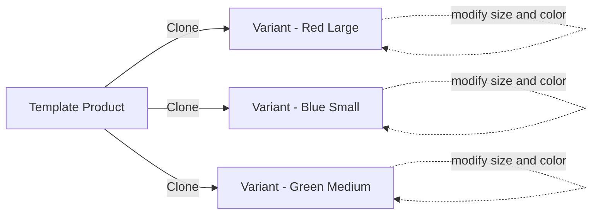

---
topic:
  - Software Architecture
subtopic:
  - Patterns
summary: "Creates new objects by copying an existing instance rather than constructing from scratch, with the prototype knowing how to clone itself."
level:
  - "2"
priority: High
status: Done
publish: true
---

Prototype creates an object from an existing instance. It fits when construction starts from a configured template or when the concrete runtime type must decide how to copy itself.

The copy contract matters more than the `Clone` method. A shallow copy creates a new outer object but shares referenced objects. A deep copy duplicates the mutable parts that must vary independently. C# records and `with` expressions make shallow copies concise. Explicit copy constructors are clearer when selected members need deeper copying. `ICloneable` is a weak public contract because it does not state which semantics callers receive.


```mermaid
flowchart LR
    TemplateProduct["Template Product"]
    TemplateProduct -->|Clone| Copy1["Variant - Red Large"]
    TemplateProduct -->|Clone| Copy2["Variant - Blue Small"]
    TemplateProduct -->|Clone| Copy3["Variant - Green Medium"]
    Copy1 -.->|modify size and color| Copy1
    Copy2 -.->|modify size and color| Copy2
    Copy3 -.->|modify size and color| Copy3
```

# Problem

Manual property assignment makes each copy site responsible for tracking the entire type:

```csharp
public class ProductService
{
    public Product CreateVariant(Product baseProduct, string size, string color, decimal priceAdjustment)
    {
        // ⚠️ Manual property copy — adding a new field to Product means updating this method
        var variant = new Product
        {
            Id = Guid.NewGuid(),
            Name = baseProduct.Name,
            Sku = $"{baseProduct.Sku}-{size}-{color}",
            Price = baseProduct.Price + priceAdjustment,
            Category = baseProduct.Category,
            // ⚠️ Shallow copy of Tags — mutating variant.Tags mutates baseProduct.Tags
            Tags = baseProduct.Tags,
            // ⚠️ Forgot to copy Description — variant has null description
            // Description = baseProduct.Description,  <-- missed!
            Variants = new List<ProductVariant>() // ⚠️ intentionally empty? or forgot to copy?
        };
        return variant;
    }
}
```

Adding `ShippingConstraints` now requires finding every manual copy site. A missed assignment produces a valid-looking object with incomplete state, while shared mutable members can make two variants change each other.

# Solution

Use `with` for a shallow record copy and override every member that needs fresh identity or independent mutable state. Use an explicit copy constructor when those rules should be visible in one place.

```csharp
// Modern approach: record with {} — the idiomatic C# Prototype
public record Product
{
    public Guid Id { get; init; }
    public string Name { get; init; } = "";
    public string Sku { get; init; } = "";
    public decimal Price { get; init; }
    public string Description { get; init; } = "";
    public ProductCategory Category { get; init; } = null!;
    public IReadOnlyList<string> Tags { get; init; } = [];
    public ShippingConstraints Shipping { get; init; } = ShippingConstraints.Default;
}

public class ProductService
{
    public Product CreateVariant(Product baseProduct, string size, string color, decimal priceAdjustment)
    {
        // ✅ 'with' expression copies all fields, then overrides only what changes
        // Adding a new field to Product automatically includes it — no manual update needed
        return baseProduct with
        {
            Id = Guid.NewGuid(),                                    // ✅ new identity
            Sku = $"{baseProduct.Sku}-{size}-{color}",             // ✅ variant-specific
            Price = baseProduct.Price + priceAdjustment,           // ✅ adjusted price
            Tags = [..baseProduct.Tags, $"size:{size}", $"color:{color}"] // ✅ new list, not shared reference
        };
        // All other fields (Name, Description, Category, Shipping) are copied automatically
    }
}

// Classical approach: explicit copy constructor for classes (when record isn't appropriate)
public class Order
{
    public Guid Id { get; set; }
    public Customer Customer { get; set; } = null!;
    public List<OrderItem> Items { get; set; } = [];
    public Address ShippingAddress { get; set; } = null!;
    public decimal Total { get; set; }

    // ✅ Copy constructor — explicit about what gets deep-copied
    public Order(Order source)
    {
        Id = Guid.NewGuid();                                    // new identity
        Customer = source.Customer;                             // shallow — Customer is shared
        Items = source.Items.Select(i => new OrderItem(i)).ToList(); // ✅ deep copy items
        ShippingAddress = new Address(source.ShippingAddress);  // ✅ deep copy address
        Total = source.Total;
    }

    // Factory method using the copy constructor
    public Order Clone() => new(this);
}

// Usage: create a draft order from a template
var templateOrder = orderRepository.GetTemplate("B2B_STANDARD");
var draftOrder = templateOrder.Clone();
draftOrder.Customer = currentCustomer;
```

New record fields participate in the compiler-generated copy automatically. Referenced objects are still shared unless the initializer replaces them. The example replaces `Tags` for that reason.

# .NET Forms

**`record with {}`** creates a modified shallow copy. It works well for value-like models whose referenced members are immutable or replaced explicitly.

**Copy constructors or named copy methods** can state exactly which members remain shared and which are duplicated. They are usually the clearest choice for mutable object graphs.

**`MemberwiseClone()`** performs the outer shallow copy used by many classical implementations. A protected primitive is safer than promising unspecified semantics through `ICloneable`.

# Pitfalls

**Shared mutable references.** `with` does not recursively copy a list, array, or child entity. `IReadOnlyList<T>` restricts the exposed API but does not prove that the underlying collection is immutable. Replace mutable members or use an immutable collection.

**Ambiguous identity.** A cloned entity usually needs a new identifier, while shared value objects may keep their values. Copying persistence identifiers, event subscriptions, locks, or caches can create two objects that claim to be the same entity or share runtime-only state.

**Stale explicit copy logic.** Copy constructors must be reviewed when the source type gains a member. That cost is acceptable when the alternative is an implicit deep-copy policy nobody can see.

# Questions

> [!QUESTION]- What pressure justifies Prototype instead of direct construction?
> The new object begins as a variant of an existing configured instance, or the client knows only an abstract type and needs that runtime object to reproduce itself. Direct construction remains clearer when there is no meaningful template or runtime-type boundary.

> [!QUESTION]- Where is the boundary between a shallow and a deep copy?
> A shallow copy duplicates the outer object's fields and preserves references to nested objects. A deep-copy policy replaces the mutable nested state that must evolve independently. Copying every reachable object is rarely the real requirement. Ownership and identity decide where copying stops.

# References

- [Prototype pattern](https://refactoring.guru/design-patterns/prototype)
- [Records (C# reference) — `record with {}` as the modern C# Prototype](https://learn.microsoft.com/en-us/dotnet/csharp/language-reference/builtin-types/record)
- [Object.MemberwiseClone — classical shallow copy mechanism](https://learn.microsoft.com/en-us/dotnet/api/system.object.memberwiseclone)
