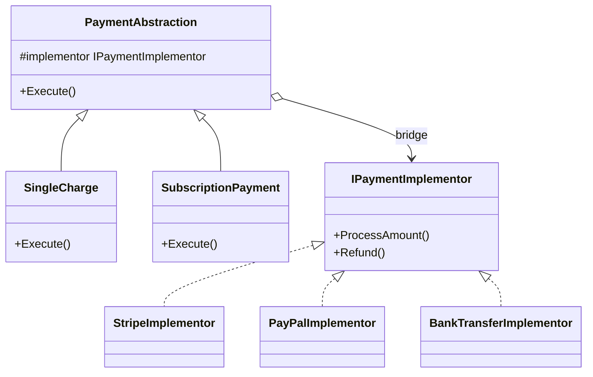

---
topic:
  - Software Architecture
subtopic:
  - Patterns
summary: "Bridge decouples an abstraction from its implementation so the two hierarchies can evolve independently instead of exploding combinatorially."
level:
  - "3"
priority: High
status: Ready to Repeat
publish: true
---

A remote control defines operations such as power and volume. A television brand supplies the hardware-specific implementation. Connecting the two through a stable device interface allows either side to change without rebuilding the other hierarchy.

The Bridge pattern separates an abstraction from its implementation so both can evolve independently. The abstraction holds an implementation interface instead of inheriting from a concrete implementation. For payments, operation types such as charges or refunds form one dimension, while providers form another. Combining both dimensions through inheritance produces classes such as `StripeCharge` and `PayPalRefund`. A bridge keeps the two sets separate and joins them through delegation.



> [!NOTE] Bridge vs Adapter
> [[Home/Software Architecture/Patterns/Design Patterns/Structural/Adapter]] retrofits an interface that cannot be changed. Bridge is designed around two independent dimensions from the start. Legacy integration points toward Adapter. A new model with independently growing abstractions and implementations points toward Bridge.

# Problem

`PaymentService` has methods per provider. Adding a new payment type (subscription) AND a new provider (BankTransfer) causes a combinatorial explosion:

```csharp
// ⚠️ 3 providers × 3 payment types = 9 methods, growing to N×M
public class PaymentService
{
    public Task<Payment> ProcessStripeChargeAsync(Order order) { /* Stripe API */ return null!; }
    public Task<Payment> ProcessStripeSubscriptionAsync(Customer customer, Product plan) { /* Stripe */ return null!; }
    public Task<bool> ProcessStripeRefundAsync(Payment payment) { /* Stripe */ return null!; }

    public Task<Payment> ProcessPayPalChargeAsync(Order order) { /* PayPal API */ return null!; }
    public Task<Payment> ProcessPayPalSubscriptionAsync(Customer customer, Product plan) { /* PayPal */ return null!; }
    public Task<bool> ProcessPayPalRefundAsync(Payment payment) { /* PayPal */ return null!; }

    // ⚠️ Adding BankTransfer requires 3 more methods
    // ⚠️ Adding "partial refund" payment type requires 2 more methods (one per provider)
    // ⚠️ Shared logic (retry, logging, idempotency) duplicated across all methods
}
```

A partial refund must be implemented once per provider, and every new provider needs its own version of every payment operation. The two dimensions are locked together.

# Solution

Separate payment operations from provider implementations:

```csharp
// Implementation interface — the "bridge"
public interface IPaymentGateway
{
    Task<string> AuthorizeAsync(decimal amount, string currency, PaymentMethod method);
    Task<string> CaptureAsync(string authorizationId);
    Task<bool> RefundAsync(string transactionId, decimal amount);
    Task<string> CreateSubscriptionAsync(string customerId, string planId, decimal amount);
}

// Concrete implementations — one per provider
public class StripeGateway(StripeOptions options) : IPaymentGateway
{
    public async Task<string> AuthorizeAsync(decimal amount, string currency, PaymentMethod method)
    {
        // Stripe-specific API call
        var intent = await StripeClient.CreatePaymentIntentAsync(amount, currency, method.Token);
        return intent.Id;
    }
    public Task<string> CaptureAsync(string authorizationId) =>
        StripeClient.CapturePaymentIntentAsync(authorizationId);
    public Task<bool> RefundAsync(string transactionId, decimal amount) =>
        StripeClient.CreateRefundAsync(transactionId, amount);
    public Task<string> CreateSubscriptionAsync(string customerId, string planId, decimal amount) =>
        StripeClient.CreateSubscriptionAsync(customerId, planId);
}

public class PayPalGateway(PayPalOptions options) : IPaymentGateway
{
    public Task<string> AuthorizeAsync(decimal amount, string currency, PaymentMethod method) =>
        PayPalClient.CreateOrderAsync(amount, currency, method.PayPalToken);
    public Task<string> CaptureAsync(string authorizationId) =>
        PayPalClient.CaptureOrderAsync(authorizationId);
    public Task<bool> RefundAsync(string transactionId, decimal amount) =>
        PayPalClient.RefundCaptureAsync(transactionId, amount);
    public Task<string> CreateSubscriptionAsync(string customerId, string planId, decimal amount) =>
        PayPalClient.CreateSubscriptionAsync(customerId, planId);
}

// Abstraction — payment types, each using the gateway bridge
public abstract class PaymentOperation(IPaymentGateway gateway)
{
    protected readonly IPaymentGateway Gateway = gateway;
    public abstract Task<Payment> ExecuteAsync(Order order);
}

// ✅ Concrete abstractions — payment types vary independently of providers
public class SingleChargePayment(IPaymentGateway gateway) : PaymentOperation(gateway)
{
    public override async Task<Payment> ExecuteAsync(Order order)
    {
        var authId = await Gateway.AuthorizeAsync(order.Total, "USD", order.Customer.PaymentMethod);
        var captureId = await Gateway.CaptureAsync(authId);
        return new Payment(captureId, order.Total, PaymentStatus.Captured);
    }
}

public class SubscriptionPayment(IPaymentGateway gateway, string planId) : PaymentOperation(gateway)
{
    public override async Task<Payment> ExecuteAsync(Order order)
    {
        var subscriptionId = await Gateway.CreateSubscriptionAsync(
            order.Customer.Id.ToString(), planId, order.Total);
        return new Payment(subscriptionId, order.Total, PaymentStatus.Subscribed);
    }
}

// ✅ Adding PartialRefundPayment = one new class, works with ALL providers
public class PartialRefundPayment(IPaymentGateway gateway, string originalTransactionId, decimal refundAmount)
    : PaymentOperation(gateway)
{
    public override async Task<Payment> ExecuteAsync(Order order)
    {
        var success = await Gateway.RefundAsync(originalTransactionId, refundAmount);
        return new Payment(originalTransactionId, refundAmount,
            success ? PaymentStatus.Refunded : PaymentStatus.Failed);
    }
}

// ✅ Adding BankTransferGateway = one new class, works with ALL payment types
public class BankTransferGateway(BankOptions options) : IPaymentGateway { /* ... */ }

// Usage: combine any abstraction with any implementation
var stripeGateway = new StripeGateway(stripeOptions);
var singleCharge = new SingleChargePayment(stripeGateway);
var payment = await singleCharge.ExecuteAsync(order);

// Switch to PayPal: change the gateway, keep the payment type
var paypalGateway = new PayPalGateway(paypalOptions);
var paypalCharge = new SingleChargePayment(paypalGateway);
```

A new payment-operation variant expressible through the existing gateway primitives needs one `PaymentOperation` subclass. A new provider needs one `IPaymentGateway` implementation. Adding a genuinely new primitive changes `IPaymentGateway` and every provider implementation; Bridge prevents a provider-by-operation subclass cross-product, not evolution of the shared implementor contract.

# Related .NET Abstractions

**ADO.NET `DbConnection` / `DbCommand`** provide base types for database-specific implementations such as `SqlConnection`. This is provider polymorphism, not a clear Bridge by itself: application code still varies along one provider dimension unless a separate abstraction hierarchy composes with it.

**`ILogger<T>` and logging providers** separate logging calls from destinations. That boundary is closer to Strategy or ordinary interface polymorphism because the consumer has no second abstraction hierarchy that varies independently.

**`IDistributedCache`** follows the same shape. DI selects one cache implementation behind one application-facing interface. It becomes Bridge-like only when another independently changing abstraction composes with that provider contract.

# Pitfalls

**Premature abstraction.** One implementation and one operation do not need two class hierarchies. A direct implementation is easier to trace. Bridge earns its extra indirection when the second independent dimension appears.

**Implementation details in the bridge.** A gateway that exposes `PaymentIntentId` has embedded a Stripe concept in the shared contract. Provider-neutral terms such as `transactionId` keep other implementations from pretending to support a foreign model.

**False independence.** Bridge assumes the combinations are meaningful. If subscriptions only work with Stripe, provider and payment type are coupled, and the abstraction advertises flexibility the system does not have.

# Tradeoffs

| Concern | Bridge | Monolithic class hierarchy |
|---|---|---|
| Adding a new provider | One new implementation class | N new methods (one per payment type) |
| Adding an operation variant from existing gateway primitives | One new abstraction class | M new methods (one per provider) |
| Shared logic (retry, logging) | In the abstraction base class | Duplicated across all methods |
| Complexity | Two class hierarchies, indirection | Single hierarchy, direct calls |
| Testability | Mock `IPaymentGateway` for abstraction tests | Must mock entire service |

Bridge becomes useful when both dimensions already vary or are about to vary. A 2×2 = 4 combination is a useful prompt to inspect the design, though repeated methods that differ only by provider are stronger evidence. With one dimension, Strategy or a direct implementation is usually enough.

# Questions

> [!QUESTION]- When does payment-provider selection need Bridge rather than Strategy?
> Strategy swaps one behavior behind an interface. Bridge connects two independently changing models. Provider selection alone needs Strategy. Provider selection combined with a growing set of payment operations may justify Bridge.

> [!QUESTION]- What makes the payment example Bridge rather than ordinary provider polymorphism?
> Both sides vary. `PaymentOperation` has charge, subscription, or refund variants, while `IPaymentGateway` has Stripe, PayPal, or bank implementations. Provider implementations can grow independently, and operation variants can grow independently while they compose existing gateway primitives. A new primitive still changes the gateway contract and every provider. Injecting only one gateway behind one service interface would be ordinary polymorphism or Strategy.

> [!QUESTION]- What's the difference between Bridge and Dependency Injection?
> Dependency injection supplies an object with its dependencies. Bridge decides that the abstraction and implementation should be separate models connected through composition. DI can wire an `IPaymentGateway` into a `PaymentOperation`, but it does not create the structural boundary.

# References

- [Bridge pattern](https://refactoring.guru/design-patterns/bridge)
- [Bridge Pattern — Christopher Okhravi](https://www.youtube.com/watch?v=F1YQ7YRjttI&list=PLrhzvIcii6GNjpARdnO4ueTUAVR9eMBpc&index=11)
- [IDistributedCache — .NET caching Bridge with multiple provider implementations](https://learn.microsoft.com/en-us/dotnet/api/microsoft.extensions.caching.distributed.idistributedcache)
