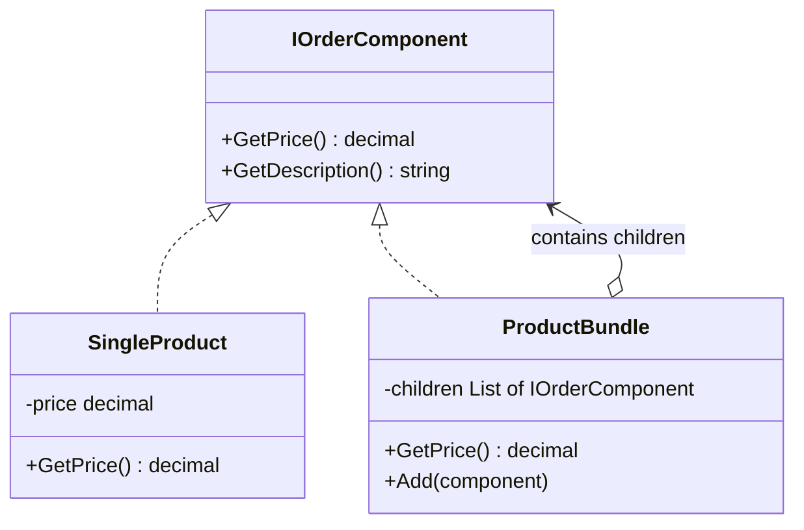

---
topic:
  - Software Architecture
subtopic:
  - Patterns
summary: "Composite arranges objects into tree structures and lets clients treat individual objects and compositions uniformly through one interface."
level:
  - "3"
priority: High
status: Ready to Repeat
publish: true
---

A military command tree illustrates Composite. An order sent to a division flows through its child units until it reaches individual soldiers. The caller uses the same command operation at every level and leaves recursion to the hierarchy.

The Composite pattern represents part-whole trees through one component interface. A leaf performs an operation directly. A composite implements the same operation by delegating to its children, which may be leaves or more composites. In a catalog, both `SingleProduct` and `ProductBundle` can expose `GetPrice()`. A bundle calculates its price from the components below it, while the caller works with either object in the same way.



# Problem

`PricingService` has separate logic for individual products, simple bundles, and nested bundles. Three code paths, recursive logic scattered in the service:

```csharp
public class PricingService
{
    // ⚠️ Three separate methods for what is conceptually one operation
    public decimal GetProductPrice(Product product) => product.Price;

    public decimal GetBundlePrice(ProductBundle bundle)
    {
        decimal total = 0;
        foreach (var item in bundle.Items)
        {
            // ⚠️ Type-checking — breaks when a new item type is added
            if (item is Product p)
                total += p.Price;
            else if (item is ProductBundle subBundle)
                total += GetBundlePrice(subBundle); // ⚠️ manual recursion in the service
            else
                throw new NotSupportedException($"Unknown item type: {item.GetType().Name}");
        }
        return total * (1 - bundle.DiscountPercent / 100m);
    }

    // ⚠️ Cart pricing duplicates the same type-checking logic
    public decimal GetCartTotal(ShoppingCart cart)
    {
        decimal total = 0;
        foreach (var item in cart.Items)
        {
            if (item is Product p) total += p.Price * item.Quantity;
            else if (item is ProductBundle b) total += GetBundlePrice(b) * item.Quantity;
            // ⚠️ Adding SubscriptionProduct requires editing this AND GetBundlePrice
        }
        return total;
    }
}
```

Adding `SubscriptionProduct` requires editing every method that branches on concrete item types. That list grows with each new pricing operation.

# Solution

Define `IOrderComponent` for both `SingleProduct` and `ProductBundle`. Pricing then follows the tree through ordinary polymorphic calls:

```csharp
// Component interface — the uniform contract
public interface IOrderComponent
{
    string Name { get; }
    decimal GetPrice();
    int GetItemCount(); // works for both leaf and composite
}

// Leaf — individual product
public class SingleProduct(Product product) : IOrderComponent
{
    public string Name => product.Name;
    public decimal GetPrice() => product.Price;
    public int GetItemCount() => 1;
}

// Composite — bundle containing other components (products or sub-bundles)
public class ProductBundle : IOrderComponent
{
    private readonly List<IOrderComponent> _components = [];
    private readonly decimal _discountPercent;

    public ProductBundle(string name, decimal discountPercent = 0)
    {
        Name = name;
        _discountPercent = discountPercent;
    }

    public string Name { get; }

    public void Add(IOrderComponent component) => _components.Add(component);
    public void Remove(IOrderComponent component) => _components.Remove(component);

    // ✅ Recursive — delegates to children, which may themselves be composites
    public decimal GetPrice()
    {
        var subtotal = _components.Sum(c => c.GetPrice());
        return subtotal * (1 - _discountPercent / 100m);
    }

    public int GetItemCount() => _components.Sum(c => c.GetItemCount()); // ✅ recursive count
}

// ✅ Adding SubscriptionProduct = new leaf class, zero changes to bundle or pricing logic
public class SubscriptionProduct(Product plan, int months) : IOrderComponent
{
    public string Name => $"{plan.Name} ({months}mo)";
    public decimal GetPrice() => plan.Price * months;
    public int GetItemCount() => 1;
}

// PricingService works against IOrderComponent — no type-checking
public class PricingService
{
    // ✅ One method handles products, bundles, nested bundles, subscriptions — uniformly
    public decimal GetPrice(IOrderComponent component) => component.GetPrice();

    public decimal GetCartTotal(IReadOnlyList<(IOrderComponent Component, int Quantity)> items) =>
        items.Sum(i => i.Component.GetPrice() * i.Quantity);
}

// Building a nested bundle tree
var laptop = new SingleProduct(new Product { Name = "Laptop Pro", Price = 1299m });
var mouse = new SingleProduct(new Product { Name = "Wireless Mouse", Price = 49m });
var keyboard = new SingleProduct(new Product { Name = "Mechanical Keyboard", Price = 129m });

var peripheralsBundle = new ProductBundle("Peripherals Bundle", discountPercent: 10);
peripheralsBundle.Add(mouse);
peripheralsBundle.Add(keyboard);

var workstationBundle = new ProductBundle("Workstation Bundle", discountPercent: 15);
workstationBundle.Add(laptop);
workstationBundle.Add(peripheralsBundle); // ✅ bundle-of-bundles — same interface

// ✅ Client doesn't know or care about the tree structure
Console.WriteLine($"Total: {workstationBundle.GetPrice():C}");
Console.WriteLine($"Items: {workstationBundle.GetItemCount()}");
```

`SubscriptionProduct` now needs only an `IOrderComponent` implementation. Neither `ProductBundle` nor `PricingService` changes.

# Common .NET Examples

**`IConfiguration`** exposes hierarchical configuration through `IConfigurationSection` nodes. Callers traverse the merged tree without handling each provider separately.

**`CompositeFileProvider`** presents several `IFileProvider` instances as one provider. `GetFileInfo()` searches the composed sources through a single contract.

**`CancellationTokenSource.CreateLinkedTokenSource()`** creates one cancellation source driven by any linked token. Callers observe a single token.

**A Blazor component tree** lets the renderer traverse leaf components and components with `RenderFragment` children through the same rendering model.

# Pitfalls

**Composite-only operations in the shared interface.** `Add()` and `Remove()` do not make sense for leaves. Putting them on `IOrderComponent` forces leaf implementations to reject valid-looking calls. Keep the shared contract limited to operations supported by every node, and expose child management on `ProductBundle`.

**Cycles.** A bundle that contains itself, directly or through descendants, makes recursive operations overflow the stack. Enforce acyclic structure when attaching children.

**Repeated traversal.** `GetPrice()` walks the tree on every call. Large or frequently read trees may need cached aggregates with explicit invalidation. That optimization also makes mutation harder, so it belongs behind measurements.

# Tradeoffs

| Concern | Composite | Type-checking in service |
|---|---|---|
| Adding a new item type | New leaf class, zero changes to service | Edit every method that type-checks |
| Recursive operations | Automatic via delegation | Manual recursion in service |
| Type safety | Uniform interface, no casting | Explicit type checks, runtime errors |
| Leaf-only operations | Must be excluded from interface | Can be called directly on concrete type |
| Complexity | Tree structure, recursive calls | Flat logic, easier to trace |

Composite fits a genuine part-whole tree when callers need the same operation on leaves and groups. Repeated `if (item is X)` branches across several operations are a useful signal. A fixed two-type model may be clearer without the extra abstraction.

# Questions

> [!QUESTION]- How does Composite relate to the Visitor pattern?
> Composite defines a uniform tree. Visitor can add operations to that tree without adding methods to every node type. Composite helps when the hierarchy varies. Visitor helps when operations vary more often than the nodes.

> [!QUESTION]- When does a Composite tree become a performance problem?
> Cost grows with the number of visited nodes. A bundle containing 10,000 SKUs makes `GetPrice()` visit those nodes on each uncached call. Profiling should decide whether to cache totals or update an aggregate during mutation. Either choice introduces an invalidation rule.

# References

- [Composite pattern](https://refactoring.guru/design-patterns/composite)
- [Composite Pattern — Christopher Okhravi](https://www.youtube.com/watch?v=EWDmWbJ4wRA&list=PLrhzvIcii6GNjpARdnO4ueTUAVR9eMBpc&index=14)
- [IConfiguration — .NET's built-in Composite for layered configuration](https://learn.microsoft.com/en-us/dotnet/api/microsoft.extensions.configuration.iconfiguration)
