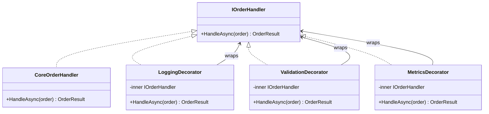

---
topic:
  - Software Architecture
subtopic:
  - Patterns
summary: "Decorator attaches responsibilities to an object dynamically by wrapping it in objects sharing the same interface, composable in any order."
level:
  - "3"
priority: High
status: Done
publish: true
---

Pizza toppings work as layers over one base. Each layer changes the result without changing the dough underneath, and different combinations can be assembled from the same pieces.

The Decorator pattern adds behavior by wrapping an object with another object that implements the same interface. A decorator keeps a reference to the wrapped component, delegates to it, and runs work before or after that call. Because the wrapper still satisfies the original contract, layers such as `LoggingHandler(ValidationHandler(MetricsHandler(CoreHandler)))` can be composed without changing the client. Order matters because each layer controls when delegation occurs.



> [!NOTE] Decorator vs Proxy
> Both wrap the same interface. Decorator adds behavior such as logging or validation. [[Home/Software Architecture/Patterns/Design Patterns/Structural/Proxy]] controls access to the real object through mechanisms such as authorization or lazy loading. Their structure can look identical. Intent separates them.

# Problem

`OrderProcessor.ProcessOrder()` has growing cross-cutting concerns mixed with core logic:

```csharp
public class OrderProcessor(
    IOrderRepository repository,
    ILogger<OrderProcessor> logger,
    IMetricsCollector metrics,
    IAuditLog auditLog)
{
    public async Task<OrderResult> ProcessOrderAsync(Order order)
    {
        // ⚠️ Logging, metrics, validation, and core logic all interleaved
        logger.LogInformation("Processing order {OrderId}", order.Id);
        var stopwatch = Stopwatch.StartNew();

        try
        {
            // ⚠️ Validation mixed with processing
            if (order.Items.Count == 0)
                throw new InvalidOperationException("Order has no items");
            if (order.Total <= 0)
                throw new InvalidOperationException("Order total must be positive");

            // ⚠️ Audit trail mixed with processing
            await auditLog.RecordAsync($"Order {order.Id} processing started by {order.Customer.Id}");

            var result = await repository.SaveAndProcessAsync(order);

            stopwatch.Stop();
            metrics.RecordOrderProcessingTime(stopwatch.ElapsedMilliseconds);
            logger.LogInformation("Order {OrderId} processed in {Ms}ms", order.Id, stopwatch.ElapsedMilliseconds);

            return result;
        }
        catch (Exception ex)
        {
            logger.LogError(ex, "Order {OrderId} processing failed", order.Id);
            metrics.RecordOrderFailure();
            throw;
        }
        // ⚠️ Adding a new concern (rate limiting, idempotency check) means editing this method
    }
}
```

Adding idempotency requires editing `ProcessOrderAsync`, where it can disturb unrelated processing concerns that already work.

# Solution

Move each concern into a decorator around the next handler:

```csharp
// Component interface
public interface IOrderHandler
{
    Task<OrderResult> HandleAsync(Order order);
}

// Core handler — pure business logic, no cross-cutting concerns
public class CoreOrderHandler(IOrderRepository repository) : IOrderHandler
{
    public Task<OrderResult> HandleAsync(Order order) =>
        repository.SaveAndProcessAsync(order);
}

// Decorator: validation
public class ValidationOrderHandler(IOrderHandler next) : IOrderHandler
{
    public async Task<OrderResult> HandleAsync(Order order)
    {
        // ✅ Validation isolated — can be tested independently
        if (order.Items.Count == 0)
            throw new InvalidOperationException("Order has no items");
        if (order.Total <= 0)
            throw new InvalidOperationException("Order total must be positive");

        return await next.HandleAsync(order); // ✅ delegates to next in chain
    }
}

// Decorator: logging
public class LoggingOrderHandler(IOrderHandler next, ILogger<LoggingOrderHandler> logger) : IOrderHandler
{
    public async Task<OrderResult> HandleAsync(Order order)
    {
        logger.LogInformation("Processing order {OrderId} for customer {CustomerId}",
            order.Id, order.Customer.Id);
        try
        {
            var result = await next.HandleAsync(order);
            logger.LogInformation("Order {OrderId} processed successfully", order.Id);
            return result;
        }
        catch (Exception ex)
        {
            logger.LogError(ex, "Order {OrderId} processing failed", order.Id);
            throw;
        }
    }
}

// Decorator: metrics
public class MetricsOrderHandler(IOrderHandler next, IMetricsCollector metrics) : IOrderHandler
{
    public async Task<OrderResult> HandleAsync(Order order)
    {
        var sw = Stopwatch.StartNew();
        try
        {
            var result = await next.HandleAsync(order);
            metrics.RecordOrderProcessingTime(sw.ElapsedMilliseconds);
            return result;
        }
        catch
        {
            metrics.RecordOrderFailure();
            throw;
        }
    }
}

public interface IIdempotencyStore
{
    // Atomically coordinates concurrent calls for the same key.
    Task<OrderResult> ExecuteOnceAsync(Guid key, Func<Task<OrderResult>> operation);
}

// ✅ Adding idempotency = new decorator class, zero changes to existing decorators
public class IdempotencyOrderHandler(IOrderHandler next, IIdempotencyStore store) : IOrderHandler
{
    public Task<OrderResult> HandleAsync(Order order) =>
        store.ExecuteOnceAsync(order.Id, () => next.HandleAsync(order));
}

// Composition — order matters: validation runs first, then idempotency, then logging, then metrics, then core
IOrderHandler handler =
    new ValidationOrderHandler(
        new IdempotencyOrderHandler(
            new LoggingOrderHandler(
                new MetricsOrderHandler(
                    new CoreOrderHandler(repository),
                    metrics),
                logger),
            idempotencyStore));

// With Scrutor (DI-based decoration):
builder.Services.AddScoped<IOrderHandler, CoreOrderHandler>();
builder.Services.Decorate<IOrderHandler, MetricsOrderHandler>();
builder.Services.Decorate<IOrderHandler, LoggingOrderHandler>();
builder.Services.Decorate<IOrderHandler, ValidationOrderHandler>(); // outermost = runs first
```

Idempotency now lives in one `IdempotencyOrderHandler`. Existing decorators and the core handler stay unchanged.

# Common .NET Examples

**A `Stream` chain** can layer buffering, encryption, or compression while every wrapper remains a `Stream`.

**ASP.NET Core middleware** composes delegates around the next `RequestDelegate`. Startup order determines request order and the reverse response path.

**`DelegatingHandler` in `HttpClient`** layers request and response behavior around an inner handler.

**Scrutor `Decorate<T>()`** registers a decorator around an existing service without manual object construction.

# Pitfalls

**Ordering changes behavior.** Validation outside logging rejects invalid orders before they are logged. Reversing those layers records every attempt. The composition root should make the chosen semantics visible.

**Deep wrapper stacks are harder to trace.** Each layer adds another frame and another place where control may stop before delegation. Correlation identifiers help reconstruct one request, but a long chain is still a design smell worth inspecting.

**Mutable state can leak between requests.** A singleton decorator must not carry request-specific fields. Its lifetime must be compatible with the wrapped service and every injected dependency.

# Tradeoffs

| Concern | Decorator chain | Monolithic method | AOP (PostSharp/Castle) |
|---|---|---|---|
| Adding a new concern | New class, zero changes | Edit existing method | New attribute/interceptor |
| Concern ordering | Explicit at composition | Implicit in method body | Framework-controlled |
| Testability | Each decorator tested independently | Must test all concerns together | Interceptors tested separately |
| Debuggability | Deep call stacks | Single method, easy to trace | Framework magic, hard to trace |
| Complexity | Many small classes | One large class | Framework dependency |

Decorator fits optional behaviors that share a contract and need explicit composition. One small concern may be clearer inside the component. A concern spanning every request usually belongs in middleware rather than in a decorator for each service.

# Questions

> [!QUESTION]- How does ASP.NET Core Middleware implement the Decorator pattern?
> Each middleware receives a `RequestDelegate` for the remaining pipeline. It can run logic before delegation, after delegation, or stop the chain. Startup composition fixes the wrapper order, so ordering mistakes appear as runtime behavior rather than type errors.

> [!QUESTION]- When should Decorator replace inheritance for added behavior?
> Decorator suits optional behavior assembled at composition time, especially around sealed or third-party types. Inheritance suits a stable subtype relationship. A decorator avoids coupling behavior to a base-class implementation, but introduces another object and call boundary.

> [!QUESTION]- What's the performance cost of a deep decorator chain?
> Each decorator adds a call boundary and may add asynchronous state-machine work if its method awaits. I/O usually dominates that cost. A CPU-bound hot path still deserves measurement. If wrapper overhead appears in profiles, collapsing layers on that path may be reasonable.

# References

- [Decorator pattern](https://refactoring.guru/design-patterns/decorator)
- [Decorator Pattern — Christopher Okhravi](https://www.youtube.com/watch?v=GCraGHx6gso&list=PLrhzvIcii6GNjpARdnO4ueTUAVR9eMBpc&index=3)
- [ASP.NET Core Middleware — Decorator pattern in the ASP.NET Core request pipeline](https://learn.microsoft.com/en-us/aspnet/core/fundamentals/middleware/)
- [DelegatingHandler — Decorator pattern in the HttpClient pipeline](https://learn.microsoft.com/en-us/dotnet/api/system.net.http.delegatinghandler)
