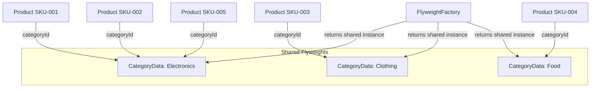

---
topic:
  - Software Architecture
subtopic:
  - Patterns
summary: "Flyweight cuts memory by sharing immutable intrinsic state across many fine-grained objects while callers pass unique extrinsic state."
level:
  - "1"
priority: High
status: Ready to Repeat
publish: true
---
A printing press uses shared letter stamps instead of casting a unique metal letter for every character in a book. The "A" stamp is reused thousands of times across every page — only its position (extrinsic state) changes. The shape of the letter (intrinsic state) is shared. Without this, printing a book would require millions of unique metal pieces instead of a few dozen reusable stamps.

The Flyweight pattern reduces memory usage by sharing common state across many fine-grained objects. It splits an object’s data into **intrinsic state** (shared, immutable — stored in the flyweight) and **extrinsic state** (unique per use — passed in by the caller). A flyweight factory returns the same instance for objects with identical intrinsic state. In an e-commerce catalog, 100,000 products might share only 50 category definitions — each product stores a category ID, not a full copy of tax rates, display rules, and shipping constraints.



# Problem

Each of 100,000 `Product` instances stores its own copy of category metadata — tax rates, display rules, shipping constraints — even though thousands of products share the same category:

```csharp
public class Product
{
    public Guid Id { get; set; }
    public string Sku { get; set; } = "";
    public decimal Price { get; set; }
    public int StockQuantity { get; set; }

    // ⚠️ These fields are identical for every product in the same category
    // 100,000 products × 3 categories = 100,000 copies of the same 3 objects
    public string CategoryName { get; set; } = "";
    public decimal TaxRate { get; set; }
    public string[] DisplayRules { get; set; } = [];
    public ShippingConstraints ShippingConstraints { get; set; } = null!;
    public string[] AllowedRegions { get; set; } = [];
}
```

Here's what breaks when requirements change: updating the tax rate for "Electronics" requires updating 40,000 `Product` instances in memory. A category rule change requires a full product reload.

# Solution

Extract shared category data into a flyweight. Products store only a category ID:

```csharp
// Flyweight — intrinsic state (shared, immutable)
public sealed class CategoryFlyweight
{
    public string Name { get; init; } = "";
    public decimal TaxRate { get; init; }
    public IReadOnlyList<string> DisplayRules { get; init; } = [];
    public ShippingConstraints ShippingConstraints { get; init; } = null!;
    public IReadOnlyList<string> AllowedRegions { get; init; } = [];
}

// Flyweight factory — returns the same instance for the same category
public class CategoryFlyweightFactory
{
    private readonly Dictionary<string, CategoryFlyweight> _cache = new();

    public CategoryFlyweight GetOrCreate(string categoryName, Func<CategoryFlyweight> factory)
    {
        if (!_cache.TryGetValue(categoryName, out var flyweight))
        {
            flyweight = factory();
            _cache[categoryName] = flyweight;
        }
        return flyweight; // ✅ same instance returned for all products in this category
    }
}

// Product — stores only extrinsic state (unique per product) + a reference to the flyweight
public class Product
{
    public Guid Id { get; set; }
    public string Sku { get; set; } = "";
    public decimal Price { get; set; }
    public int StockQuantity { get; set; }

    // ✅ One shared CategoryFlyweight instance per category, not per product
    public CategoryFlyweight Category { get; set; } = null!;

    // Convenience accessors — delegate to flyweight
    public decimal TaxRate => Category.TaxRate;
    public decimal PriceWithTax => Price * (1 + Category.TaxRate);
}

// Usage: 100,000 products share 3 CategoryFlyweight instances
var factory = new CategoryFlyweightFactory();
var electronicsCategory = factory.GetOrCreate("Electronics",
    () => new CategoryFlyweight { Name = "Electronics", TaxRate = 0.20m, /* ... */ });

var products = productData.Select(p => new Product
{
    Id = p.Id,
    Sku = p.Sku,
    Price = p.Price,
    Category = factory.GetOrCreate(p.CategoryName, () => LoadCategory(p.CategoryName))
}).ToList();
// ✅ Memory: 3 CategoryFlyweight objects instead of 100,000 copies
```

Updating the Electronics tax rate now means updating one `CategoryFlyweight` instance — all 40,000 electronics products reflect the change immediately.

# You Already Use This

**`string.Intern()`** — the CLR string intern pool is a Flyweight factory. `string.Intern("Electronics")` returns the same `string` instance for every call with the same value. Useful when the same string appears thousands of times (e.g., category names, status codes).

**`ArrayPool<T>` / `MemoryPool<T>`** — rent a buffer, use it, return it to the pool. The pool shares buffer instances across operations, avoiding repeated allocations. The rented buffer is the flyweight; the data written into it is the extrinsic state.

**`ObjectPool<T>` (ASP.NET Core)** — pools expensive-to-create objects (e.g., `StringBuilder`, regex matchers). The pooled object is the flyweight; the content processed by it is extrinsic.

# Tradeoffs

**Use it when**: you have a *very large* number of objects whose state cleanly splits into shared-immutable **intrinsic** state and per-instance **extrinsic** state, and memory (not CPU) is the bottleneck. The win scales with the duplication ratio — 100k products over 50 categories is a 2000× saving on that data.

**Don't reach for it when**: the object count is modest — the factory/indirection is premature optimization that buys nothing. It also **requires the shared state to be immutable**; sharing mutable intrinsic state means one caller's change silently affects thousands of others (a nasty class of bug). And if the state can't be split cleanly, the pattern doesn't apply.

**vs a cache**: both reuse instances, but a Flyweight specifically shares **immutable intrinsic** state to cut memory across many fine-grained objects, whereas a [[Home/Data Persistence/Caching|cache]] stores *any* expensive-to-recompute value for latency. In modern .NET you often get Flyweight for free — `string.Intern`, an interned `record`, or a small dictionary cache — without building an explicit factory.

# Questions

> [!QUESTION]- How do you identify intrinsic vs extrinsic state?
> Intrinsic state is the same for all objects in a group — it doesn't change based on context. Extrinsic state is unique per object or changes based on context. For `Product`: `TaxRate` is intrinsic (same for all Electronics); `Price` is extrinsic (unique per SKU). The test: if two objects can share a piece of state without one affecting the other, it's intrinsic. If sharing would cause one object's change to affect another, it's extrinsic. The tradeoff: the more state you classify as intrinsic, the more memory you save, but the flyweight becomes less flexible.

> [!QUESTION]- When is Flyweight not worth the complexity?
> When the memory savings are negligible relative to the system's total memory use, or when the shared objects are already small. Flyweight adds a factory, a cache, and the intrinsic/extrinsic split — meaningful complexity. Profile first: if 100,000 products each hold a 50-byte category struct, that's 5MB — probably not worth the pattern. If each holds a 10KB category object with images and rules, that's 1GB — Flyweight is justified. The signal: memory profiler shows many identical large objects.

# References

- [Flyweight — refactoring.guru](https://refactoring.guru/design-patterns/flyweight) — canonical pattern description with intrinsic/extrinsic state diagram and C# example
- [`ArrayPool<T>` — Microsoft Learn](https://learn.microsoft.com/en-us/dotnet/api/system.buffers.arraypool-1) — .NET's built-in Flyweight for buffer reuse
- [`ObjectPool<T>` — Microsoft Learn](https://learn.microsoft.com/en-us/dotnet/api/microsoft.extensions.objectpool.objectpool-1) — ASP.NET Core object pooling (Flyweight for expensive objects)
- [string.Intern — Microsoft Learn](https://learn.microsoft.com/en-us/dotnet/api/system.string.intern) — CLR string intern pool as a Flyweight factory
