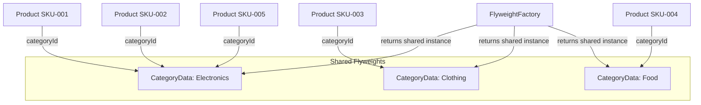

---
topic:
  - Software Architecture
subtopic:
  - Patterns
summary: "Flyweight cuts memory by sharing immutable intrinsic state across many fine-grained objects while callers pass unique extrinsic state."
level:
  - "1"
priority: High
status: Ready to Repeat
publish: true
---

A printing press reuses one letter stamp at many positions on a page. The glyph shape stays the same. Position changes with each impression. Sharing the stable part avoids manufacturing a separate stamp for every character occurrence.

The Flyweight pattern reduces memory use by sharing intrinsic state across many fine-grained objects. Intrinsic state belongs to the reusable flyweight and should be immutable. Extrinsic state belongs to one use and is supplied by the caller. A factory or interning table returns the same flyweight for equal intrinsic state. In a catalog with 100,000 products and 50 category definitions, products can reference shared category data instead of copying it into every instance.


```mermaid
flowchart TD
    subgraph Shared Flyweights
        Electronics["CategoryData: Electronics"]
        Clothing["CategoryData: Clothing"]
        Food["CategoryData: Food"]
    end
    P1["Product SKU-001"] -->|categoryId| Electronics
    P2["Product SKU-002"] -->|categoryId| Electronics
    P3["Product SKU-003"] -->|categoryId| Clothing
    P4["Product SKU-004"] -->|categoryId| Food
    P5["Product SKU-005"] -->|categoryId| Electronics
    FlyweightFactory -->|returns shared instance| Electronics
    FlyweightFactory -->|returns shared instance| Clothing
    FlyweightFactory -->|returns shared instance| Food
```

# Problem

Each of 100,000 `Product` instances stores its own copy of category metadata, even though thousands of products share the same category:

```csharp
public class Product
{
    public Guid Id { get; set; }
    public string Sku { get; set; } = "";
    public decimal Price { get; set; }
    public int StockQuantity { get; set; }

    // ⚠️ These fields are identical for every product in the same category
    // 100,000 products × 3 categories = 100,000 copies of the same 3 objects
    public string CategoryName { get; set; } = "";
    public decimal TaxRate { get; set; }
    public string[] DisplayRules { get; set; } = [];
    public ShippingConstraints ShippingConstraints { get; set; } = null!;
    public string[] AllowedRegions { get; set; } = [];
}
```

Updating the Electronics tax rate now means touching 40,000 `Product` instances in memory. A category-rule change can require reloading the full product set.

# Solution

Extract category data into shared flyweights. Each product keeps its unique state and a reference to the category object:

```csharp
// Deeply immutable intrinsic state. Strings and nested record fields cannot be mutated in place.
public sealed record ShippingConstraints(decimal MaxWeightKg, bool RequiresSignature);

public sealed record CategoryFlyweight(
    string Name,
    decimal TaxRate,
    string DisplayRules,
    ShippingConstraints ShippingConstraints,
    string AllowedRegions);

// Flyweight factory — returns the same instance for the same category
public class CategoryFlyweightFactory
{
    private readonly Dictionary<string, CategoryFlyweight> _cache = new();

    public CategoryFlyweight GetOrCreate(string categoryName, Func<CategoryFlyweight> factory)
    {
        if (!_cache.TryGetValue(categoryName, out var flyweight))
        {
            flyweight = factory();
            _cache[categoryName] = flyweight;
        }
        return flyweight; // ✅ same instance returned for all products in this category
    }
}

// Product — stores only extrinsic state (unique per product) + a reference to the flyweight
public class Product
{
    public Guid Id { get; set; }
    public string Sku { get; set; } = "";
    public decimal Price { get; set; }
    public int StockQuantity { get; set; }

    // ✅ One shared CategoryFlyweight instance per category, not per product
    public CategoryFlyweight Category { get; set; } = null!;

    // Convenience accessors — delegate to flyweight
    public decimal TaxRate => Category.TaxRate;
    public decimal PriceWithTax => Price * (1 + Category.TaxRate);
}

// Usage: 100,000 products share 3 CategoryFlyweight instances
var factory = new CategoryFlyweightFactory();
var electronicsCategory = factory.GetOrCreate("Electronics",
    () => new CategoryFlyweight(
        Name: "Electronics",
        TaxRate: 0.20m,
        DisplayRules: "Featured",
        ShippingConstraints: new ShippingConstraints(25m, RequiresSignature: false),
        AllowedRegions: "US,CA"));

var products = productData.Select(p => new Product
{
    Id = p.Id,
    Sku = p.Sku,
    Price = p.Price,
    Category = factory.GetOrCreate(p.CategoryName, () => LoadCategory(p.CategoryName))
}).ToList();
// ✅ Memory: 3 CategoryFlyweight objects instead of 100,000 copies
```

With immutable flyweights, a tax-rate change is applied by replacing the shared category entry and rebuilding or redirecting references as the model permits. Mutating one shared instance would make the change visible everywhere, but it would also break the immutability rule that keeps shared state safe.

# Common .NET Examples

**`string.Intern()`** is a direct Flyweight example. The CLR intern pool returns one canonical string instance for equal values. Explicit interning trades duplicate strings for a pool entry that can live for the lifetime of the process.

**`ArrayPool<T>` / `MemoryPool<T>`** also reuse objects, but they implement Object Pool semantics rather than Flyweight. A caller temporarily owns a mutable buffer and returns it after use. A flyweight is shared concurrently as intrinsic state.

**`ObjectPool<T>` in ASP.NET Core** has the same distinction. It recycles mutable objects between borrowers instead of sharing one immutable value among many owners.

# Tradeoffs

**Use it when:** a large object population duplicates substantial immutable state and memory profiles show that duplication matters. The saving grows with the ratio between object instances and distinct intrinsic values.

**Skip it when:** the population is modest, shared state is tiny, or the state cannot be split cleanly. Factory lookup and indirection are real costs. Mutable intrinsic state is worse: one write silently changes the view observed by many owners.

**Compared with a cache:** both retain values for reuse. Flyweight specifically shares immutable intrinsic state to reduce duplication across many objects. A [[Home/Data Persistence/Caching|cache]] retains values primarily to avoid repeated retrieval or computation. A small interning dictionary is often enough. A named factory hierarchy adds little.

# Questions

> [!QUESTION]- When is Flyweight not worth the complexity?
> It is not worth using when duplicate state is a small part of the process heap or object counts stay low. A memory profiler should show many equal, retained objects before the model is split. The factory and lookup path otherwise add complexity without relieving a measured constraint.

# References

- [Flyweight pattern](https://refactoring.guru/design-patterns/flyweight)
- [`ArrayPool<T>` — .NET's built-in Flyweight for buffer reuse](https://learn.microsoft.com/en-us/dotnet/api/system.buffers.arraypool-1)
- [`ObjectPool<T>` — ASP.NET Core object pooling (Flyweight for expensive objects)](https://learn.microsoft.com/en-us/dotnet/api/microsoft.extensions.objectpool.objectpool-1)
- [string.Intern — CLR string intern pool as a Flyweight factory](https://learn.microsoft.com/en-us/dotnet/api/system.string.intern)
