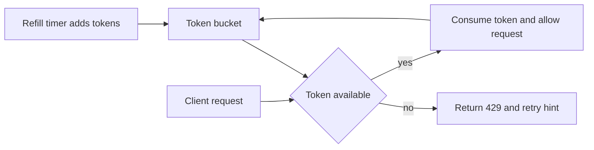

---
topic:
  - Software Architecture
subtopic:
  - Patterns
summary: "Caps how many requests a client can make in a period so one caller cannot exhaust shared resources."
priority: High
publish: true
level:
  - "3"
status: Done
---

Rate limiting caps how much work a caller may start during a defined interval. The limit protects shared capacity and keeps metered work predictable, especially LLM inference and embedding calls billed per request or token. In a system design discussion, it is best treated as admission control: well-behaved tenants keep usable latency when traffic spikes or one client misbehaves. Public APIs, multi-tenant services, and endpoints that fan out to costly dependencies are common boundaries.

One .NET system may enforce separate limits at the edge gateway, the application tenant boundary, and the external provider. Each layer answers a different ownership question. The chosen algorithm then sets burst behavior, state cost, and fairness.

# What the Limit Protects

- Reliability: shields thread pools, DB connections, and downstream APIs from overload.
- Cost control: caps spend for metered dependencies such as LLM completions and vector search.
- Fairness: prevents a noisy tenant from starving others in shared infrastructure.
- Throttling signal: `429 Too Many Requests` signals throttling, and `Retry-After` supplies a retry time when present.

# Core Algorithms
## Token Bucket

Token bucket maintains a bucket with capacity `B` tokens. Tokens are added at a refill rate `R` over time, and each request consumes one or more tokens. If tokens are available, the request is allowed. If not, it is rejected or queued.

A token bucket holds sustained throughput near `R` while allowing a short burst up to `B`. That behavior fits public APIs and AI inference endpoints where tenants need brief spikes without unbounded sustained load. The policy maps cleanly to requirements such as "N requests per second with burst M."

The cost is per-key state: the current token count and last refill time. A distributed implementation must update refill and consumption atomically.



## Sliding Window Log

Sliding window log stores timestamps of recent requests per key and removes entries older than the window size. A new request is allowed only if the count of timestamps in the active window is below the limit.

The log gives an exact count for every rolling interval and avoids fixed-window boundary artifacts. That precision costs memory and writes because every accepted request adds a timestamp, then later cleanup removes it.

It fits low-to-moderate traffic and quotas where approximation is unacceptable. High-cardinality, high-throughput systems usually pay too much for the exactness.

## Sliding Window Counter

Sliding window counter approximates rolling windows using two adjacent fixed buckets (current and previous), then weights the previous bucket based on elapsed time. It estimates requests in the active rolling window without storing every timestamp.

This counter uses less memory than a timestamp log and behaves more fairly than a fixed window. The estimate can drift near bucket boundaries, and the weighted calculation is slightly harder to implement.

It is a practical default for high-throughput or distributed APIs that need near-rolling accuracy without storing every request.

## Fixed Window Counter

Fixed window tracks a simple counter per key for each discrete window (for example, one minute). Counter resets when the window changes.

Fixed windows are cheap to store and easy to operate. Their hard reset creates the central weakness: a client may spend the full quota at the end of one window and again at the start of the next, producing a burst close to twice the configured rate.

That tradeoff is often acceptable for predictable internal traffic or an early implementation where simple operation matters more than smooth edge behavior.

# Quick Comparison

| Algorithm | Burst support | Accuracy | Memory cost | Operational complexity | Typical fit |
| --- | --- | --- | --- | --- | --- |
| Fixed Window | Poor at edges | Low to medium | Low | Low | Simple internal quotas |
| Sliding Window Log | Limited by policy | High | High | Medium | Strict fairness and auditability |
| Sliding Window Counter | Medium | Medium to high | Medium | Medium | Balanced general purpose API limits |
| Token Bucket | Strong and controlled | Medium to high | Medium | Medium | Public APIs and tenant burst tolerance |

# ASP.NET Core Example
ASP.NET Core provides rate-limiting middleware through `Microsoft.AspNetCore.RateLimiting`. Policies are registered with `AddRateLimiter`, then attached globally or per endpoint.

```csharp
using System.Globalization;
using System.Threading.RateLimiting;
using Microsoft.AspNetCore.RateLimiting;

var builder = WebApplication.CreateBuilder(args);

builder.Services.AddRateLimiter(options =>
{
    options.RejectionStatusCode = StatusCodes.Status429TooManyRequests;
    options.OnRejected = (context, _) =>
    {
        if (context.Lease.TryGetMetadata(MetadataName.RetryAfter, out var retryAfter))
        {
            context.HttpContext.Response.Headers.RetryAfter =
                Math.Ceiling(retryAfter.TotalSeconds).ToString(CultureInfo.InvariantCulture);
        }

        return ValueTask.CompletedTask;
    };

    options.AddFixedWindowLimiter("fixed-global", limiterOptions =>
    {
        limiterOptions.PermitLimit = 100;
        limiterOptions.Window = TimeSpan.FromMinutes(1);
        limiterOptions.QueueLimit = 0;
        limiterOptions.AutoReplenishment = true;
    });

    options.AddTokenBucketLimiter("token-global", limiterOptions =>
    {
        limiterOptions.TokenLimit = 200;
        limiterOptions.TokensPerPeriod = 20;
        limiterOptions.ReplenishmentPeriod = TimeSpan.FromSeconds(1);
        limiterOptions.QueueLimit = 0;
        limiterOptions.AutoReplenishment = true;
    });
});

var app = builder.Build();

app.UseRateLimiter();

app.MapGet("/api/public", () => Results.Ok("ok"))
   .RequireRateLimiting("token-global");

app.MapGet("/api/admin", () => Results.Ok("ok"))
   .RequireRateLimiting("fixed-global");

app.Run();
```

## Per Tenant Partitioning
Multi-tenant APIs should partition by tenant or API key rather than IP address alone. `PartitionedRateLimiter` gives each key separate limiter state.

```csharp
using System.Threading.RateLimiting;

builder.Services.AddRateLimiter(options =>
{
    options.GlobalLimiter = PartitionedRateLimiter.Create<HttpContext, string>(httpContext =>
    {
        var tenantId = httpContext.User.FindFirst("tenant_id")?.Value;

        if (string.IsNullOrWhiteSpace(tenantId))
        {
            tenantId = "anonymous";
        }

        return RateLimitPartition.GetTokenBucketLimiter(
            partitionKey: tenantId,
            factory: _ => new TokenBucketRateLimiterOptions
            {
                TokenLimit = 120,
                TokensPerPeriod = 60,
                ReplenishmentPeriod = TimeSpan.FromMinutes(1),
                QueueLimit = 0,
                AutoReplenishment = true
            });
    });
});
```

The partition key is part of the domain model. A tenant key usually aligns B2B SaaS limits with fairness and billing. It must come from an authenticated claim, API key, or gateway-verified header that external traffic cannot forge. Anonymous public APIs need a server-derived fallback such as a fixed anonymous bucket or a deliberately chosen network key. Raw IP alone groups unrelated users behind NAT, while arbitrary request headers let callers mint new quota partitions.

# Distributed Rate Limiting
In-memory limiter state belongs to one process. Behind a load balancer, each instance sees only part of the traffic, so a "100 req/min" policy can become roughly `100 x instance_count` without shared state.

Single-instance in-memory:

- Lowest latency and simplest operations.
- Acceptable for monoliths or when a single gateway instance enforces limits.
- Not accurate when requests are distributed across replicas.

Redis-backed distributed counters:

- Shared state across all instances for accurate global enforcement.
- Typical patterns: atomic `INCR` with expiry for fixed windows, Lua script for token bucket, sorted sets for sliding log.
- For sliding window counters, `MULTI`/`EXEC` can atomically group bucket reads and increments, but strict allow/deny decisions are safer in one Lua script (or `WATCH` plus retry) to avoid race conditions.

Remote state puts the limiter backend on the request path. Its outage behavior must be explicit: availability-sensitive consumer traffic may fail open, while security-sensitive or high-cost operations may need to fail closed.

```text
# Simplified Redis transaction pattern for sliding window buckets
MULTI
INCR rl:tenant:{tenantId}:bucket:{currentBucket}
EXPIRE rl:tenant:{tenantId}:bucket:{currentBucket} 120
GET rl:tenant:{tenantId}:bucket:{previousBucket}
EXEC
```

# Pitfalls
## 1) Fixed Window Boundary Spike

With a limit of 100/minute, a client can send 100 requests at 12:00:59 and another 100 at 12:01:00. Hard counter resets permit 200 requests in two seconds. Token bucket or sliding window counter avoids that edge behavior.

## 2) Wrong Partition Key

An IP address rarely matches quota ownership. Shared NAT can throttle many legitimate users together, while an attacker rotates addresses. API key, tenant, user, or a deliberate composite key should match the identity or billing unit that owns the quota.

## 3) Clock Skew in Distributed Limiters

Window calculations become inconsistent when hosts disagree on the current time. Centralizing time decisions in Redis scripts removes cross-host disagreement from the allow/deny path. NTP still matters, and client-provided timestamps must never drive enforcement.

## 4) Missing Response Metadata

A bare `429` gives a client no safe retry time, so blind retries can add more load. Include `Retry-After` and useful quota metadata such as `X-RateLimit-Remaining`, `X-RateLimit-Limit`, and `X-RateLimit-Reset`.

# References

- [Rate limiting in ASP.NET Core](https://learn.microsoft.com/aspnet/core/performance/rate-limit)
- [Scaling your API with rate limiters](https://stripe.com/blog/rate-limiters)
- [Cloudflare rate limiting rules](https://developers.cloudflare.com/waf/rate-limiting-rules/)
