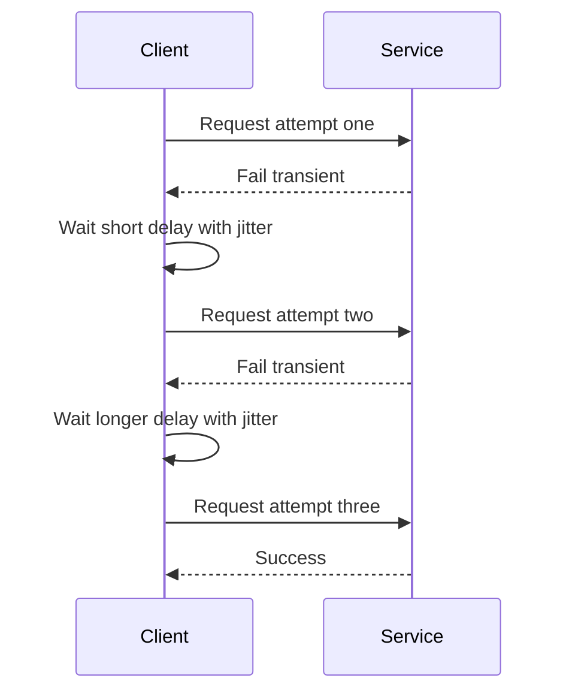

---
topic:
  - Software Architecture
subtopic:
  - Patterns
summary: "Defensive strategies that re-attempt transient failures and bound how long a call may wait before failing."
level:
  - "3"
priority: High
status: Ready to Repeat
publish: true
---

Retries repeat operations after plausibly transient failures. Timeouts bound how long each attempt, or the whole operation, may occupy caller capacity. Distributed systems regularly encounter brief network loss, DNS failures, overload, and cold-start latency that clears within seconds. A missing retry turns those faults into unnecessary failures. A missing timeout lets one hung dependency hold connection slots until latency collapses upstream.

Most request-response boundaries need both controls, including HTTP APIs, message brokers, databases, and caches. Streaming and long-running background work need explicit deadline ownership with different retry budgets. Modern .NET applications usually compose these strategies with Polly v8 through `Microsoft.Extensions.Http.Resilience`.

# Retry Mechanism

## Retry Strategies

- `Immediate retry`: run the next attempt with no delay. Useful only for very short transient blips.
- `Fixed delay`: wait the same interval each time. Simple and predictable, but can still synchronize clients.
- `Exponential backoff`: increase wait duration after each failure to reduce pressure on an unhealthy dependency.
- `Exponential backoff with jitter`: add randomization to each delay so clients do not retry in lockstep.

Linear and exponential describe how the base delay grows between attempts. Jitter describes the randomness applied around that base. A fixed one-second delay randomized to `0.8`, `1.1`, and `1.3` seconds is fixed backoff with jitter, not linear backoff. Exponential backoff with jitter is the usual fleet-safe default, but it still needs a maximum attempt count, maximum delay, and total deadline.

## Why Jitter Matters

If 10,000 clients fail together and retry after exactly 200 ms, then 400 ms, then 800 ms, they create synchronized spikes while the dependency is still weak. Jitter spreads those arrivals across time and gives the service room to recover.

## Exponential Backoff Formula

The formula below is only a conceptual model for exponential backoff:

```text
delay grows exponentially from a base value and jitter randomizes each attempt
```

Polly v8 exponential retry with `UseJitter = true` uses decorrelated jitter, so its documentation defines the exact delay behavior. In practice, a small `baseDelay` plus capped delay and attempts must fit inside the latency SLO.

## Max Retry Attempts

User-facing request paths need a strict retry cap. A long-running background worker may retry indefinitely only when cancellation, a maximum delay, and monitoring can stop an unhealthy loop.

## What to Retry

An operation is retryable only when it can be replayed and the failure is plausibly transient. Connection resets, temporary DNS failures, and per-attempt timeouts can qualify. An uncertain timeout is different: the server may already have completed the work.

## HTTP Retry Policy

HTTP method semantics set the starting point, but the endpoint's actual behavior decides whether another attempt is safe:

- `GET`, `HEAD`, `OPTIONS`, and `TRACE` are defined as safe and idempotent. A retry still depends on the API honoring those semantics and the request being replayable.
- `PUT` and `DELETE` are idempotent by specification, but a retry can repeat logging, billing, or other incorrectly attached side effects. The concrete endpoint remains authoritative.
- `POST` and `PATCH` are not idempotent by default. Retry them only with an idempotency key or another server-side deduplication contract whose retention exceeds the retry window.
- `408 Request Timeout` can be retried on a new connection when the request is replayable. `425 Too Early` can be retried after avoiding early data. `429 Too Many Requests` should respect `Retry-After` and the caller's deadline.
- `502 Bad Gateway`, `503 Service Unavailable`, and `504 Gateway Timeout` often represent transient gateway or availability failures, but retry only within a bounded budget. Respect `Retry-After` on `503`.
- Treat `500 Internal Server Error` as endpoint-specific. A deterministic server bug will not improve on retry. Do not retry `400`, `401`, `403`, `404`, validation failures, or other permanent outcomes unless that API documents a transient meaning.

One layer should own retries for a call path. The remaining deadline and attempt budget must cross service boundaries, while telemetry records effective attempts per original request. Otherwise three attempts at two nested services can turn one request into nine downstream calls.

## Retry Flow



# Timeout and Deadline Boundary

A timeout limits how long one operation may wait. A deadline fixes the latest completion time for the whole operation. Every retry must reuse that deadline. Fresh timeouts at each attempt or downstream hop silently expand the end-to-end latency budget.

## Budget Model

For a two-second request budget with at most two dependency attempts:

- Reserve 200 ms for response serialization and network return.
- Give each dependency attempt at most 700 ms.
- Stop before another attempt when the remaining deadline cannot cover the attempt plus backoff.
- Propagate cancellation so database, HTTP, and broker calls stop consuming resources after the caller no longer needs the result.

Per-attempt timeout without an overall deadline can still exceed the user budget across retries. An overall deadline without a per-attempt timeout lets the first hung call consume the entire budget.

## Deadline Propagation in .NET

```csharp
public sealed class PricingClient(HttpClient httpClient)
{
    public async Task<decimal> GetPriceAsync(
        Guid productId,
        CancellationToken deadlineToken)
    {
        using var attempt = CancellationTokenSource.CreateLinkedTokenSource(deadlineToken);
        attempt.CancelAfter(TimeSpan.FromMilliseconds(700));

        using var response = await httpClient.GetAsync(
            $"/prices/{productId}",
            attempt.Token);

        response.EnsureSuccessStatusCode();
        return await response.Content.ReadFromJsonAsync<decimal>(attempt.Token);
    }
}
```

```csharp
app.MapGet("/quotes/{productId:guid}", async (
    Guid productId,
    PricingClient pricing,
    CancellationToken requestAborted) =>
{
    using var deadline = CancellationTokenSource.CreateLinkedTokenSource(requestAborted);
    deadline.CancelAfter(TimeSpan.FromSeconds(2));

    var price = await pricing.GetPriceAsync(productId, deadline.Token);
    return Results.Ok(new { productId, price });
});
```

The endpoint owns the overall budget, while `PricingClient` creates a shorter linked token for one attempt. gRPC can carry the deadline so the server receives the remaining budget. With HTTP APIs, cancellation stays local unless the protocol and service contract carry a deadline explicitly. A downstream service cannot treat a TCP disconnect as a reliable budget signal.

A retry starts only when the remaining budget covers both backoff and another attempt. Cancellation does not prove that a downstream write rolled back, so uncertain writes still require an idempotency contract.

# .NET Implementation

This Polly v8 pipeline puts a total timeout outside bounded exponential retry with jitter, then applies a per-attempt timeout inside. It retries a replayable `GET` and honors a valid `Retry-After`. `HttpClient.Timeout` is disabled so two timeout mechanisms do not compete.

```csharp
using Microsoft.Extensions.Http.Resilience;
using Polly;
using Polly.Retry;
using Polly.Timeout;

builder.Services.AddHttpClient<InventoryClient>(client =>
{
    client.BaseAddress = new Uri("https://inventory.internal/");
    client.Timeout = Timeout.InfiniteTimeSpan;
})
.AddResilienceHandler("inventory", pipeline =>
{
    pipeline.AddTimeout(TimeSpan.FromSeconds(8));

    pipeline.AddRetry(new RetryStrategyOptions<HttpResponseMessage>
    {
        MaxRetryAttempts = 3,
        Delay = TimeSpan.FromMilliseconds(200),
        BackoffType = DelayBackoffType.Exponential,
        UseJitter = true,
        ShouldHandle = new PredicateBuilder<HttpResponseMessage>()
            .Handle<HttpRequestException>()
            .Handle<TimeoutRejectedException>()
            .HandleResult(response => response.StatusCode is
                System.Net.HttpStatusCode.RequestTimeout or
                System.Net.HttpStatusCode.TooManyRequests or
                System.Net.HttpStatusCode.BadGateway or
                System.Net.HttpStatusCode.ServiceUnavailable or
                System.Net.HttpStatusCode.GatewayTimeout),
        DelayGenerator = static args =>
        {
            var retryAfter = args.Outcome.Result?.Headers.RetryAfter;
            var delay = retryAfter?.Delta;

            if (delay is null && retryAfter?.Date is { } date)
            {
                delay = date - DateTimeOffset.UtcNow;
            }

            return ValueTask.FromResult<TimeSpan?>(
                delay > TimeSpan.Zero ? delay : null);
        }
    });

    pipeline.AddTimeout(TimeSpan.FromSeconds(2));
});
```

Returning `null` from `DelayGenerator` lets Polly use exponential backoff with jitter when the response has no valid `Retry-After`. The caller's cancellation token and total deadline still win, so a delay cannot exceed the remaining request budget. The pipeline belongs only on methods the dependency treats as replayable. A `POST` needs server-side deduplication whose retention exceeds the retry window.

# Integration with Other Resilience Patterns

The pipeline order below runs from outermost to innermost:

1. `Total timeout` outermost to cap full operation time.
2. `Fallback` after inner strategies fail to provide degraded response.
3. `Retry` to absorb short transient failures.
4. `Circuit Breaker` to fast-fail during sustained instability.
5. `Per-attempt timeout` innermost to cap single attempt duration.

Use this pipeline together with [[Home/Software Architecture/Patterns/Resilience Patterns/Circuit Breaker]] and [[Home/Software Architecture/Patterns/Resilience Patterns/Rate Limiting]] to protect both dependency health and caller latency.

# Pitfalls

## Retrying Non Idempotent Operations

A timed-out write may have completed even though its response never arrived. Retrying it can create a duplicate order or payment. Write APIs need an idempotency key or another server-side deduplication contract before they are safe to replay.

## No Jitter in Backoff

Deterministic delays synchronize retries across instances and regions. The resulting spikes extend the outage. Jitter, exponential backoff, and a capped attempt count spread the pressure and bound it.

## Missing Timeout Boundary

A hung dependency can hold connection slots for minutes when no timeout exists. A per-attempt timeout bounds one call. An overall timeout keeps retries inside the service latency SLO. Both boundaries matter once retries are present.

## Retry Amplification across Layers

Independent retry loops multiply. Three attempts in service A and three in service B can produce nine calls into service C for one original request. One layer should own retries, with a shared end-to-end attempt budget and propagated deadline.

# Tradeoffs

| Strategy | Benefit | Cost | Use when |
| --- | --- | --- | --- |
| Immediate retry | Lowest added latency for short glitches | Highest risk of immediate re-pressure on unstable dependency | Failure is likely a one off transport hiccup and dependency is lightly loaded |
| Fixed delay retry | Simple predictable behavior | Can still synchronize clients and recover slowly under heavy contention | Straightforward behavior and moderate traffic |
| Exponential backoff with jitter | Best protection against retry storms and downstream overload | Higher implementation complexity and longer tail latency on repeated failures | Dependency instability is common and fleet size is large |
| Per-attempt timeout only | Prevents single attempt hang | Total operation can still run too long across retries | No retries; only the individual call needs a bound |
| Per-attempt plus overall timeout | Bounds both attempt and end to end latency | Requires careful budget tuning between layers | Retries or multi-hop calls with strict SLO targets |

Exponential backoff with jitter and both timeout boundaries form a sensible default. Attempt counts and time budgets then follow observed latency percentiles and downstream error rates.

# References

- [HTTP resilience in .NET](https://learn.microsoft.com/dotnet/core/resilience/http-resilience)
- [Exponential Backoff and Jitter](https://aws.amazon.com/blogs/architecture/exponential-backoff-and-jitter/)
- [RFC 9110: HTTP Semantics](https://www.rfc-editor.org/info/rfc9110/)
- [gRPC deadlines](https://grpc.io/docs/guides/deadlines/)
