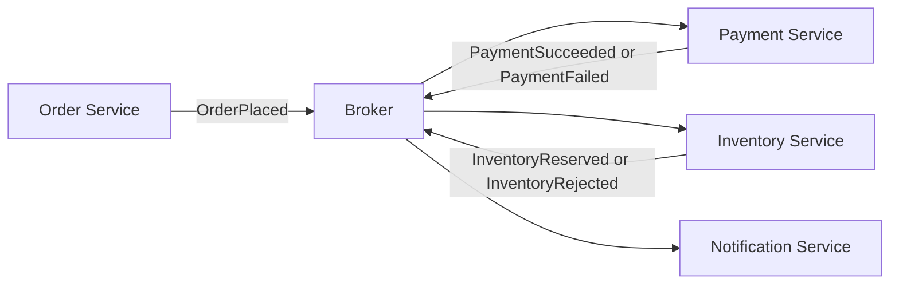
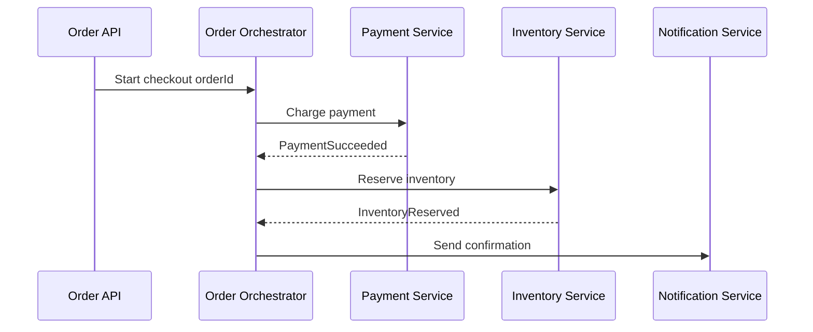

---
topic:
  - Software Architecture
subtopic:
  - System Architecture
summary: "A style where services communicate by publishing and consuming events instead of calling each other directly."
level:
  - "2"
priority: High
status: Done

publish: true
---
Event-Driven Architecture (EDA) is a style where components publish facts such as `OrderPlaced`, `PaymentFailed`, or `InventoryReserved`, and consumers react without the producer naming them directly. It reduces temporal coupling when reactions can happen asynchronously. Event-driven components commonly coexist with synchronous APIs for queries and decisions that need an immediate answer.

In interview terms: EDA is not "just using a queue". It is a contract-driven communication model where events represent state changes, subscribers own their reaction logic, and consistency is typically eventual rather than immediate.

Durable cross-process EDA usually uses [[Home/Software Architecture/Distributed Systems/Message Queues/Message Queues|messaging]] or a retained log, but a broker is not definitional. In-process event dispatch, database change streams, and HTTP webhooks can also carry events with different durability and coupling contracts.

# Core Concepts

## Event Types

**Domain Event**

- Describes something meaningful that happened inside a bounded context.
- Produced by domain logic because business state changed.
- Examples: `InvoiceIssued`, `OrderConfirmed`, `CustomerUpgradedToPremium`.
- Scope: primarily internal to the service/domain, though some may later be promoted externally.

**Integration Event**

- A stable, explicit contract published for other services to consume.
- Usually emitted after local transaction success and often via an outbox/publisher pipeline.
- Examples: `OrderPlacedIntegrationEvent`, `PaymentCapturedIntegrationEvent`.
- Scope: cross-service communication. Versioning and backward compatibility matter.

**Event Notification**

- Lightweight signal saying "something changed", often with minimal payload (ID + timestamp + type).
- Consumers fetch full state separately when needed.
- Example: `CatalogItemChanged { ItemId, ChangedAt }`.
- Scope: low payload fan-out scenarios, cache invalidation, or trigger-based processing.

## Difference at a Glance

| Type | Primary purpose | Payload style | Typical audience |
| --- | --- | --- | --- |
| Domain Event | Capture domain fact | Rich domain data | Same bounded context |
| Integration Event | Cross-service contract | Stable DTO contract | Other services |
| Event Notification | Signal change happened | Minimal metadata | Many listeners that re-query |

Practical rule: model domain events first, then map only the externally relevant subset into integration events.

# Patterns

## Choreography

In choreography, each service reacts to events independently. No central coordinator tells services what to do next.



Use when teams want autonomy and workflows can be decomposed into independent reactions.

## Orchestration

In orchestration, a central component (process manager/saga orchestrator) directs the workflow and issues commands.



Use when workflow visibility, explicit state handling, and compensation logic are first-class requirements.

## Tradeoffs

- **Choreography**: looser coupling and easier service autonomy, but harder to trace global flow and reason about emergent behavior as subscriptions grow.
- **Orchestration**: clearer process control, easier audit/debug per workflow instance, but introduces a central dependency that can become a bottleneck or single point of operational complexity.

# .NET messaging boundary

A broker can deliver an integration event only after the producer places it on the transport. Saving business state and publishing in two independent operations leaves a failure gap: the database can commit while the publish fails. A transactional outbox stores the business change and outgoing message through the same local `DbContext` transaction, then a delivery service forwards it to the broker.

```csharp
public sealed record OrderPlacedIntegrationEvent(
    Guid EventId,
    Guid OrderId,
    Guid CustomerId,
    decimal Total,
    DateTime OccurredAtUtc);
```

```csharp
builder.Services.AddMassTransit(bus =>
{
    bus.AddEntityFrameworkOutbox<OrdersDbContext>(outbox =>
    {
        outbox.UsePostgres();
        outbox.UseBusOutbox();
    });

    bus.UsingRabbitMq((context, rabbit) =>
        rabbit.ConfigureEndpoints(context));
});
```

With `UseBusOutbox`, a scoped `IPublishEndpoint` captures the event in `OrdersDbContext`; one `SaveChangesAsync` commits the order and outbox row together. Broker delivery happens afterward and can retry without losing the event.

Consumers face the inverse gap: a handler can commit its business change and crash before acknowledging the message. Configure the Entity Framework consumer outbox so inbox state and the consumer's changes share a local transaction. Put a unique constraint on the business idempotency key as well, such as one `PaymentIntent` per `OrderId`; inbox state suppresses redelivery of one message identity, while the domain constraint protects the invariant if the same fact arrives under another identity.

```csharp
bus.AddConsumer<OrderPlacedConsumer>();
bus.AddEntityFrameworkOutbox<BillingDbContext>(outbox =>
    outbox.UsePostgres());

rabbit.ReceiveEndpoint("billing-order-placed", endpoint =>
{
    endpoint.UseEntityFrameworkOutbox<BillingDbContext>(context);
    endpoint.ConfigureConsumer<OrderPlacedConsumer>(context);
});
```

| Failure | Durable state | Recovery |
| --- | --- | --- |
| Process stops before producer save | Neither order nor message committed | Client may retry with an idempotency key |
| Process stops after producer save | Order and outbox row committed | Outbox delivery service publishes later |
| Broker redelivers after consumer commit | Consumer change and inbox state committed | Duplicate delivery is suppressed |
| Consumer permanently rejects schema or data | Message remains unprocessed | Dead-letter with alert and replay procedure |

The outbox closes a local database-to-broker gap. It does not turn the broker and every downstream database into one global exactly-once transaction.

# Governance and data pipelines

![[System Design 101/f24452c55f5c2b1ab8dd95a948c020cece30080b79520b91667967513014c20e.png]]

The governance visual is one organization-specific topology. The reusable boundary is centralized compatibility and telemetry guardrails with domain-owned event meaning:

- **Registry:** schema versions, owner, compatibility mode, lifecycle, and data classification.
- **SDK:** a narrow paved road for envelopes, trace context, serialization, and telemetry without hiding broker semantics.
- **Gateway:** optional ingress for authentication, quotas, and routing; internal producers do not all need an extra hop.
- **Domain ownership:** producers own event meaning and availability; the platform owns guardrails and shared infrastructure.
- **Regional isolation:** replication declares lag, ordering, conflict, residency, and failover behavior.

For `MenuItemPriceChanged`, the Restaurant domain owns semantics and its producer SLO. CI checks the schema against the registry. Regional brokers keep local consumers running during a remote outage; a global consumer accepts delayed and duplicate replicated events. [[Home/Software Architecture/Distributed Systems/Event Schema Evolution]] covers compatibility across retained messages and independently deployed consumers.

![[System Design 101/95696d28879b34b489342eb0f5aabbfa21c5929f6a13785fe1ea91712ad2dac8.png]]

The pipeline visual names conceptual stages; real batch and streaming paths can combine or skip them. Trace `checkout-42` through the reusable stages:

1. **Collect:** checkout emits an event ID, trace ID, schema ID, tenant, and event time.
2. **Ingest:** the broker assigns partition and offset and exposes lag.
3. **Store:** object storage writes immutable raw records partitioned by event date and schema version.
4. **Compute:** a stateful job checkpoints offsets and derives `DailyRevenue`; malformed records enter an owned quarantine path.
5. **Consume:** warehouse and alerting outputs declare separate freshness and correctness SLOs.

Preserve source event IDs in derived records and publish lineage from input dataset through job to output. Low broker lag does not prove a warehouse table is fresh or correct. "Exactly once" must name a boundary: a stream processor may atomically checkpoint input offsets and write one managed sink, while an external email or payment call remains at-least-once and needs idempotency.
# Pitfalls

## 1) Event Ordering

- **What goes wrong**: consumers may process `OrderCancelled` before `OrderPlaced` (or receive updates in different order across partitions/queues).
- **Why**: distributed brokers and parallel consumers do not guarantee global ordering.
- **Mitigation**: design handlers for per-aggregate ordering where needed (partition by aggregate key), include version/sequence in events, and detect stale events.

## 2) Idempotency

- **What goes wrong**: duplicate delivery causes duplicate side effects (double charge, duplicate email, repeated inventory decrement).
- **Why**: at-least-once delivery is common in real systems.
- **Mitigation**: use deterministic idempotency keys (`EventId`), store processed-message fingerprints, and make state transitions conditional.

## 3) Event Schema Evolution

- **What goes wrong**: a producer ships a breaking payload change and multiple consumers fail.
- **Why**: integration events are shared contracts with independent deployment cycles.
- **Mitigation**: version events, evolve contracts backward-compatibly (additive first), and validate in contract tests before release.

## 4) Distributed Flow Debugging

- **What goes wrong**: incidents are hard to reconstruct across many async hops.
- **Why**: no single request thread shows full workflow.
- **Mitigation**: propagate correlation/causation IDs, instrument with OpenTelemetry traces/metrics/logs, and keep searchable event audit logs.

# Questions

> [!QUESTION]- When would you choose orchestration over choreography in an event-driven workflow?
> Orchestrate when the workflow is long-running and needs real ordering or compensation — a checkout that charges payment, reserves inventory, then ships. A central process manager keeps that flow easy to follow and roll back, at the cost of one more component that can bottleneck. Choreography fits loosely-related reactions, like "order placed" fanning out to email, analytics, and search: autonomous and decoupled, but no single place knows the whole story, so tracing gets harder as subscriptions grow. Rule of thumb — orchestrate transactions you must reason about end to end; choreograph independent reactions.

> [!QUESTION]- How do you evolve integration event contracts without breaking consumers?
> Treat the event as a public API — other teams deploy against it on their own schedule. Keep changes additive; never rename or drop a field in place. For a genuine breaking change, version it (`OrderPlaced.v2`) and publish both through a migration window until consumers move over. Consumer-driven contract tests in CI catch regressions before release, and deserialization-failure metrics surface a bad change in minutes. The mindset that keeps you safe: an event schema is a long-lived contract, not an internal DTO you can refactor freely.

> [!QUESTION]- How do you process events reliably under at-least-once delivery?
> Duplicates and reordering are normal, so consumers need durable idempotency keys and conditional state changes. An outbox closes the local database-to-publish gap; per-key partitioning plus sequence numbers protects scoped order. An exactly-once claim is valid only for an explicit transactional boundary, such as a processor atomically checkpointing offsets and writing one supported sink. External calls still need their own idempotency contract.

# References

- [Martin Fowler - What do you mean by Event-Driven?](https://martinfowler.com/articles/201701-event-driven.html) — distinguishes event notification, event-carried state transfer, Event Sourcing, and event-driven processing.
- [Microsoft Learn - Asynchronous messaging options](https://learn.microsoft.com/azure/architecture/guide/technology-choices/messaging) — requirements-based selection across queues, publish/subscribe, streams, and managed services.
- [Microsoft Learn - Event-driven architecture style](https://learn.microsoft.com/azure/architecture/guide/architecture-styles/event-driven) — official components, benefits, constraints, and delivery considerations.
- [Microsoft Learn - Competing consumers pattern](https://learn.microsoft.com/azure/architecture/patterns/competing-consumers) — official parallel-consumption and ordering tradeoffs.
- [MassTransit Documentation](https://masstransit.io/) — official .NET bus, consumer, saga, outbox, and transport guidance.
- [Cloud Design Patterns - Idempotent Consumer](https://learn.microsoft.com/azure/architecture/patterns/idempotent-consumer) — official duplicate-safe consumer state pattern.
- [Particular Blog - Banish ghost messages and zombie records from your web tier](https://particular.net/blog/transactional-session) — practitioner account of atomic database/message session boundaries.
- [AsyncAPI specification](https://www.asyncapi.com/docs/reference/specification/latest) — contract format for channels, messages, operations, and reusable schemas in event-driven systems.
- [CloudEvents specification](https://github.com/cloudevents/spec/blob/main/cloudevents/spec.md) — CNCF event-envelope attributes for portable identity, source, type, time, and data references.
- [Apache Flink checkpointing](https://nightlies.apache.org/flink/flink-docs-stable/docs/ops/state/checkpoints/) — official recovery boundary for stateful stream-processing jobs.
- [OpenLineage specification](https://openlineage.io/docs/spec/) — open model for connecting datasets, jobs, and runs across a data pipeline.
- [MassTransit transactional outbox](https://masstransit.io/documentation/patterns/transactional-outbox) - Bus outbox and consumer outbox behavior with Entity Framework Core.
- [MassTransit Entity Framework outbox](https://masstransit.io/documentation/configuration/middleware/outbox) - Storage configuration, delivery service, and inbox state.
- [Transactional Outbox pattern](https://microservices.io/patterns/data/transactional-outbox.html) - Failure gap closed by persisting messages with local business state.
- [Idempotent Consumer pattern](https://microservices.io/post/microservices/patterns/2020/10/16/idempotent-consumer.html) - Why at-least-once delivery requires durable duplicate handling.

## ByteByteGo provenance

- [McDonald's event-driven architecture](https://github.com/ByteByteGoHq/system-design-101/blob/b28380a4710c5ec9638ec037d4168e288f334cba/data/guides/mcdonald%27s-event-driven-architecture.md) — editorial lead for the registry, SDK, gateway, domain, and regional governance case.
- [Data pipelines overview](https://github.com/ByteByteGoHq/system-design-101/blob/b28380a4710c5ec9638ec037d4168e288f334cba/data/guides/data-pipelines-overview.md) — provenance for the conceptual pipeline stages and record trace.
