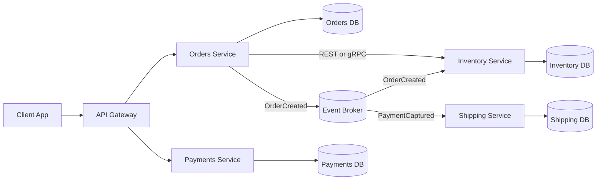

---
topic:
  - Software Architecture
subtopic:
  - System Architecture
summary: "A style splitting a system into independently deployable services, each aligned to a business capability and owning its own data."
level:
  - "3"
priority: Medium
status: Done

publish: true
---

Microservices divide a system into services that can be changed and deployed independently. Each service owns a business capability and the data behind it. The useful boundary is deployment independence: separate processes alone do not make a microservice architecture.

This style starts paying for itself when teams block one another's releases or parts of the system need sharply different scaling and availability. It also moves work out of the compiler and into production. Network latency, partial failure, asynchronous consistency, and a larger operational surface become everyday design constraints.

# Core Principles

- **Boundaries follow business capabilities.** Orders, Inventory, Billing, and Shipping are plausible boundaries because each contains its own rules and language.
- **Data has one owner.** A service controls its schema and persistence model. Other services use its contract instead of reading its tables. Separate database servers are optional. Exclusive ownership is not.
- **Integration happens through contracts.** Versioned APIs and events carry data across boundaries. Shared libraries stay small enough that one team's release cannot force another's.
- **Deployment is independent.** A service can ship, roll back, and scale without coordinating a full-system release.
- **Governance stays thin.** Platform standards cover cross-cutting concerns while teams retain control of domain choices.

# Communication Patterns

A synchronous call fits a decision that must complete before the caller can continue. [[Home/Networks/Protocols/REST]] and [[Home/Networks/Protocols/gRPC]] both serve that case. Keep the path short. A chain such as `A -> B -> C -> D` adds every dependency's latency and gives each failure another route back to the client.

[[Home/Software Architecture/Distributed Systems/Message Queues/Message Queues|Message Queues]] and [[Home/Software Architecture/System Architecture/Event-Driven Architecture]] fit work that can continue later. An immutable `OrderPlaced` event can start reservation or notification work after the request has returned. Consumers still need idempotency because a broker may redeliver a message after an uncertain acknowledgement.

The boundary is the business decision. Use a direct call when an immediate answer is part of that decision. Publish a fact when independent work can happen afterward.

# Implementation and Operations

An independently deployable service can run in a container, virtual machine, managed application platform, or function service. Docker and Kubernetes are delivery choices, not defining properties of microservices.

Each service needs a small operating contract:

- an owner and escalation path.
- supported API or event versions, plus the build artifact and rollback procedure.
- service-level indicators with alert thresholds.
- correlation across logs, metrics, traces, synchronous calls, and messages.
- request deadlines, bounded retries, circuit breaking, and load shedding.
- audited configuration and secret delivery.
- datastore ownership, migration order, backup, and restore evidence.

A platform should make these basics cheap without forcing one topology onto every service. A low-volume internal API can run on App Service. A partitioned consumer fleet may justify Kubernetes, while a scheduled job can remain a managed container task.

Kubernetes supplies declarative rollout, service discovery, probes, and resource controls. It cannot supply correct service boundaries or safe database migrations. Resource requests should come from measurements. Disruption budgets come from the required availability. Readiness should report whether this instance can serve traffic. If every pod fails readiness during a shared database outage, the cluster removes all routes even though another pod cannot improve the result.

# Microservices vs. Monolith vs. Modular Monolith

| Dimension | [[Home/Software Architecture/System Architecture/Monolith Architecture\|Monolith]] | [[Home/Software Architecture/System Architecture/Modular Monolith]] | Microservices |
|---|---|---|---|
| Deployments | Single unit | Single unit with strict module boundaries | Independent service deployments |
| Team model | Shared ownership | Team ownership by module | Team ownership by service |
| Data model | Shared database | Shared database with modular access rules | Database per service |
| Runtime calls | In-process | In-process | Network calls |
| Operational complexity | Low | Low to medium | High |
| Best fit | Small team, early product | Growing product, clear domains, limited ops capacity | Large org, high release velocity, independent scaling needs |

[[Home/Software Architecture/System Architecture/Monolith Architecture]] is usually the safest starting point while domain boundaries are still moving. It keeps refactoring local and failure modes visible. Distribution can wait until a real constraint appears.

# Migration Boundary

A migration should remove a measured constraint. Moving the same coupling across a network only makes it harder to see. A good first candidate has clear ownership, isolatable data, and release or scaling pressure that already costs the organization. The most central workflow is usually a poor first extraction because it hides the most dependencies and makes rollback hardest.

## Staged Extraction

1. **Measure the pressure.** Record deployment wait time, change collisions, uneven load, and incidents caused by the candidate boundary.
2. **Create an in-process seam.** Put the capability behind a contract inside the monolith and block direct table or internal-code access.
3. **Assign data ownership.** Move writes behind that contract. Replace cross-boundary joins with explicit queries, replicated read models, or events.
4. **Introduce the remote implementation.** Route a controlled cohort through HTTP, gRPC, or messaging while keeping the old path available.
5. **Prove independent operation.** Deploy and roll back the service alone, exercise dependency failure, and verify traces and alerts.
6. **Retire the old path.** Remove duplicate code and tables only after traffic, reconciliation, and rollback windows show the new owner is stable.

This is a strangler migration. The replacement grows around a working system, one boundary at a time.

## Extraction Gate

`Billing` is ready to leave `Orders` when it owns payment-intent state behind a versioned contract, Orders has stopped touching Billing tables, and either side can release alone. Its outage policy must be explicit: Orders rejects, queues, or degrades. Trace and causation identifiers connect the request to later messages, and reconciliation catches orders whose payment state does not converge. Until those conditions hold, the boundary belongs in-process.

## Data Migration

Prefer one writer during transition:

1. Backfill the new store from a consistent snapshot.
2. Capture later changes through an outbox or change-data-capture stream.
3. Compare counts and business invariants between stores.
4. Route reads to the new owner for a small cohort.
5. Switch writes only when lag is zero and rollback can replay the retained change stream.
6. Stop the old writer, then remove its tables after the recovery window.

Uncontrolled dual writes create two sources of truth. If a transition cannot avoid them, name the authoritative store and build reconciliation before the first production write.

## Migration Evidence

| Claim | Evidence before extraction | Evidence after extraction |
| --- | --- | --- |
| Faster delivery | Candidate changes wait on shared pipeline | Service releases without monolith release |
| Independent scaling | Candidate saturates while rest is idle | Service scales without multiplying whole app |
| Better isolation | Candidate incidents affect whole deploy | Failure drill contains impact at contract boundary |
| Clear ownership | Multiple teams modify same internals | One team owns contract, data, SLO, and pager |

Stop when the next candidate lacks a measurable constraint. One monolith beside a few services can be a stable architecture. The visuals below show Airbnb's historical migration rather than a universal sequence.

![[Software Architecture/Software Architecture-Microservices-18120000-3.png]]

Airbnb's multi-year evolution shows services being extracted as organizational and scaling pressure appeared. It does not support a target service count.

![[Software Architecture/Software Architecture-Microservices-18120000-4.jpg]]

Its later use of both microservices and larger macroservices shows that service size should follow ownership and change coupling.

# Boundaries and Delivery Independence

A service boundary is credible only when one team can change and operate it without a lockstep release. Shared writable tables or paired deployments create a distributed monolith even when the processes run separately. A mandatory synchronous chain can do the same.

![[Software Architecture/Software Architecture-Microservices-18120000.png]]

This capability map is a menu. Gateways and meshes answer specific operating needs. Containers and separate databases do not create sound domain boundaries by themselves.

![[Software Architecture/Software Architecture-Microservices-18120000-2.png]]

Ownership and explicit failure behavior are the baseline. Cross-boundary telemetry shows whether those promises hold once requests and messages leave a process.

# Production Platform Capabilities Are Conditional

![[Software Architecture/Software Architecture-Microservices-18120000-1.png]]

The pictured components answer observed failure modes or platform constraints. None is a prerequisite for a microservice architecture.

# Workflow Ownership: Orchestration versus Choreography

Workflow ownership crosses service boundaries. For `Charge -> Reserve -> Ship`, [[Home/Software Architecture/Distributed Systems/Orchestration|orchestration]] gives one durable process manager responsibility for incomplete state and compensation. For `OrderPlaced -> email + analytics + search indexing`, [[Home/Software Architecture/Distributed Systems/Choreography|choreography]] lets independent services react without inventing a coordinator that makes no business decision. A single workflow can use both: orchestrate the transaction, then publish facts for unrelated reactions.

# When Microservices Are the Wrong Fit

A modular monolith fits better while domain boundaries change weekly, one team owns the product, and deployments do not block delivery. It is also the honest choice when the team cannot support distributed tracing, on-call ownership, or asynchronous consistency. Microservices replace some compile-time coupling with network and operational coupling. Coordination never disappears for free.

A useful stop rule is simple. If extracting `Catalog` creates its own pipeline, datastore, dashboard, pager, and compatibility contract while releases remain coordinated with the monolith, the extraction has bought cost without independence. Restore the in-process boundary and wait for the constraint to change.

# Pitfalls

**Distributed monolith.** Processes are separate, but shared tables and lockstep releases keep them coupled. Splitting by technical layer often causes this shape. Business boundaries, exclusive data ownership, and short call paths make independence testable.

**Partial business state.** One service commits before another fails. Distributed ACID protocols such as two-phase commit can coordinate supported resources, though they add coupling and difficult recovery. Most workflows instead use local transactions, an outbox, idempotent consumers, and compensation.

**Operational overload.** Every service adds a build, deployment surface, dependencies, telemetry, and an on-call burden. A platform can standardize the common path, but it cannot erase that cost. Too many small services make incidents a graph traversal exercise.

**Retry storms.** Network calls fail slowly and sometimes ambiguously. Deadlines limit the wait. Bounded retries with jitter avoid synchronized pressure. Circuit breakers and backpressure stop a struggling dependency from pulling the rest of the system down.

# Questions

> [!QUESTION]- Why do microservices create distributed data consistency problems, and what keeps a cross-service workflow reliable?
> Each service commits its own data, so a cross-service workflow cannot rely on one local ACID transaction. One service may commit successfully and a later step may fail. The workflow is usually split into local transactions connected by a saga. Outbox and inbox patterns make message transfer recoverable, and idempotent handlers make redelivery safe.
>
> If a completed step must be reversed, the saga runs a business compensation where that is possible. Its state must remain visible so the system can keep retrying, finish later, or wait for manual repair instead of leaving partial work hidden.

> [!QUESTION]- What architecture usually fits a new product, and what evidence would justify moving to microservices?
> The starting point is the release and ownership constraint, not a preferred topology. One team still discovering the domain usually gets the fastest feedback from a monolith. A modular monolith keeps changes and transactions in-process while enforcing domain boundaries.
>
> Microservices become justified when a stable boundary repeatedly needs independent deployment or scaling, and the team can own the added operational cost. Until that pressure is measured, distribution adds network and data-consistency problems without buying real independence.

> [!QUESTION]- What evidence shows that an extracted service is independent rather than part of a distributed monolith?
> - Its team can change, deploy, roll back, and operate it without a paired release.
> - It owns its writable data and exposes a versioned contract. Dependency failure behavior is defined and exercised.
> - Traces and reconciliation prove that synchronous calls and later messages can be followed across the boundary.

# References

- [Microservices](https://martinfowler.com/articles/microservices.html)
- [.NET microservices architecture guide](https://learn.microsoft.com/en-us/dotnet/architecture/microservices/)
- [Building Microservices, Second Edition](https://samnewman.io/books/building_microservices_2nd_edition/)
- [Decompose by business capability](https://microservices.io/patterns/decomposition/decompose-by-business-capability.html)
