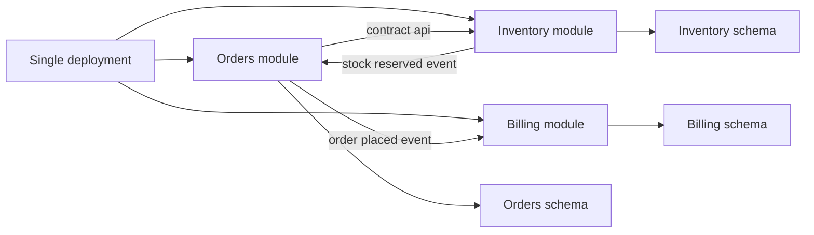

---
topic:
  - Software Architecture
subtopic:
  - System Architecture
summary: "A single deployable application intentionally split into strict modules with explicit boundaries, gaining microservices benefits without the distributed systems tax."
level:
  - "3"
priority: High
status: Ready to Repeat
publish: true
---

A modular monolith keeps one process and one deployment while dividing the codebase into modules that own distinct business capabilities. It captures much of what teams want from [[Home/Software Architecture/System Architecture/Microservices]]: clearer ownership and safer parallel change, without turning every boundary into a network call. For most growing products, that is the sensible default. Strengthen boundaries inside the application first. Distribute a module only when delivery, scaling, or isolation pressure justifies the operating cost.

# Enforcing Module Boundaries In-Process
Each module owns its domain model, application behavior, persistence, and public contract. Code outside the module sees only that contract.

- **Code boundary**: contracts such as commands, events, DTOs, and interfaces live in a small contracts assembly. Another module cannot reference internal domain or infrastructure types.
- **Data boundary**: each table has one owner. Separate `DbContext` types and schemas make ownership visible, while direct cross-module reads remain forbidden.
- **Runtime boundary**: communication stays in process while the modules share a deployment. A future move to HTTP, gRPC, or messaging changes latency, failure, and transaction semantics even if the application-facing interface keeps the same shape.

But a contracts assembly does not enforce any of this by itself. Project references, architecture tests, and database permissions must make boundary violations harder than using the published contract.



> [!IMPORTANT]
> **Data isolation makes the transaction boundary visible.** Separate `DbContext` types or schemas can still share one local ACID transaction when they use the same relational database, connection, and provider transaction. Once modules use separate databases or a broker, that guarantee ends. Each module must commit locally and publish through an outbox or another durable handoff.

# .NET Implementation

Separate projects give the compiler and architecture tests something concrete to reject:

```text
src/
  Modules/
    Orders/
      Orders.Contracts/
      Orders.Core/
      Orders.Infrastructure/
    Inventory/
      Inventory.Contracts/
      Inventory.Core/
      Inventory.Infrastructure/
  Host/
  Shared.Kernel/
```

`Orders.Core` may reference `Inventory.Contracts`. References to `Inventory.Core` or `Inventory.Infrastructure` are boundary violations. The contracts assembly stays narrow:

```csharp
namespace Inventory.Contracts;

public sealed record ReserveStockRequest(
    Guid ProductId,
    int Quantity,
    Guid OrderId);

public sealed record ReserveStockResult(bool Success, string? FailureCode);

public interface IInventoryGateway
{
    Task<ReserveStockResult> ReserveAsync(
        ReserveStockRequest request,
        CancellationToken cancellationToken);
}
```

The Orders handler depends on that contract instead of Inventory internals:

```csharp
public interface IUnitOfWork
{
    Task<T> ExecuteAsync<T>(
        Func<CancellationToken, Task<T>> operation,
        CancellationToken cancellationToken);
}

public sealed class PlaceOrderHandler(
    IInventoryGateway inventory,
    IOrderRepository orders,
    IUnitOfWork unitOfWork)
{
    public Task<Result> HandleAsync(
        PlaceOrderCommand command,
        CancellationToken cancellationToken)
    {
        if (command.Quantity <= 0)
        {
            return Task.FromResult(Result.Failure("orders.invalid_quantity"));
        }

        return unitOfWork.ExecuteAsync(async transactionToken =>
        {
            var reservation = await inventory.ReserveAsync(
                new ReserveStockRequest(
                    command.ProductId,
                    command.Quantity,
                    command.OrderId),
                transactionToken);

            if (!reservation.Success)
            {
                return Result.Failure(
                    reservation.FailureCode ?? "inventory.unavailable");
            }

            await orders.AddAsync(
                Order.Create(command.OrderId, command.CustomerId),
                transactionToken);

            return Result.Success();
        }, cancellationToken);
    }
}
```

This example assumes `ExecuteAsync` saves every participating context and commits the shared local transaction. `AddAsync` alone only stages the order. If Inventory moves behind a network boundary, the handler must become a durable workflow with idempotent reservation and compensation. The local unit of work can no longer cover both modules.

## Module-owned Registration

Each infrastructure assembly owns its persistence registration and migrations history. The host composes modules through their registration methods and does not reach into domain or persistence types.

```csharp
public static class InventoryModuleExtensions
{
    public static IServiceCollection AddInventoryModule(
        this IServiceCollection services,
        IConfiguration configuration)
    {
        var connectionString = configuration.GetConnectionString("Application")
            ?? throw new InvalidOperationException(
                "Connection string 'Application' is required.");

        services.AddDbContext<InventoryDbContext>(options =>
            options.UseNpgsql(
                connectionString,
                postgres => postgres.MigrationsHistoryTable(
                    "__EFMigrationsHistory",
                    "inventory")));

        services.AddScoped<IInventoryGateway, InventoryGateway>();
        services.AddScoped<IInventoryRepository, InventoryRepository>();

        return services;
    }
}
```

```csharp
var builder = WebApplication.CreateBuilder(args);

builder.Services.AddOrdersModule(builder.Configuration);
builder.Services.AddInventoryModule(builder.Configuration);

var app = builder.Build();
app.MapOrdersEndpoints();
app.Run();
```

## Shared Transaction when the Resource is Shared

Two `DbContext` instances can commit atomically when they share the same open relational connection and provider transaction:

```csharp
await using var connection = new NpgsqlConnection(connectionString);
await connection.OpenAsync(cancellationToken);

var ordersOptions = new DbContextOptionsBuilder<OrdersDbContext>()
    .UseNpgsql(connection)
    .Options;

var inventoryOptions = new DbContextOptionsBuilder<InventoryDbContext>()
    .UseNpgsql(connection)
    .Options;

await using var orders = new OrdersDbContext(ordersOptions);
await using var inventory = new InventoryDbContext(inventoryOptions);
await using var transaction = await orders.Database.BeginTransactionAsync(
    cancellationToken);

await inventory.Database.UseTransactionAsync(
    transaction.GetDbTransaction(),
    cancellationToken);

orders.Orders.Add(order);
inventory.Reservations.Add(reservation);

await orders.SaveChangesAsync(cancellationToken);
await inventory.SaveChangesAsync(cancellationToken);
await transaction.CommitAsync(cancellationToken);
```

Different schemas do not block the transaction because PostgreSQL is still one transactional resource. Move either module to another database or broker and the shared commit disappears. The local change should then include an outbox record, while the cross-module workflow exposes its asynchronous state instead of hiding it behind a method call.

# Extraction Path to Microservices

Good module boundaries reduce the amount of code touched during extraction. They do not make extraction transparent. A contract such as `IInventoryGateway` may preserve the use-case shape, but the network boundary changes the design:

1. Put deadlines and cancellation on remote requests, then decide what callers do when Inventory is slow or unavailable.
2. Retry only idempotent operations. Carry an idempotency key when duplicate execution is possible, and cap retries so a partial outage does not become a retry storm.
3. Propagate trace context and measure dependency latency, errors, saturation, and retries before traffic moves.
4. Replace the process-wide transaction with local commits plus an outbox. Longer workflows may also need compensation or a saga.
5. Move owned data through an explicit migration with backfill, reconciliation, rollback, and any required dual-read or dual-write window.

The interface may look familiar, but its contract now includes partial failure and eventual consistency. Module ownership narrows the migration surface. It cannot make a remote operation behave like a local method call.

# Collocation and Scale Cases

Collocation pays when work changes together, scales together, and moves a large amount of intermediate data. Prime Video's monitoring team reported that moving one tightly ordered video-analysis pipeline into a single process removed remote orchestration and transfer costs. That result belongs to the workload. It is not a blanket argument against services.

Stack Overflow's documented 2016 architecture shows another shape. Its stateless application tier scaled horizontally, with SQL Server, Redis, and search kept as specialized systems. The useful lesson is not the server count. A modular deployment can carry substantial load when request paths and database limits are understood and enough failure headroom remains.

These cases test the boundary decision. Keep modules together while their changes and scaling remain coupled. Extract only when independent deployment, stronger failure isolation, or asymmetric scaling repeatedly pays for the new network boundary.

# Pitfalls

- **Boundary erosion**: direct table reads or internal project references turn modules into folders. Architecture tests should fail the build when a shortcut crosses the contract.
- **Shared database coupling**: one database can preserve local ACID transactions, but shared tables and unowned migrations still couple modules. Give each module a schema and `DbContext`, then exchange data through contracts or events.
- **Premature partitioning**: unstable domain boundaries create constant churn. Start with a few bounded contexts and split when ownership or scaling evidence makes the seam durable.

# Tradeoffs

| Criterion | Traditional Monolith | Modular Monolith | Microservices |
|---|---|---|---|
| Deployment | Single unit | Single unit | Independent service deployments |
| Team model | Shared ownership across codebase | Ownership by module with explicit contracts | Ownership by service with strong autonomy |
| Data isolation | Usually shared schema and shared table access | Isolated schema or strict table ownership per module | Database per service with hard isolation |
| Runtime overhead | Lowest in process calls | Low in process calls plus boundary discipline | Highest due to network calls and resilience layers |
| Operational complexity | Low | Low to medium | High observability platform and deployment orchestration needs |
| Extraction cost | High if internals are tangled | Medium: contracts reduce code churn, but remote failure semantics and data migration remain | Not applicable: already extracted |

Default to a modular monolith for a product that needs durable boundaries but can still ship as one unit. A traditional monolith is enough for a small or short-lived system. Microservices earn their cost when independent deployment, isolation, or scaling repeatedly blocks delivery.

# Questions

> [!QUESTION]- When is a modular monolith a better fit than microservices, and what signals justify extracting a module?
> A modular monolith fits while business domains stay cleanly separated into modules and one deployment remains reliable. Extraction becomes worthwhile when one module repeatedly needs its own scaling, release cadence, or isolation policy. The domain contract can remain familiar, but the remote interaction must be redesigned around deadlines, retries, observability, and local transactions.

# References

- [Modular Monolith with DDD](https://github.com/kgrzybek/modular-monolith-with-ddd)
- [Modular Monolith: A Primer](https://www.kamilgrzybek.com/blog/posts/modular-monolith-primer)
