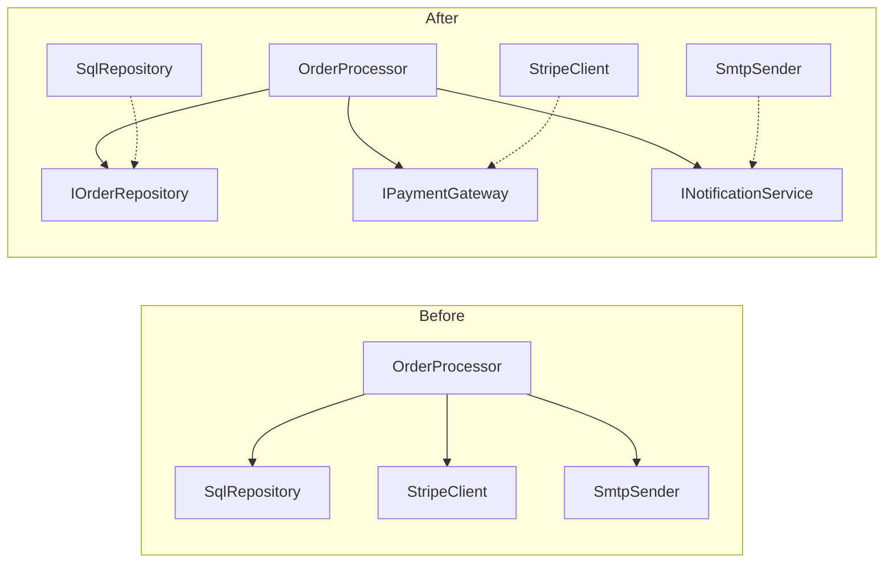

---
topic:
  - Software Design
subtopic:
  - Principles
summary: "Five design principles governing how classes relate and where new behavior goes."
level:
  - "4"
priority: High
status: Ready to Repeat
publish: true
---

# SOLID Principles

SOLID is a mnemonic for five design principles that govern how classes relate to each other — who knows about whom, who changes when, and where new behavior gets added. Think of a large enterprise codebase as a city: SOLID principles are zoning laws that prevent a chemical factory from opening next to a kindergarten. Violating them does not cause an immediate explosion — it causes slow rot where tests require 14 dependencies, features take two sprints because one change breaks three classes, and onboarding stretches to months because every file does four unrelated things.

## S — Single Responsibility Principle

**One class, one reason to change.** "Reason to change" means one actor or stakeholder whose requirements drive modifications to that class.

Imagine a Swiss Army knife. It has a blade, a screwdriver, a corkscrew, and a toothpick. Handy for camping — terrible for a professional kitchen. A chef needs a proper knife that does one thing excellently. SRP says: build chef's knives, not Swiss Army knives.

When a class serves multiple actors, a change requested by one actor can silently break behavior relied upon by another. The `OrderService` below handles order persistence, email notifications, and invoice PDF generation — three actors (the warehouse team, the marketing team, the finance team) whose requirements change on different schedules.

**Violation — one class, three actors:**

```csharp
// ⚠️ Three reasons to change: persistence logic, email templates, PDF formatting
public class OrderService
{
    private readonly ShopDbContext _db;
    private readonly SmtpClient _smtp;
    public OrderService(ShopDbContext db, SmtpClient smtp) { _db = db; _smtp = smtp; }

    public async Task PlaceOrderAsync(Order order)
    {
        // Actor 1: warehouse — storage rules
        order.Status = OrderStatus.Placed;
        _db.Orders.Add(order);
        await _db.SaveChangesAsync();

        // Actor 2: marketing — email content and design
        var body = $"<h1>Thank you, {order.Customer.Name}</h1>";
        await _smtp.SendMailAsync(new MailMessage("noreply@shop.com",
            order.Customer.Email, "Order Confirmed", body));

        // Actor 3: finance — invoice format, tax rules
        var pdf = GenerateInvoicePdf(order);
        await File.WriteAllBytesAsync($"invoices/{order.Id}.pdf", pdf);
    }

    private byte[] GenerateInvoicePdf(Order order) =>
        Encoding.UTF8.GetBytes($"INVOICE #{order.Id}\n{order.Customer.Name}\nTotal: {order.Total:C}");
}
```

Marketing wants to redesign the confirmation email. A developer adds the customer's shipping address to the template — `order.Customer.ShippingAddress.City` — but digital-only orders have a null `ShippingAddress`. The `NullReferenceException` fires *after* `SaveChangesAsync` completes: the order is persisted and the customer is charged, but the confirmation email never sends. The bug originates in marketing's email template, but it breaks the warehouse workflow because operators rely on confirmation emails to start packing.

**Fix — each actor gets its own class:**

```csharp
// ✅ Each class changes for exactly one actor
public class OrderRepository
{
    private readonly ShopDbContext _db;
    public OrderRepository(ShopDbContext db) => _db = db;
    public async Task SaveAsync(Order order)
    {
        order.Status = OrderStatus.Placed;
        _db.Orders.Add(order);
        await _db.SaveChangesAsync();
    }
}

public class OrderConfirmationMailer
{
    private readonly SmtpClient _smtp;
    public OrderConfirmationMailer(SmtpClient smtp) => _smtp = smtp;
    public async Task SendAsync(Order order) =>
        await _smtp.SendMailAsync(BuildMessage(order));
    private MailMessage BuildMessage(Order order) =>
        new("noreply@shop.com", order.Customer.Email, "Order Confirmed",
            $"<h1>Thank you, {order.Customer.Name}</h1><p>Order #{order.Id}</p>");
}

public class InvoiceGenerator
{
    public byte[] Generate(Order order) =>
        Encoding.UTF8.GetBytes($"Invoice #{order.Id} | {order.Customer.Name} | {order.Total:C}");
}
```

**Why breaking SRP hurts you:** Every bug fix and feature request requires reading and understanding code that has nothing to do with the change. Test setup explodes — testing email logic requires mocking the database. Deployment risk compounds — a finance-team invoice format change forces redeploying the entire order pipeline.

**Detection:** If describing a class requires the word "and" ("it saves orders *and* sends emails *and* generates invoices"), it has multiple responsibilities. If two different teams file tickets that touch the same class, SRP is violated.

## O — Open/Closed Principle

**Open for extension, closed for modification.** Add new behavior by adding new code — not by editing existing code that already works.

Think of a power strip. When you buy a new appliance, you plug it into an open socket. You do not rewire the strip's internals. The strip is *closed* for modification (its wiring is fixed) but *open* for extension (new plugs fit existing sockets).

The problem surfaces when behavior selection lives inside a method as branching logic. Every new variant forces modifying the same method, retesting all existing branches, and risking regressions in paths that were working fine.

**Violation — switch statement that grows with every new shipping carrier:**

```csharp
// ⚠️ Adding FedEx means modifying this method and retesting UPS + DHL paths
public class ShippingCostCalculator
{
    public decimal Calculate(Order order, string carrier) => carrier switch
    {
        "UPS" => order.TotalWeight * 1.5m + 4.99m,
        "DHL" => order.TotalWeight * 1.8m + 2.99m,
        // Every new carrier: edit this file, retest everything
        _ => throw new NotSupportedException($"Unknown carrier: {carrier}")
    };
}
```

**Fix — new carriers are new classes, existing code untouched:**

```csharp
// ✅ Adding FedEx = adding one new class. Zero changes to existing code.
public interface IShippingCostStrategy
{
    string Carrier { get; }
    decimal Calculate(Order order);
}

public class UpsShipping : IShippingCostStrategy
{
    public string Carrier => "UPS";
    public decimal Calculate(Order order) => order.TotalWeight * 1.5m + 4.99m;
}

public class DhlShipping : IShippingCostStrategy
{
    public string Carrier => "DHL";
    public decimal Calculate(Order order) => order.TotalWeight * 1.8m + 2.99m;
}

public class ShippingCostCalculator
{
    private readonly IEnumerable<IShippingCostStrategy> _strategies;
    public ShippingCostCalculator(IEnumerable<IShippingCostStrategy> strategies)
        => _strategies = strategies;

    public decimal Calculate(Order order, string carrier)
        => _strategies.First(s => s.Carrier == carrier).Calculate(order);
}
```

**Why breaking OCP hurts you:** Every modification to a working method is a potential regression. In a team of 8 developers, the shipping calculator becomes a merge conflict hotspot — three developers adding three carriers in the same sprint all edit the same switch statement. Code review becomes archaeology: reviewers must verify that the new branch did not subtly change an existing one.

**Detection:** Count the number of times a file appears in `git log` across unrelated feature branches. If the same file is modified for every new variant of a behavior, OCP is violated.

## L — Liskov Substitution Principle

**Subtypes must honor the contract of their base type.** If calling code works with a base class reference, swapping in any derived class must not break correctness — no surprises, no silent behavioral changes, no weakened guarantees.

Imagine hiring a substitute teacher. Parents expect the substitute to follow the same curriculum, the same grading policy, and the same classroom rules. A substitute who cancels all homework and gives everyone an A *technically fills the role* but violates the contract the parents relied on. LSP says: substitutes must honor the original's promises.

The violation is subtle because the code compiles and runs. The damage is silent incorrectness — logic that depends on base-class behavior quietly produces wrong results.

**Violation — a caching repository that silently drops writes:**

```csharp
// ⚠️ Base contract: Save persists the product. Subtype silently breaks this.
public class ProductRepository
{
    protected readonly ShopDbContext Db;
    public ProductRepository(ShopDbContext db) => Db = db;
    public virtual async Task<Product> GetByIdAsync(int id)
        => await Db.Products.FindAsync(id);

    public virtual async Task SaveAsync(Product product)
    {
        Db.Products.Update(product);
        await Db.SaveChangesAsync(); // ← caller relies on this persisting
    }
}

public class CachedProductRepository : ProductRepository
{
    private readonly IMemoryCache _cache;
    public CachedProductRepository(ShopDbContext db, IMemoryCache cache) : base(db) => _cache = cache;

    public override async Task SaveAsync(Product product)
    {
        // ⚠️ Only updates cache, skips database entirely
        _cache.Set($"product:{product.Id}", product);
        // No call to base.SaveAsync — writes are silently lost
    }
}
```

A developer writes integration tests against `ProductRepository`. They pass. In production, DI resolves `CachedProductRepository`. Price updates from the admin panel appear to succeed (the UI reads from cache) but never reach the database. After an app restart, all prices revert to their old values. The team spends two days debugging what looks like a database issue.

**Fix — composition instead of inheritance, explicit contracts:**

```csharp
// ✅ Cache is a decorator that preserves the persistence contract
public interface IProductRepository
{
    Task<Product?> GetByIdAsync(int id);
    Task SaveAsync(Product product);
}

public class SqlProductRepository : IProductRepository
{
    private readonly ShopDbContext _db;
    public SqlProductRepository(ShopDbContext db) => _db = db;
    public async Task<Product?> GetByIdAsync(int id) =>
        await _db.Products.FindAsync(id);
    public async Task SaveAsync(Product product)
    {
        _db.Products.Update(product);
        await _db.SaveChangesAsync();
    }
}

public class CachedProductRepository : IProductRepository
{
    private readonly IProductRepository _inner;
    private readonly IMemoryCache _cache;
    public CachedProductRepository(IProductRepository inner, IMemoryCache cache) { _inner = inner; _cache = cache; }

    public async Task SaveAsync(Product product)
    {
        await _inner.SaveAsync(product); // ✅ Persistence contract honored
        _cache.Set($"product:{product.Id}", product);
    }
}
```

**Why breaking LSP hurts you:** LSP violations are the hardest SOLID violations to catch because the compiler cannot enforce behavioral contracts. Tests pass against the base type; bugs surface only when the DI container resolves a subtype — often only in production. Debugging is expensive because the symptom (wrong data) is disconnected from the cause (a subtype override).

**Detection:** Search for `override` methods that do not call `base.Method()` when the base established a side effect. Search for `is` or `as` type checks in consuming code — they often indicate that the caller cannot trust the base type contract and is compensating.

## I — Interface Segregation Principle

**No client should be forced to depend on methods it does not use.** Prefer small, focused interfaces over large "fat" interfaces.

Think of a restaurant menu. A steakhouse that hands you a 40-page binder covering sushi, pizza, dim sum, and BBQ is not being helpful — it is overwhelming you with options you did not ask for. ISP says: give each customer the menu relevant to what they ordered.

Fat interfaces create phantom dependencies. A class implements 12 methods to satisfy the interface, but its caller uses only 2. When any of the other 10 method signatures change, the implementing class must be updated and recompiled — even though the change is irrelevant to the caller.

**Violation — one interface forces every implementation to handle everything:**

```csharp
// ⚠️ Notification service must implement SMS even if it only handles email
public interface IOrderService
{
    Task<Order> CreateOrderAsync(OrderRequest request);
    Task CancelOrderAsync(int orderId);
    Task RefundOrderAsync(int orderId, decimal amount);
    Task SendConfirmationEmailAsync(int orderId);
    Task SendShippingNotificationSmsAsync(int orderId);
    Task<byte[]> GenerateInvoicePdfAsync(int orderId);
    Task SyncInventoryAsync(int orderId);
}

// ⚠️ This class only needs to send notifications, but must implement 7 methods
public class NotificationHandler : IOrderService
{
    private readonly IEmailClient _email;
    private readonly ISmsClient _sms;
    public NotificationHandler(IEmailClient email, ISmsClient sms) { _email = email; _sms = sms; }
    public Task<Order> CreateOrderAsync(OrderRequest r) => throw new NotSupportedException();
    public Task CancelOrderAsync(int id) => throw new NotSupportedException();
    public Task RefundOrderAsync(int id, decimal a) => throw new NotSupportedException();
    public Task SendConfirmationEmailAsync(int id) => _email.SendAsync($"Order {id} confirmed");
    public Task SendShippingNotificationSmsAsync(int id) => _sms.SendAsync($"Order {id} shipped");
    public Task<byte[]> GenerateInvoicePdfAsync(int id) => throw new NotSupportedException();
    public Task SyncInventoryAsync(int id) => throw new NotSupportedException();
}
```

**Fix — interfaces split by client need:**

```csharp
// ✅ Each interface represents one capability
public interface IOrderManager
{
    Task<Order> CreateOrderAsync(OrderRequest request);
    Task CancelOrderAsync(int orderId);
    Task RefundOrderAsync(int orderId, decimal amount);
}

public interface IOrderNotifier
{
    Task SendConfirmationEmailAsync(int orderId);
    Task SendShippingNotificationSmsAsync(int orderId);
}

public interface IInvoiceGenerator
{
    Task<byte[]> GenerateInvoicePdfAsync(int orderId);
}

// ✅ NotificationHandler only implements what it actually does
public class NotificationHandler : IOrderNotifier
{
    private readonly IEmailClient _email;
    private readonly ISmsClient _sms;
    public NotificationHandler(IEmailClient email, ISmsClient sms) { _email = email; _sms = sms; }
    public Task SendConfirmationEmailAsync(int id) => _email.SendAsync($"Order {id} confirmed");
    public Task SendShippingNotificationSmsAsync(int id) => _sms.SendAsync($"Order {id} shipped");
}
```

**Why breaking ISP hurts you:** Fat interfaces turn unrelated classes into change partners. Adding a `Task TrackShipmentAsync()` method to `IOrderService` forces *every* implementation to add a stub — including `NotificationHandler` which has nothing to do with shipment tracking. This means every new method triggers changes in N classes, N sets of tests, and N code reviews for zero business value.

**Detection:** Count `throw new NotSupportedException()` or `throw new NotImplementedException()` in interface implementations. Each one signals a method that the class was forced to "implement" but does not actually support.

## D — Dependency Inversion Principle

**High-level modules should not depend on low-level modules. Both should depend on abstractions.** The direction of source-code dependency should point toward the business policy, not toward the implementation detail.

Think of a wall outlet. Your laptop charger depends on the outlet *shape* (the abstraction), not on the specific wiring inside the wall. The power company can completely rewire the building infrastructure without you buying a new charger — because both sides agreed on the outlet interface.

Without DIP, high-level business logic reaches directly into low-level infrastructure. The `OrderProcessor` below knows the concrete type of every dependency — SQL Server for storage, Stripe for payments, SMTP for emails. Replacing any of these requires rewriting the core business class.

**Violation — business logic hardcoded to infrastructure:**

```csharp
// ⚠️ Changing payment provider means rewriting the business class
public class OrderProcessor
{
    private readonly SqlOrderRepository _repo = new();
    private readonly StripePaymentClient _stripe = new(Environment.GetEnvironmentVariable("STRIPE_SECRET_KEY")!);
    private readonly SmtpEmailSender _mailer = new("smtp.company.com");

    public async Task ProcessAsync(Order order)
    {
        await _stripe.ChargeAsync(order.Total, order.Customer.CardToken);
        await _repo.SaveAsync(order);
        await _mailer.SendAsync(order.Customer.Email, "Order confirmed");
    }
}
```

**Fix — depend on abstractions, inject implementations:**

```csharp
// ✅ Business logic depends on interfaces. Infrastructure plugs in from outside.
public class OrderProcessor
{
    private readonly IOrderRepository _repo;
    private readonly IPaymentGateway _payment;
    private readonly INotificationService _notifier;

    public OrderProcessor(
        IOrderRepository repo,
        IPaymentGateway payment,
        INotificationService notifier)
    {
        _repo = repo;
        _payment = payment;
        _notifier = notifier;
    }

    public async Task ProcessAsync(Order order)
    {
        await _payment.ChargeAsync(order.Total, order.Customer.PaymentToken);
        await _repo.SaveAsync(order);
        await _notifier.SendOrderConfirmationAsync(order);
    }
}
```

The dependency direction flips:



**Why breaking DIP hurts you:** Without DIP, unit testing the order processing flow requires a live SQL database, a Stripe test account, and an SMTP server. Test execution time goes from milliseconds to seconds. In CI, flaky infrastructure dependencies cause intermittent failures. When the team decides to switch from Stripe to Adyen, the change touches the core business class instead of being isolated to a single `AdyenPaymentGateway` implementation.

**Detection:** Look for `new ConcreteClass()` inside business logic classes. If a high-level class directly instantiates a low-level dependency, DIP is violated. In ASP.NET Core, check whether all infrastructure dependencies are registered in DI and injected via constructors.

## How the Principles Reinforce Each Other

SOLID principles are not independent checkboxes — violating one typically cascades into violating others.

**SRP violation often leads to OCP violation:** A class with three responsibilities accumulates changes from three actors. The more frequently a class changes, the more likely those changes modify existing code rather than extending through new classes — increasing pressure toward OCP violations.

**ISP violation often leads to LSP violation:** A fat interface pushes implementors to stub methods with `NotSupportedException`. Callers who invoke those stubs get runtime errors — the subtype does not honor the base contract, which is the defining symptom of an LSP violation.

**DIP violation amplifies all others:** When high-level code depends on concrete low-level classes, substituting implementations becomes difficult (LSP pressure), extending behavior often requires modifying existing code (OCP pressure), and splitting interfaces has limited value because everything is already coupled through concrete types (ISP pressure).

The practical implication: when debugging a SOLID violation, look one level deeper. The visible symptom (a class that is hard to extend) often has a root cause in a different principle (it depends on concrete types instead of abstractions).

## Tradeoffs

| Principle | Benefit | Cost | When to relax |
|-----------|---------|------|---------------|
| SRP | Focused classes, isolated testing, fewer unrelated regressions | More files, more navigation, harder to follow a single request across classes | Small utilities with one actor, scripts under 100 lines |
| OCP | New features without regression risk, reduced merge conflicts | Requires upfront abstraction design, more types to navigate | When the extension point has not yet emerged from real usage — premature abstraction is worse than a switch statement |
| LSP | Substitutable types, no runtime type checks, reliable polymorphism | Constrains inheritance hierarchies, may require redesigning class relationships | Rarely — LSP violations are almost always design errors, not pragmatic shortcuts |
| ISP | Clients depend only on what they use, reduced recompilation surface, focused mocking | More interfaces to maintain, risk of over-splitting into single-method interfaces | When one client genuinely uses all methods and no other client exists |
| DIP | Testable with mocks, swappable implementations, deployment flexibility | DI container configuration overhead, more indirection in stack traces | Performance-critical hot paths where virtual dispatch overhead is measurable, or leaf classes with no realistic alternative implementation |

**Decision rule:** Apply SOLID where you have evidence of coupling pain — code that is hard to test, hard to change, or hard to understand. Do not apply it speculatively to code that has not yet caused problems. The cost of over-engineering (47 single-method interfaces for a 20-endpoint CRUD app) is as real as the cost of under-engineering (a 2,000-line `OrderService` that nobody dares touch).

## Pitfalls

**Over-abstraction theater.** A team applies ISP so aggressively to a 20-endpoint internal tool that they create 47 single-method interfaces. Navigating the codebase requires tracing through 3-4 layers of indirection for every feature. New developers take 2 weeks to onboard on what should be a simple CRUD application. **Why it happens:** Mechanical rule-following without assessing whether the abstraction serves a real need. **Mitigation:** An interface should exist because two or more consumers need different implementations, not because "SOLID says so."

**SRP taken to the extreme.** Splitting every method into its own class creates a constellation of tiny objects with no cohesion. A 10-line helper becomes 4 files with dependency injection wiring. **Why it happens:** Confusing "one responsibility" with "one method." SRP is about actors, not methods. **Mitigation:** A class can have multiple methods as long as they all change for the same stakeholder.

**Premature DIP.** Extracting an interface for a class that will only ever have one implementation adds indirection without value. `ICurrentDateProvider` wrapping `DateTime.UtcNow` makes sense in a time-sensitive domain; `IStringHelper` does not. **Why it happens:** Applying DIP as a blanket rule rather than responding to real substitution needs. **Mitigation:** Extract interfaces when you have a second consumer or need testability for a specific dependency.

**LSP-violating inheritance hierarchies.** Inheriting for code reuse rather than behavioral substitution (e.g., `CachedRepository : SqlRepository`) creates subtypes that silently change the base contract. **Why it happens:** Inheritance feels like the obvious reuse mechanism. **Mitigation:** Prefer composition (decorator pattern) when the derived class modifies rather than extends behavior.

**Interface explosion from ISP.** Splitting interfaces too granularly creates a combinatorial explosion of types that are harder to discover, harder to mock in tests, and harder to compose in DI registration. **Why it happens:** Applying ISP mechanically to every interface without checking whether any client actually suffers from the fat interface. **Mitigation:** Split only when you find a concrete client that is forced to depend on methods it does not call.

## Questions

> [!QUESTION]- Which SOLID principles does a typical Singleton violate, and why does it matter in a microservice?
> - **DIP**: consuming code depends on a concrete global instance (`Singleton.Instance`) instead of an abstraction injected via DI. This makes it impossible to swap implementations per-tenant or per-environment.
> - **SRP**: the singleton class mixes business logic with lifecycle management (lazy initialization, thread-safety) and global access control. Changes to any of these concerns affect the same class.
> - **OCP**: replacing or extending behavior usually requires changing call sites or the singleton itself — you cannot plug in an alternative without modifying existing code.
> - **Fix in .NET**: expose an interface, register the implementation with `AddSingleton<IService, ConcreteService>()` in the DI container. The container manages lifetime; the class manages only its business logic.
> - DI adds indirection and configuration overhead, so a static singleton is simpler for genuinely global, stateless utilities (`StringComparer.OrdinalIgnoreCase`). For anything stateful or with infrastructure dependencies, DI-managed singletons win outright.

> [!QUESTION]- How would you refactor a 2,000-line service class to satisfy SRP without breaking existing callers?
> - **Step 1**: Identify actors — group methods by which team or business process triggers changes to them. Common groupings: persistence, notification, validation, reporting.
> - **Step 2**: Extract method groups into focused classes (e.g., `OrderValidator`, `OrderNotifier`, `OrderRepository`). Each class gets one actor's methods.
> - **Step 3**: Introduce interfaces for each new class. The original `OrderService` becomes a thin facade that delegates to the extracted classes via interfaces.
> - **Step 4**: Existing callers continue using `OrderService` (facade). New callers depend on the focused interfaces directly.
> - **Step 5**: Gradually migrate existing callers away from the facade as you touch them for other reasons. Eventually remove the facade.
> - The intermediate facade adds indirection without the full SRP payoff, but it buys an incremental migration over several sprints instead of a big-bang rewrite that freezes feature work.

> [!QUESTION]- When is it acceptable to violate SOLID principles, and how do you decide?
> - **Small scripts and prototypes**: abstractions cost more than the code they protect. A 50-line console app does not need interfaces.
> - **Performance-critical hot paths**: virtual dispatch, interface resolution, and DI overhead are measurable in tight loops processing millions of items per second. Profile first — if the abstraction boundary appears in your flame graph, inline it.
> - **Premature abstraction risk**: when you have exactly one implementation and no foreseeable second one, extracting an interface adds navigation cost without substitution value. Wait for the second use case.
> - **Decision heuristic**: apply SOLID when you have evidence — when tests are hard to write, when unrelated teams edit the same file, when adding a feature requires modifying code that already works. Do not apply it to prevent hypothetical future problems.
> - Every SOLID application trades simplicity for flexibility. The real question is never "should I apply SOLID" but "does the flexibility outweigh the complexity it adds right now?"

## References

- [Architectural Principles — Microsoft Learn](https://learn.microsoft.com/en-us/dotnet/architecture/modern-web-apps-azure/architectural-principles) — SOLID principles in the context of ASP.NET Core architecture with dependency injection examples and real .NET guidance from the Microsoft architecture team
- [Clean Architecture (Robert C. Martin)](https://www.oreilly.com/library/view/clean-architecture-a/9780134494272/) — the book that extends SOLID into architectural-level principles including component cohesion, coupling metrics, and the dependency rule that underpins DIP
- [SOLID Principles in C# — dotnetcurry](https://www.dotnetcurry.com/software-gardening/1235/solid-principles-csharp-dotnet) — practitioner walkthrough of all five principles with C# examples showing before/after refactorings in realistic codebases
- [The Principles of OOD — Robert C. Martin](http://butunclebob.com/ArticleS.UncleBob.PrinciplesOfOod) — the original article series where Robert C. Martin articulated the SOLID principles with links to individual principle papers on SRP, OCP, LSP, ISP, and DIP
- [Dependency Injection in .NET — Mark Seemann](https://www.manning.com/books/dependency-injection-principles-practices-patterns) — deep practitioner treatment of DIP in .NET: composition roots, lifetime management, decorator patterns, and the pitfalls of service locator anti-patterns
