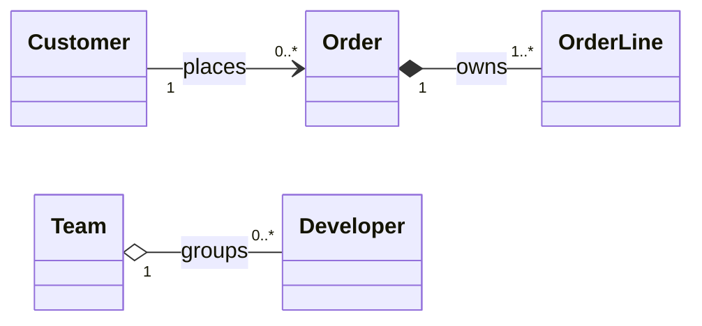

---
topic:
  - Software Design
subtopic:
  - UML
summary: "Reading and drawing UML class diagrams without confusing type relationships with object ownership."
level:
  - "4"
priority: Medium
status: Ready to Repeat
publish: true
---

A UML class diagram is a static map of types, their members, and the relationships between their instances. Use it to make a domain model or public contract discussable before implementation. It does not show runtime order, database tables, or object allocation by itself; a sequence diagram, data model, or code is needed for those questions.

The diagram is useful only when the arrows carry precise meaning. Association says objects know about one another. Shared aggregation adds a weak whole–part hint but does not define lifecycle. Composition says the whole owns each part exclusively and the part has no independent lifecycle in that model. Generalization and realization describe type contracts, not object ownership.

# Notation and relationship semantics with a C# example

| Mark | Meaning | Example |
| --- | --- | --- |
| Three-part box | Type name, attributes, operations | `Order`, `_lines`, `AddLine()` |
| `+`, `-`, `#`, `~` | Public, private, protected, package visibility | `+Total(): decimal` |
| `1`, `0..1`, `*`, `1..*` | Multiplicity at one end of a relationship | One order owns one or more lines |
| Solid line | Association | A customer places orders |
| Hollow diamond | Shared aggregation | A team groups developers who exist independently |
| Filled diamond | Composition | An order owns order lines |
| Solid line with hollow triangle | Generalization | `CardPayment` is a `Payment` |
| Dashed line with hollow triangle | Realization | `CardPayment` implements `IPayment` |

## C# domain example



- `Customer` and `Order` are associated. Deleting a customer record does not imply that completed orders lose their legal or accounting lifecycle.
- `Team` aggregates `Developer`. Developers exist before and after a team and may move without being recreated. UML gives shared aggregation deliberately weak semantics; use a plain association when the whole–part hint adds no decision value.
- `Order` composes `OrderLine`. A line belongs to one order in this model and has no operation outside it. Removing the order removes the aggregate's lines from the domain lifecycle, even though .NET garbage collection is a separate runtime mechanism.

```csharp
public sealed class Order
{
    private readonly List<OrderLine> _lines = [];

    public IReadOnlyList<OrderLine> Lines => _lines.AsReadOnly();

    public void AddLine(string sku, int quantity, decimal unitPrice)
    {
        if (quantity <= 0) throw new ArgumentOutOfRangeException(nameof(quantity));
        if (unitPrice < 0) throw new ArgumentOutOfRangeException(nameof(unitPrice));

        _lines.Add(new OrderLine(sku, quantity, unitPrice));
    }

    public decimal Total() => _lines.Sum(line => line.Quantity * line.UnitPrice);
}

public sealed record OrderLine(string Sku, int Quantity, decimal UnitPrice);
```

The private collection makes composition visible in code: callers cannot attach a line to two orders or bypass `AddLine` and its invariants. C# has no aggregation keyword; association, aggregation, and composition are design semantics enforced by ownership and APIs.

# Pitfalls

**Using aggregation as decoration.** A hollow diamond does not automatically define who creates, updates, or deletes a part. If the lifecycle rule is not specific, use a plain association.

**Reading multiplicity as a database constraint.** `1..*` expresses the domain model. The database, constructor, and mutation methods must still enforce it.

**Treating inheritance as reuse.** The triangle promises substitutability. If a subtype disables a base operation or strengthens its preconditions, the diagram is hiding a broken contract; prefer composition or a narrower interface.

# References

- [OMG Unified Modeling Language 2.5.1](https://www.omg.org/spec/UML/2.5.1/PDF) — the normative UML specification for classifiers, associations, aggregation, composition, generalization, and realization.
- [Mermaid class diagrams](https://mermaid.js.org/syntax/classDiagram.html) — the syntax used for the Obsidian/Quartz-compatible example.
- [ByteByteGo source snapshot: a cheatsheet for UML class diagrams](https://github.com/ByteByteGoHq/system-design-101/blob/b28380a4710c5ec9638ec037d4168e288f334cba/data/guides/a-cheatsheet-for-uml-class-diagrams.md) — the source summary expanded here with lifecycle and ownership semantics plus a concrete C# model.
