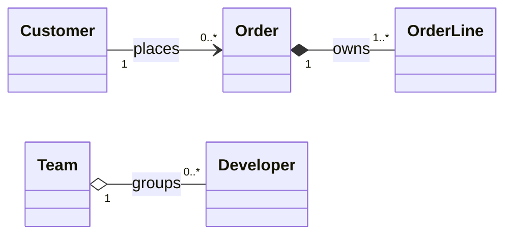

---
topic:
  - Software Design
subtopic:
  - UML
summary: "Reading and drawing UML class diagrams without confusing type relationships with object ownership."
level:
  - "4"
priority: Medium
status: Ready to Repeat
publish: true
---

A UML class diagram is a static view of classifiers, their members, and selected relationships. It makes a domain model or public contract discussable without pretending to describe every runtime detail. Execution order, persistence layout, and allocation belong in sequence diagrams, data models, or code when those details matter.

The diagram earns its keep when each line carries a deliberate meaning. An association records a semantic relationship between classifiers. Navigability is a separate choice and the line alone does not prove that one object stores a direct reference to another. Shared aggregation adds only a weak whole–part hint. Composite aggregation is stronger: a part can belong to at most one composite at a time, and the model gives that composite responsibility for the part's existence and storage. The exact create, remove, and delete behaviour still has to be stated and enforced. Generalization and realization describe type contracts rather than object ownership.

# Notation and Relationship Semantics with a C# Example

| Mark | Meaning | Example |
| --- | --- | --- |
| Three-part box | Type name, attributes, operations | `Order`, `_lines`, `AddLine()` |
| `+`, `-`, `#`, `~` | Public, private, protected, package visibility | `+Total(): decimal` |
| `1`, `0..1`, `*`, `1..*` | Multiplicity at one end of a relationship | One order owns one or more lines |
| Solid line | Association | A customer places orders |
| Hollow diamond | Shared aggregation | A team groups developers who exist independently |
| Filled diamond | Composition | An order owns order lines |
| Solid line with hollow triangle | Generalization | `CardPayment` is a `Payment` |
| Dashed line with hollow triangle | Realization | `CardPayment` implements `IPayment` |

The `~` marker means UML package visibility. Mermaid labels it “Package/Internal,” but C# `internal` is assembly visibility, so the two are only rough analogues.

## C# Domain Example


```mermaid
classDiagram
    direction LR
    class Customer
    class Order
    class OrderLine
    class Team
    class Developer
    Customer "1" --> "0..*" Order : places
    Order "1" *-- "1..*" OrderLine : owns
    Team "1" o-- "0..*" Developer : groups
```

- `Customer` and `Order` are associated. The arrow gives this Mermaid diagram a reading direction, while the domain still decides whether either object stores a direct reference. Deleting a customer record does not imply that completed orders lose their legal or accounting lifecycle.
- `Team` aggregates `Developer`. Developers exist before and after a team and may move without being recreated. UML gives shared aggregation deliberately weak semantics. Use a plain association when the whole–part hint adds no decision value.
- `Order` composes `OrderLine`. A line belongs to at most one order at a time in this model, and the order is responsible for the line's lifecycle within the aggregate. That domain rule is separate from .NET garbage collection and must also be reflected in construction, mutation, and persistence.

```csharp
public sealed class Order
{
    private readonly List<OrderLine> _lines = [];

    public IReadOnlyList<OrderLine> Lines => _lines.AsReadOnly();

    public void AddLine(string sku, int quantity, decimal unitPrice)
    {
        if (quantity <= 0) throw new ArgumentOutOfRangeException(nameof(quantity));
        if (unitPrice < 0) throw new ArgumentOutOfRangeException(nameof(unitPrice));

        _lines.Add(new OrderLine(sku, quantity, unitPrice));
    }

    public decimal Total() => _lines.Sum(line => line.Quantity * line.UnitPrice);
}

public sealed record OrderLine(string Sku, int Quantity, decimal UnitPrice);
```

The private collection and `AddLine` method give `Order` control over membership and validation. Through this API, a caller cannot insert an existing `OrderLine` into several orders or mutate the collection directly. C# has no aggregation keyword. Association, aggregation, and composition remain design semantics enforced through construction, ownership, mutation, and persistence rules.

The code does not fully enforce the diagram's `1..*` multiplicity. A newly constructed `Order` contains zero lines. If every valid order must always contain at least one line, construction should require the first line or go through a factory that establishes the invariant. If an empty draft is valid, the diagram should say `0..*` for that state instead.

# Pitfalls

**Using aggregation as decoration.** A hollow diamond does not automatically define who creates, updates, or deletes a part. If the lifecycle rule is not specific, use a plain association.

**Reading multiplicity as a database constraint.** `1..*` expresses the domain model. The database, constructor, and mutation methods must still enforce it.

**Treating inheritance as reuse.** The triangle promises substitutability. If a subtype disables a base operation or strengthens its preconditions, the diagram is hiding a broken contract. Prefer composition or a narrower interface.

# References

- [OMG Unified Modeling Language 2.5.1](https://www.omg.org/spec/UML/2.5.1/PDF)
- [Mermaid class diagrams](https://mermaid.js.org/syntax/classDiagram.html)
