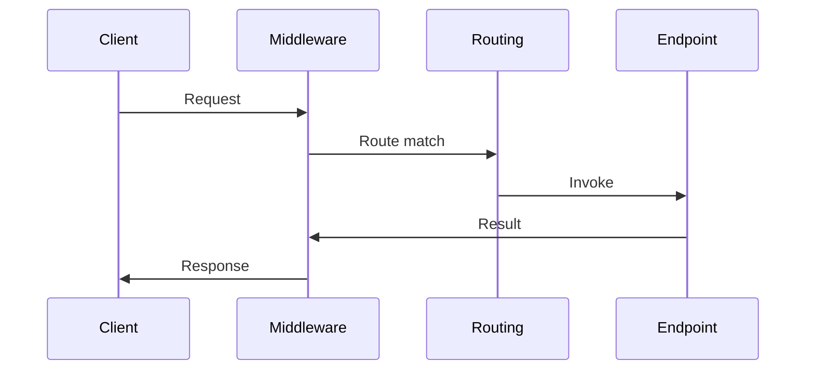

---
topic:
  - Programming
subtopic:
  - NET
level:
  - "4"
priority: High
tags:
  - FolderNote

dg-publish: true
status: Creation
---

# Intro

ASP.NET Core Web API runs each HTTP request through a middleware pipeline, then dispatches it to an endpoint (a Minimal API handler or a controller action).
In practice, you design a Web API by choosing where logic lives (middleware vs filters vs endpoint code), how you validate and map inputs, and how you handle errors and auth.
This matters because most production issues come from cross-cutting concerns: auth, validation, versioning, serialization, and observability.

### Example



### Example

Minimal API:

```csharp
var app = WebApplication.CreateBuilder(args).Build();

app.MapGet("/health", () => Results.Ok(new { status = "ok" }));

app.Run();
```

Controller style:

```csharp
[ApiController]
[Route("api/orders")]
public sealed class OrdersController : ControllerBase
{
    [HttpGet("{id}")]
    public ActionResult<OrderDto> GetById(string id) => Ok(new OrderDto(id));
}
```
 
## Questions

> [!QUESTION]- Where should authentication and authorization live in an ASP.NET Core API?
> Put authentication and authorization in the pipeline so endpoints can assume an authenticated principal.
> Use middleware for auth and use endpoint metadata and policies to decide access per endpoint.

## Links

- [ASP.NET Core web API docs](https://learn.microsoft.com/en-us/aspnet/core/web-api/?view=aspnetcore-8.0)
- [ASP.NET Core middleware](https://learn.microsoft.com/aspnet/core/fundamentals/middleware/?view=aspnetcore-10.0)
- [Routing in ASP.NET Core](https://learn.microsoft.com/aspnet/core/fundamentals/routing?view=aspnetcore-10.0)
- [Filters in ASP.NET Core](https://learn.microsoft.com/aspnet/core/mvc/controllers/filters?view=aspnetcore-10.0)
- [Minimal API filters](https://learn.microsoft.com/aspnet/core/fundamentals/minimal-apis/min-api-filters?view=aspnetcore-10.0)
- [OWASP API Security Top 10 2023](https://owasp.org/API-Security/editions/2023/en/0x11-t10/)

<!-- whats-next:start -->

---

> [!note] Whats next
> **Parent**
>  [[Software Engineering/01 Programming/NET/NET|NET]]
>
> **Pages**
> - [[Software Engineering/01 Programming/NET/ASP.NET Web API/Authentication|Authentication]]
> - [[Software Engineering/01 Programming/NET/ASP.NET Web API/Authorization|Authorization]]
> - [[Software Engineering/01 Programming/NET/ASP.NET Web API/CORS|CORS]]
> - [[Software Engineering/01 Programming/NET/ASP.NET Web API/Dependency Injection|Dependency Injection]]
> - [[Software Engineering/01 Programming/NET/ASP.NET Web API/Filters|Filters]]
> - [[Software Engineering/01 Programming/NET/ASP.NET Web API/Middlewares|Middlewares]]
<!-- whats-next:end -->
