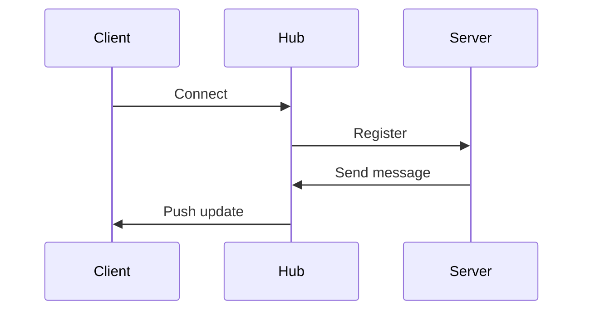

---
topic:
  - "Programming"
subtopic:
  - "NET"
level:
  - "3"
priority: Medium
status: Not-Started

dg-publish: true
---

# Intro

SignalR is a real time communication library for .NET that lets servers push messages to connected clients.
In ASP.NET Core SignalR, the server uses websockets when available and falls back to other transports when needed.
You reach for it for chat, live dashboards, collaborative editing, and notifications.

## Deeper Explanation

### Mental Model



### Example

Hub:

```csharp
public sealed class ChatHub : Hub
{
    public Task Send(string message) =>
        Clients.All.SendAsync("message", message);
}
```

### Tradeoffs

- SignalR vs polling: SignalR is lower latency and more efficient at scale, but needs infra and careful observability

## Questions

> [!QUESTION]- When is SignalR a good fit?
> When clients need near real time updates pushed from the server.

> [!QUESTION]- What is the first scaling problem you will hit?
> Multi-server message delivery.
> Plan for a backplane or a managed service early if you expect scale.

## Links

- [ASP.NET Core SignalR](https://learn.microsoft.com/aspnet/core/signalr/introduction?view=aspnetcore-8.0)
- [Scale out SignalR](https://learn.microsoft.com/aspnet/core/signalr/scale?view=aspnetcore-8.0)

<!-- whats-next:start -->

---

> [!note] Whats next
> **Parent**
>  [[Software Engineering/01 Programming/NET/NET|NET]]
>
> **Pages**
> - [[Software Engineering/01 Programming/NET/Other/OWIN|OWIN]]
<!-- whats-next:end -->
