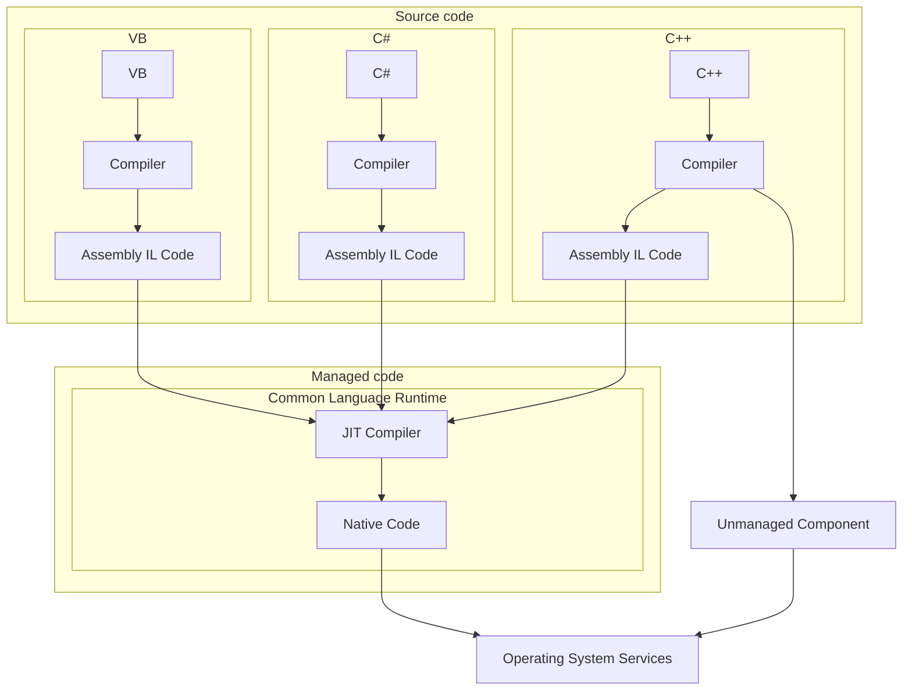

---
topic:
  - "Programming"
subtopic:
  - "NET"
level:
  - "4"
priority: High
status: Ready To Repeat

dg-publish: true
---

# Intro

CLR (Common Language Runtime) is part of the .NET Framework (or .NET Core / .NET 5+) responsible for executing code written in .NET-compatible languages. It provides the execution environment, memory management, thread management, security, and other services needed to run applications.

Core responsibilities of the CLR:

1. **Compilation to an intermediate language (IL)**:
    - Programs written in .NET languages (C#, [VB.NET](http://vb.net/), F#, etc.) are compiled into an intermediate language (Intermediate Language, IL) that is platform-independent and stored in an assembly.
2. **Just-In-Time (JIT) compilation**:
    - When an application starts, IL code is JIT-compiled into machine code that can run on the current hardware platform. This happens at runtime, improving the portability of the code.
3. **Memory management**:
    - The CLR tracks memory allocation and reclamation, automatically managing garbage collection. It determines when objects are no longer in use and frees the memory they occupy.
4. **Thread management**:
    - The CLR provides mechanisms for creating and managing threads of execution. This includes synchronizing access to data between threads and handling exceptions in multithreaded applications.
5. **Code security**:
    - The CLR provides security mechanisms such as array bounds checks, type verification, and others to prevent unsafe code execution.
6. **Metadata and reflection**:
    - The CLR stores metadata about types and other code elements inside assemblies. The Reflection API allows programs to access and manipulate this metadata at runtime.
7. **Exception handling**:
    - The CLR provides an exception-handling mechanism that makes it easier for programs to handle exceptional situations.
8. **Interop with native code**:
    - The CLR provides mechanisms for interoperating with native code, enabling reuse of existing code in C, C++, and other languages.

These capabilities make the CLR a key component of .NET by providing the runtime environment and ensuring portability and code safety. Note that details can evolve as new versions of .NET are released; for up-to-date information, refer to the official Microsoft documentation.

The process of starting a .NET application and running it under the CLR involves several key steps. Below is a high-level overview:

1. **Source code compilation:**
    - After writing code in .NET-compatible languages (for example, C#), the source code is compiled into an intermediate language (IL - Intermediate Language, CIL - Common Intermediate Language, MSIL - Microsoft Intermediate Language). This is done by the language compiler the code is written for (for example, the C# compiler **`csc`**).
2. **Assembly creation:**
    - The compiled IL code, along with type metadata, is packaged into an assembly (.dll or .exe assembly). The assembly contains information about the code structure, metadata, resources, and other required information.
3. **Application startup:**
    - When the user launches a .NET application, the operating system loads the executable (.exe) into memory.
4. **Just-In-Time (JIT) compilation:**
    - The CLR, which is part of the .NET runtime, translates IL code into machine code while the application is running. This process is called JIT compilation. It adapts the code to the specific hardware platform and improves application portability.
5. **Loading into memory:**
    - The generated machine code and referenced assemblies are loaded into memory. The CLR manages this process, establishing links between assemblies as needed.
6. **Code execution:**
    - The CLR begins executing the application by invoking the **`Main()`** method (or another entry point specified in configuration) from the application's main class.
7. **Memory management and garbage collection:**
    - The CLR automatically manages memory allocation and reclamation, including the garbage collection process. This includes tracking unused objects and reclaiming them to improve memory efficiency.
8. **Threading and synchronization:**
    - The CLR provides mechanisms for managing application threads, ensuring safety and synchronized access to data.
9. **Exception handling:**
    - When exceptions occur, the CLR handles them, providing the call stack and other information for debugging.

## Deeper Explanation

## Questions

> [!QUESTION]- What is managed vs unmanaged code?
> Managed code runs under the .NET runtime (CLR) and benefits from runtime services like type safety checks, exception handling, garbage collection, and JIT/AOT compilation.
> Unmanaged code runs directly as native machine code under the OS (for example, C/C++ binaries). It does not run under the CLR and typically requires explicit resource and lifetime management.

> [!QUESTION]- What is the CLR? What does it do? What is IL (CIL/MSIL)?
> The CLR (Common Language Runtime) is the execution engine of .NET. It loads assemblies, verifies and executes IL, compiles IL to native code (JIT or AOT), manages memory (GC), handles exceptions, supports threading and interop, and provides other runtime services.
> IL (also called CIL or MSIL) is the CPU-independent intermediate instruction set produced by .NET language compilers and stored in assemblies together with metadata. The CLR turns IL into native code for the current platform.

## Links

- [Common Language Runtime - Wikipedia](https://en.wikipedia.org/wiki/Common_Language_Runtime)
- [Just-in-time compilation - Wikipedia](https://en.wikipedia.org/wiki/Just-in-time_compilation)
- [Common Language Runtime (CLR) overview - .NET \| Microsoft Learn](https://docs.microsoft.com/en-us/dotnet/standard/clr)

<!-- whats-next:start -->

---

> [!note] Whats next
> **Parent**
>  [[Software Engineering/01 Programming/NET/NET|NET]]
>
> **Pages**
> - [[Software Engineering/01 Programming/NET/Runtime/Garbage Collector|Garbage Collector]]
> - [[Software Engineering/01 Programming/NET/Runtime/Memory Leaks|Memory Leaks]]
<!-- whats-next:end -->
