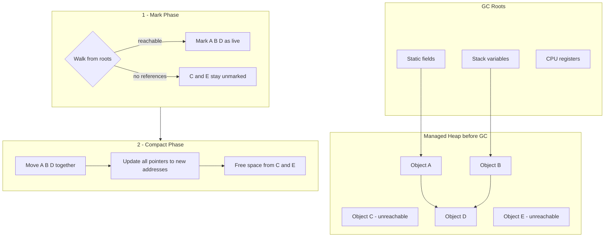
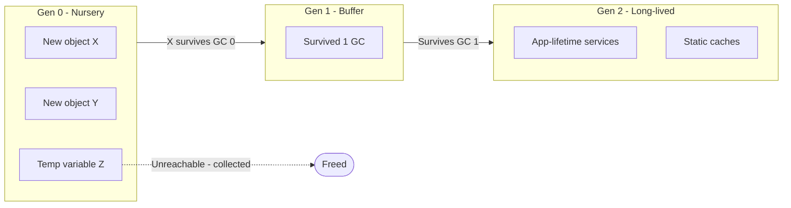

---
topic:
  - Programming
subtopic:
  - NET
level:
  - "4"
priority: High
status: Creation

dg-publish: true
---

# Intro

The Garbage Collector (GC) is the CLR's automatic memory manager. Every `new` allocates on the managed heap; the GC periodically identifies objects no longer reachable from GC roots (static fields, stack variables, CPU registers, GC handles, finalization queue), reclaims their memory, and compacts survivors to reduce fragmentation. You never call `free` — but you pay for that convenience in pause time and throughput overhead, so understanding the GC's internals is essential for writing latency-sensitive .NET services.

The GC uses a **generational model** based on the empirical observation that most objects die young. Gen 0 holds newly allocated objects and collects in under 1 ms on modern hardware. Objects that survive promote to Gen 1 (a buffer between short- and long-lived), then to Gen 2 (application-lifetime objects like singletons and static caches). The Large Object Heap (LOH, ≥85 KB by default) is collected alongside Gen 2 but is **not compacted by default** — allocations leave gaps that fragment the address space over time.

The GC runs in three phases: **mark** (walk from roots, flag reachable objects), **sweep/compact** (reclaim dead memory, slide survivors together, update pointers), and **promote** (move survivors to the next generation). Background GC (enabled by default since .NET 4.5) runs the expensive Gen 2 mark phase on a dedicated thread, allowing Gen 0/1 collections to proceed concurrently — this is what keeps p99 latencies under control in ASP.NET Core services.

For unmanaged resources (file handles, database connections, native memory), the GC provides no help — you must implement `IDisposable` and use `using` statements. Objects with finalizers get queued on the finalization thread, which delays their collection by at least one GC cycle and serializes all finalizer execution on a single thread.

## Managed heap

After the garbage collector is initialized, the CLR allocates a segment of memory for storing and managing objects. This memory is called the managed heap, as opposed to the operating system's native heap.

Each managed process has its own managed heap. All threads in the process allocate memory for objects from the same heap.

To reserve memory, the garbage collector calls the OS (`VirtualAlloc` on Windows, `mmap` on Linux) and releases it back (`VirtualFree`/`munmap`) after clearing objects.

> [!INFO]
> **Segments vs regions.** The "one large segment per heap" model described here is the *legacy* layout. Since **.NET 7** the GC uses **regions** instead — many small, fixed-size regions that the GC assigns to generations independently. This makes it far cheaper to give memory back to the OS and to rebalance generations, but the mental model (Gen 0/1/2 + LOH, mark/compact) is unchanged. Treat "segment" below as "the memory the GC manages," not a literal contiguous block on modern runtimes.

> [!TIP]
> 🚨 The size of segments allocated by the garbage collector is implementation-dependent and can change at any time, including in periodic updates. An application should not make assumptions about the size of a particular segment, rely on it, or attempt to tune the amount of memory available for segment allocations.

The fewer objects allocated on the heap, the less work the garbage collector has to do. When allocating objects, avoid rounded-up sizes that exceed actual needs; for example, do not allocate 32 bytes when you only need 15 bytes.

When a garbage collection is triggered, it reclaims memory occupied by unused objects. The reclamation process compacts live objects so they move together and dead space is removed, reducing the size of the heap. This process helps ensure that objects allocated together stay together on the managed heap, preserving locality.

The level of GC activity (frequency and duration of collections) depends on the number of allocations and the amount of memory that remains on the managed heap.

You can think of the heap as consisting of two heaps: the [Large Object Heap](https://learn.microsoft.com/en-us/dotnet/standard/garbage-collection/large-object-heap) (LOH) and the Small Object Heap (SOH). The LOH contains objects of size 85,000 bytes and larger, typically arrays. In rare cases, an instance object can also be very large.

> [!TIP]
> You can [**configure the threshold size**](https://learn.microsoft.com/en-us/dotnet/core/runtime-config/garbage-collector#large-object-heap-threshold) for objects placed on the Large Object Heap.

## Reclaiming memory

The GC optimization mechanism determines the best time to run a collection based on allocation activity. When the GC runs, it reclaims memory allocated for objects that are no longer used by the application. It determines which objects are no longer used by analyzing the application's *roots*. Application roots include static fields, local variables on thread stacks, CPU registers, GC handles, and the finalization queue. Each root either references an object on the managed heap or has a NULL value. The GC can ask the rest of the runtime for these roots. The GC uses this list to build a graph containing all objects reachable from the roots.

Objects that are not in the graph are unreachable from the application's roots. The GC considers unreachable objects to be garbage and reclaims the memory allocated for them. During a collection, the GC inspects the managed heap, looking for blocks of address space occupied by unreachable objects. When it finds unreachable objects, it uses memory copying to compact reachable objects in memory, freeing the address space previously occupied by unreachable objects. After compaction, the GC updates references so that application roots point to the new locations of objects. It also sets the managed heap pointer to the position after the last reachable object.

### Conditions that trigger garbage collection

Garbage collection occurs when one of the following conditions is met:

- There is not enough physical memory in the system. The available memory size is determined by a low-memory notification from the OS or by a low-memory condition as indicated by the host.
- The amount of memory used by objects allocated on the managed heap exceeds an acceptable threshold. This threshold is continuously adjusted during process execution.
- The [GC.Collect](https://learn.microsoft.com/en-us/dotnet/api/system.gc.collect) method is called. In almost all cases you should not call this method, because the GC runs automatically. It is primarily used for special scenarios and testing.

## GC execution model

### Generational Heap

Most objects die young in Gen 0 and never promote. A Gen 0 collection typically takes <1 ms. Gen 1 runs less frequently and takes 1-10 ms. Gen 2 is the expensive one: a full blocking Gen 2 can pause all managed threads for 100-500 ms on heaps larger than 2 GB. Background GC mitigates this by running the Gen 2 mark concurrently, reducing application-visible pauses to 1-10 ms in most workloads — but the sweep phase still requires a brief suspension.

1. **Mark phase - marking live objects**
    1. **Start of garbage collection:** The garbage collector starts from a set of references known as **roots**. These are memory locations that, for various reasons, must always be accessible and that contain references to objects created by the application. This can include CPU registers, thread call stacks, static variables, and other memory locations holding object references. The GC marks these objects as "live".
    2. **Graph walk and marking:** The GC walks all objects referenced by roots, marking them as "live". It then recursively repeats this process for objects referenced by already-marked objects until it has visited all objects reachable from the roots.
    3. **"Live" object criteria:** An object is considered "live" if it is referenced from the root set or from other "live" objects. The GC treats an object as a reference type if it has a field that contains a reference to another object.
2. **Move phase**
    1. **Updating references to compacted objects:** After the GC determines which objects are "live", the move phase begins. In this phase, the GC moves "live" objects so they occupy a contiguous region of memory. During this process, the GC updates all references to these objects so they point to the new memory addresses after the move.
3. **Compact phase**
    1. **Freeing space and compacting survivors:** After moving "live" objects into a contiguous memory block, the GC frees memory occupied by unused objects. The freed space can then be used for new objects. The GC also compacts surviving objects to reduce memory fragmentation.

## Root objects

To understand how the garbage collector decides when an object is no longer needed, you need to know what *application roots* are. Simply put, a *root* is a memory slot that contains a reference to an object located on the heap.

Strictly speaking, roots can include:

- References to global objects (although they are not allowed in C#, CIL code can place global objects
- References to any static objects or static fields.
- References to local objects within the application's codebase.
- References to object parameters passed to methods.
- References to an object awaiting *finalization*.
- Any CPU registers that reference an object.

## Object generations

When trying to find unreachable objects, the CLR does not literally inspect every object on the heap each time. Obviously, that would take a lot of time, especially in large projects.

To optimize the process, each object on the heap belongs to a specific *"generation"*.

The idea behind generations is fairly simple:

> The longer an object stays on the heap, the more likely it is to remain there.
> 

For example, a class defined in the main window of a desktop application may remain in memory until the program exits. On the other hand, an object that was allocated very recently (for example, one that is only in method scope) is likely to become unreachable fairly quickly. Based on these assumptions, each object on the heap belongs to:

- *Generation 0.* Identifies a new object that has just been allocated and has not yet survived a garbage collection.
- *Generation 1.* Identifies an object that has already survived one garbage collection.
- *Generation 2.* Identifies an object that has survived more than one garbage collection.

The GC first analyzes all objects that belong to generation 0. If, after collecting Gen 0, there is enough memory, all surviving objects are promoted to Gen 1. If Gen 0 has been collected but additional space is still required, the GC will also collect Gen 1. Objects that survive Gen 1 become Gen 2 objects. If the GC still needs memory, it will perform a Gen 2 collection. Since there are no generations above Gen 2, the generation of surviving objects does not increase further. From this, you can conclude that newer objects tend to be collected faster than older ones.

### Card tables and write barriers

A Gen 0 collection must *not* scan all of Gen 2 to find roots — that would defeat the point of generations. But an old object can reference a young one (e.g. a long-lived cache holding a freshly created entry). The GC solves this with a **write barrier**: every reference-type field assignment runs a tiny piece of JIT-emitted code that marks the corresponding **card** (a small range of the old heap) as dirty in a **card table**. An ephemeral (Gen 0/1) collection then scans only the dirty cards for old→young references, treating them as extra roots. This is why reference assignments cost slightly more than value writes, and why allocation-heavy code with many old→young links raises GC cost.

### Boxing as a hidden allocation source

Every time a value type is converted to `object` or an interface (`object o = 42;`, `IComparable c = myStruct;`, non-generic collections, `params object[]`, string-interpolating a struct) the runtime **boxes** it — a Gen 0 heap allocation. In hot loops this is a common, invisible source of GC pressure; prefer generics/`Span<T>` to keep value types unboxed.

### Latency modes and low-pause regions

Beyond Workstation/Server/Background, the GC exposes runtime controls:

- **`GCSettings.LatencyMode`** (`Batch`, `Interactive`, `LowLatency`, `SustainedLowLatency`) biases the GC toward throughput or short pauses for a window of work.
- **`GC.TryStartNoGCRegion(totalBytes)`** pre-reserves a budget and suppresses GC entirely for a critical section (e.g. an order-matching burst), then `GC.EndNoGCRegion()`.
- **DATAS** (Dynamic Adaptation To Application Sizes, on by default for Server GC in .NET 8/9) auto-tunes heap count to the actual load, so you rarely need to hand-set `HeapCount` anymore.
- **Frozen/NonGC heap** (.NET 8) holds objects the GC never scans or moves (e.g. readonly statics), shaving work off every collection.

## Questions

> [!QUESTION]- How does .NET's generational GC work? Why does it use generations, and what are the main tuning tradeoffs?
> The GC is the .NET runtime's automatic memory manager for managed objects. It periodically finds objects that are no longer reachable from GC roots, reclaims their memory, and (on the SOH) typically compacts surviving objects to reduce fragmentation.
> The GC is generational (Gen 0/1/2): most collections are small and fast, while full collections are less frequent. Generations exploit the generational hypothesis — most objects die young — so collecting Gen 0 frequently and cheaply avoids scanning the entire heap.
> Workstation GC (default) runs collections on the allocating thread; Server GC uses dedicated threads per logical processor for higher throughput but more memory overhead.
> Background GC (default for Gen 2) allows Gen 0/1 collections to proceed during a long Gen 2 collection, reducing pause times for latency-sensitive workloads.
> **Tradeoff**: Server GC maximizes throughput for multi-core services but uses more memory per heap; Workstation GC minimizes memory footprint for client apps and small containers. Tune based on workload sensitivity to pause duration vs throughput.

> [!QUESTION]- What are the Small Object Heap (SOH) and the Large Object Heap (LOH)?
> The SOH stores most objects (typically smaller than ~85,000 bytes) and is compacted regularly.
> The LOH stores large allocations (typically 85,000 bytes and above, often large arrays). It is collected with Gen 2 and can become fragmented; compaction behavior differs from the SOH and is more expensive.

## Pitfalls

**LOH fragmentation causing OutOfMemoryException** — the LOH is not compacted by default, so repeated allocation and deallocation of large byte arrays (common in image processing, file upload buffers, serialization) creates gaps. Over hours of steady traffic, free space fragments until no contiguous block can satisfy a new allocation, even though total free memory is sufficient. Mitigation: enable `GCSettings.LargeObjectHeapCompactionMode = CompactOnce` before a forced GC during low-traffic windows, or use `ArrayPool<byte>.Shared` to reuse buffers instead of allocating.

**Finalizer queue blocking collection** — objects with finalizers (`~ClassName()`) survive their first GC cycle because the runtime must run the finalizer before reclaiming memory. The finalizer thread is single-threaded and sequential: if one finalizer blocks (waiting on I/O, throwing an exception it swallows, or doing expensive work), every other finalizable object backs up behind it. A queue of 50,000+ pending finalizers is a memory leak in disguise. Mitigation: implement `IDisposable` with the dispose pattern, call `GC.SuppressFinalize(this)` in `Dispose()`, and treat finalizers as safety nets — never as the primary cleanup path.

**Gen 2 pauses in latency-sensitive services** — a full blocking Gen 2 collection can pause all managed threads for 100-500 ms on heaps >2 GB. For gRPC or real-time services with p99 SLOs under 50 ms, this is a production incident. Mitigation: keep the Gen 2 heap small by avoiding long-lived allocations (prefer `Span<T>`, stack allocation, object pooling), enable Server GC with `<ServerGarbageCollection>true</ServerGarbageCollection>`, and for extreme cases use `GCLatencyMode.SustainedLowLatency` to suppress Gen 2 collections during critical windows (at the cost of higher memory usage).

**Pinned objects preventing compaction** — `fixed` blocks and `GCHandle.Alloc(obj, GCHandleType.Pinned)` prevent the GC from moving objects during compaction, creating fragmentation holes identical to the LOH problem but on the SOH. Heavy P/Invoke interop or native buffer passing can pin thousands of objects. Mitigation: minimize pin duration, use `Memory<T>` / `MemoryPool<T>` with pinnable buffers, and in .NET 5+ consider `POH` (Pinned Object Heap) which isolates pinned allocations from the compactable SOH.

## Tradeoffs

| GC Mode | Throughput | Pause Time | Memory | Best For |
| --- | --- | --- | --- | --- |
| **Workstation** | Lower (single GC thread) | Shorter pauses per collection | Lower footprint (~1 heap) | Client apps, small containers (<2 cores) |
| **Server** | Higher (1 GC thread per core) | Longer individual pauses, but less frequent | Higher (1 heap per core, 2-4× Workstation) | Multi-core services, ASP.NET Core APIs |
| **Background** (default) | Slight overhead for concurrent mark | Gen 2 pauses reduced to 1-10 ms | Slightly higher (concurrent mark needs working space) | Any workload sensitive to tail latency |
| **SustainedLowLatency** | Same as base mode | Suppresses Gen 2 during critical windows | Grows unbounded until mode is reset | Real-time trading, game servers, during batch processing windows |

**Decision rule**: start with Server GC + Background (the ASP.NET Core default). If p99 latency spikes correlate with GC pauses (`dotnet-counters` shows Gen 2 count increasing), reduce allocation rate first (pooling, `Span<T>`, fewer LINQ allocations). Switch to `SustainedLowLatency` only during known critical windows and always reset afterward — running it permanently leads to OOM.

## Links

- [Fundamentals of garbage collection (Microsoft Learn)](https://learn.microsoft.com/en-us/dotnet/standard/garbage-collection/fundamentals) — official reference covering managed heap, generations, LOH, and collection triggers.
- [Garbage collection and performance (Microsoft Learn)](https://learn.microsoft.com/en-us/dotnet/standard/garbage-collection/performance) — guidance on reducing GC pressure: allocation patterns, LOH fragmentation, and server vs workstation GC modes.
- [Runtime configuration options for GC (Microsoft Learn)](https://learn.microsoft.com/en-us/dotnet/core/runtime-config/garbage-collector) — reference for all GC-related MSBuild properties and environment variables (ServerGC, ConcurrentGC, HeapCount, LOH threshold).
- [Pro .NET Memory Management (Konrad Kokosa)](https://prodotnetmemory.com/) — practitioner deep-dive into GC internals, heap segments, pinning, finalization, and performance tuning with real profiling sessions.
- [Maoni Stephens' blog](https://maoni0.medium.com/) — GC design insights from the principal engineer who built the .NET GC; covers heap tuning, region-based GC in .NET 7+, and production debugging.

<!-- whats-next:start -->

---

> [!note] Whats next
> **Parent**
>  [[Software Engineering/01 Programming/NET/NET|NET]]
>
> **Pages**
> - [[Software Engineering/01 Programming/NET/Runtime/Common Language Runtime|Common Language Runtime]]
> - [[Software Engineering/01 Programming/NET/Runtime/Memory Leaks|Memory Leaks]]
<!-- whats-next:end -->
