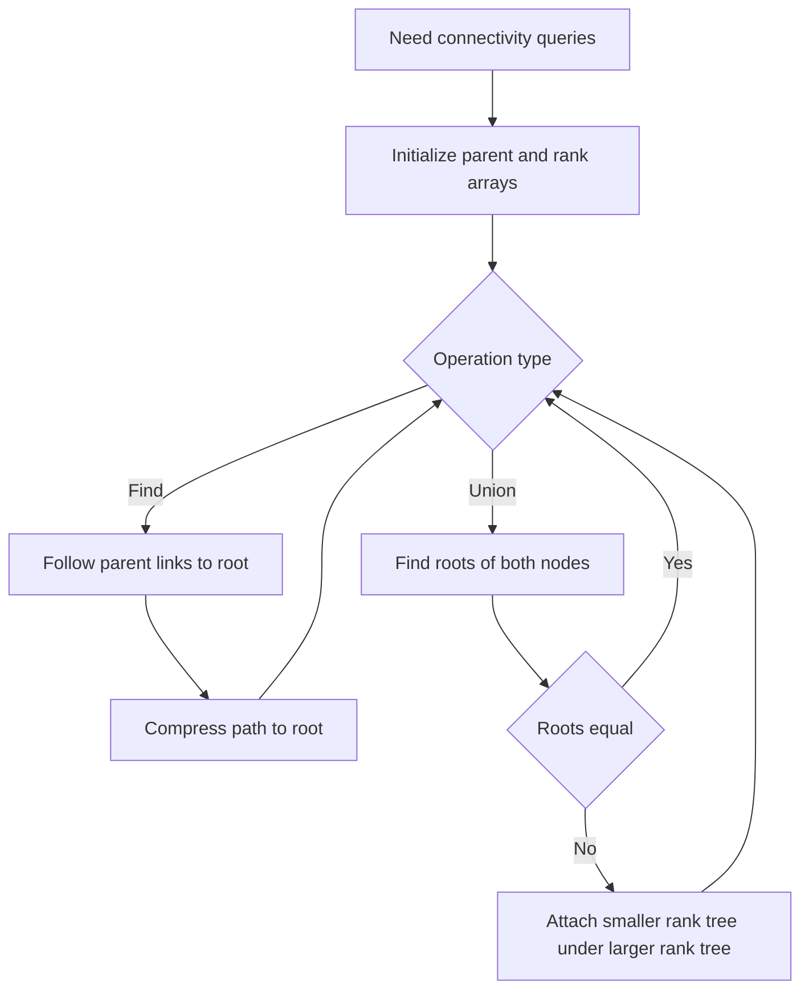

---
topic:
  - Computer Science
subtopic:
  - Algorithms
tags:
  - FolderNote
dg-publish: true
status: Ready To Repeat
priority: Medium
level:
  - '3'
---

# Intro

Disjoint Set Union (Union-Find) is a classic structure for tracking connectivity as you merge groups over time. It shows up in graph problems, clustering, and any scenario where you repeatedly union sets and query whether two items are connected. Example: Kruskal's algorithm uses DSU to build a minimum spanning tree while avoiding cycles.

## Diagram

## Questions

> [!QUESTION]- Why combine path compression with union by rank?
> - Path compression flattens trees during `find` calls.
> - Union by rank prevents tall trees from forming during merges.
> - Together they give almost constant amortized time in practice.
> - Why it matters: this is the reason DSU scales to large connectivity workloads.

> [!QUESTION]- What real problems are naturally modeled by DSU?
> - Connectivity during incremental edge additions in graphs.
> - Kruskal minimum spanning tree edge filtering.
> - Group merging problems such as account linking and clustering.
> - Why it matters: mapping a problem to DSU quickly is a strong interview signal.

## Links

- [Disjoint set data structure Wikipedia](https://en.wikipedia.org/wiki/Disjoint-set_data_structure)
- [Disjoint set union CP Algorithms](https://cp-algorithms.com/data_structures/disjoint_set_union.html)

<!-- whats-next:start -->

---

> [!note] Whats next
> **Parent**
>  [[Software Engineering/02 Computer Science/Algorithms/Algorithms|Algorithms]]
>
> **Pages**
> - [[Software Engineering/02 Computer Science/Algorithms/Disjoint Set/Disjoint Set Union-Find|Disjoint Set Union-Find]]
<!-- whats-next:end -->
