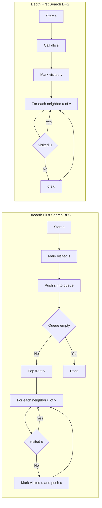

---
topic:
  - "Computer Science"
subtopic:
  - "Algorithms"
level:
  - "4"
priority: Medium
status: Ready To Repeat

dg-publish: true
---

# Intro

## Deeper Explanation

## Diagram

## Questions

> [!QUESTION]- When should I use BFS vs DFS?
> Use BFS when you need shortest paths in an unweighted graph or level-order exploration. Use DFS for reachability, cycle detection, topological sorting, and when you want to explore one path deeply (often with recursion/stack).

## Links

- [Depth-first search (Wikipedia)](https://en.wikipedia.org/wiki/Depth-first_search)
- [Breadth-first search (Wikipedia)](https://en.wikipedia.org/wiki/Breadth-first_search)
- [BFS (cp-algorithms)](https://cp-algorithms.com/graph/breadth-first-search.html)
- [DFS (cp-algorithms)](https://cp-algorithms.com/graph/depth-first-search.html)

<!-- whats-next:start -->

---

> [!note] Whats next
> **Parent**
>  [[Software Engineering/02 Computer Science/Algorithms/Algorithms|Algorithms]]
>
> **Pages**
> - [[Software Engineering/02 Computer Science/Algorithms/Graph Algorithms/Dijkstra|Dijkstra]]
<!-- whats-next:end -->
