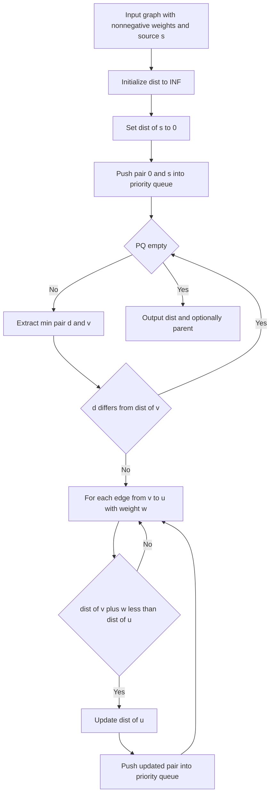

---
topic:
  - "Computer Science"
subtopic:
  - "Algorithms"
level:
  - "4"
priority: Medium
status: Ready To Repeat

dg-publish: false
---

# Intro

Dijkstra computes shortest paths from one source in graphs with non-negative edge weights. It repeatedly finalizes the currently cheapest reachable node and relaxes outgoing edges using a priority queue. Use it for routing, cost minimization, and path planning where edge costs are never negative.

## Deeper Explanation

- Maintain `dist[v]` as best known distance from source.
- Pop the smallest tentative distance from the priority queue.
- Relax each outgoing edge and push improved distances back to the queue.
- Complexity is typically `O((V + E) log V)` with adjacency list plus heap.

## Example

```text
Edges: A-B(2), A-C(5), B-C(1), B-D(4), C-D(1)
From A: dist(B)=2, dist(C)=3 via B, dist(D)=4 via C
Shortest A->D path is A->B->C->D with total cost 4
```

## Diagram



## Questions

> [!QUESTION]- Why does Dijkstra require non-negative weights?
> - Dijkstra is greedy and treats extracted minimum-distance nodes as finalized.
> - Negative edges can create a later path that is cheaper than a finalized one.
> - This breaks the core correctness invariant of the algorithm.
> - Use Bellman Ford when negative edges are possible.
> - Why it matters: this constraint is essential for correctness, not an optimization detail.

> [!QUESTION]- What data structures make Dijkstra practical at scale?
> - Adjacency list keeps memory proportional to edges for sparse graphs.
> - Min-heap priority queue gives efficient next-node selection.
> - Distance array plus optional parent array supports path reconstruction.
> - Why it matters: complexity targets depend on these choices, especially on large graphs.

## Links

- [Dijkstra's algorithm (Wikipedia)](https://en.wikipedia.org/wiki/Dijkstra%27s_algorithm)
- [Dijkstra (cp-algorithms)](https://cp-algorithms.com/graph/dijkstra.html)

<!-- whats-next:start -->

---

> [!note] Whats next
> **Parent**
>  [[Software Engineering/02 Computer Science/Algorithms/Algorithms|Algorithms]]
>
<!-- whats-next:end -->
