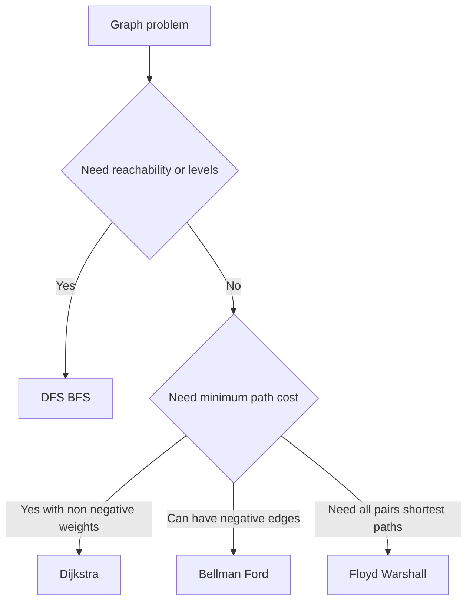

---
topic:
  - Computer Science
subtopic:
  - Algorithms
tags:
  - FolderNote
publish: true
level:
  - '4'
status: Done
priority: High
---

# Intro

Graphs model relationships: networks, dependencies, routes, permissions, and many real-world system structures. Graph algorithms help you traverse, rank, and optimize those relationships efficiently. Example: shortest-path algorithms answer "what's the cheapest route" while BFS/DFS answer "what's reachable".

## Diagram

## Algorithm Selection

| Algorithm | Solves | Time | Constraint |
| --- | --- | --- | --- |
| [[DFS BFS\|BFS]] | Reachability, shortest path by edge count | O(V + E) | Unweighted graphs |
| [[DFS BFS\|DFS]] | Cycle detection, topological sort, components | O(V + E) | Any graph |
| [[Dijkstra]] | Single-source shortest path | O((V + E) log V) | Non-negative weights |
| Bellman–Ford | Single-source shortest path | O(V·E) | Handles negative edges; detects negative cycles |
| Floyd–Warshall | All-pairs shortest path | O(V³) | Small/dense graphs |

## Questions

> [!QUESTION]- When do you pick BFS over DFS?
> - BFS is preferred for shortest path by edge count in unweighted graphs.
> - DFS is preferred for deep traversal tasks like cycle detection and topological ordering.
> - BFS uses more memory on wide graphs because of the frontier queue.
> - Both are O(V+E), so pick by the property you need, not by speed: BFS guarantees shortest paths but its frontier can hold a whole layer; DFS uses depth-bounded memory but gives no distance guarantee.

> [!QUESTION]- Why is Dijkstra not valid with negative edges?
> - Dijkstra assumes once a node is finalized, its best distance is known.
> - Negative edges can later produce a shorter route to a finalized node.
> - Bellman Ford handles negative edges by repeated relaxation.
> - Dijkstra is faster (O((V+E) log V)) but only valid with non-negative weights; Bellman–Ford accepts negative edges at O(V·E) — pay the slower cost only when weights can go negative.

> [!QUESTION]- Adjacency list or adjacency matrix?
> - Adjacency list is the default for sparse graphs (most real-world graphs): O(V+E) space and efficient neighbor iteration.
> - Adjacency matrix uses O(V²) space but answers "is there an edge A→B?" in O(1).
> - In .NET, `Dictionary<T, List<T>>` is a common adjacency-list implementation.
> - The list saves memory and speeds traversal on sparse graphs; the matrix trades O(V²) memory for constant-time edge checks, so reach for it only on dense graphs or edge-query-heavy workloads.

## References

- [Graph algorithm (Wikipedia)](https://en.wikipedia.org/wiki/Graph_algorithm)
- [Introduction to algorithms graph lectures MIT](https://ocw.mit.edu/courses/6-006-introduction-to-algorithms-spring-2020/pages/lecture-notes/)
- [Graph algorithms cp algorithms](https://cp-algorithms.com/graph/)
- [Graph algorithms (Sedgewick and Wayne, Algorithms 4th ed.)](https://algs4.cs.princeton.edu/40graphs/) — Practitioner-oriented chapter covering graph representations, traversal implementations, and shortest-path algorithms with Java code and performance analysis.
