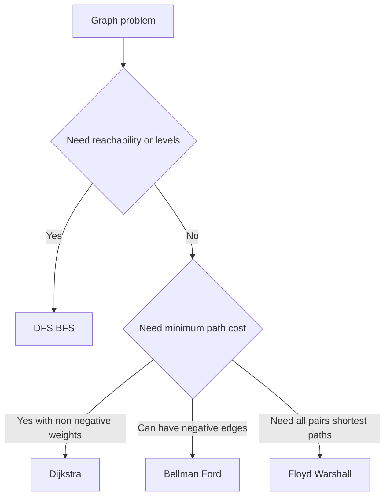

---
topic:
  - Computer Science
subtopic:
  - Algorithms
tags:
  - FolderNote
dg-publish: true
status: Ready To Repeat
priority: Medium
level:
  - '4'
---

# Intro

Graphs model relationships: networks, dependencies, routes, permissions, and many real-world system structures. Graph algorithms help you traverse, rank, and optimize those relationships efficiently. Example: shortest-path algorithms answer "what's the cheapest route" while BFS/DFS answer "what's reachable".

## Diagram

## Questions

> [!QUESTION]- When do you pick BFS over DFS?
> - BFS is preferred for shortest path by edge count in unweighted graphs.
> - DFS is preferred for deep traversal tasks like cycle detection and topological ordering.
> - BFS uses more memory on wide graphs because of the frontier queue.
> - Why it matters: choosing the wrong traversal can break correctness or blow memory budgets.

> [!QUESTION]- Why is Dijkstra not valid with negative edges?
> - Dijkstra assumes once a node is finalized, its best distance is known.
> - Negative edges can later produce a shorter route to a finalized node.
> - Bellman Ford handles negative edges by repeated relaxation.
> - Why it matters: this is a common correctness trap in interviews and real systems.

## Links

- [Graph algorithm (Wikipedia)](https://en.wikipedia.org/wiki/Graph_algorithm)
- [Introduction to algorithms graph lectures MIT](https://ocw.mit.edu/courses/6-006-introduction-to-algorithms-spring-2020/pages/lecture-notes/)
- [Graph algorithms cp algorithms](https://cp-algorithms.com/graph/)

<!-- whats-next:start -->

---

> [!note] Whats next
> **Parent**
>  [[Software Engineering/02 Computer Science/Algorithms/Algorithms|Algorithms]]
>
> **Pages**
> - [[Software Engineering/02 Computer Science/Algorithms/Graph Algorithms/Dijkstra|Dijkstra]]
<!-- whats-next:end -->
