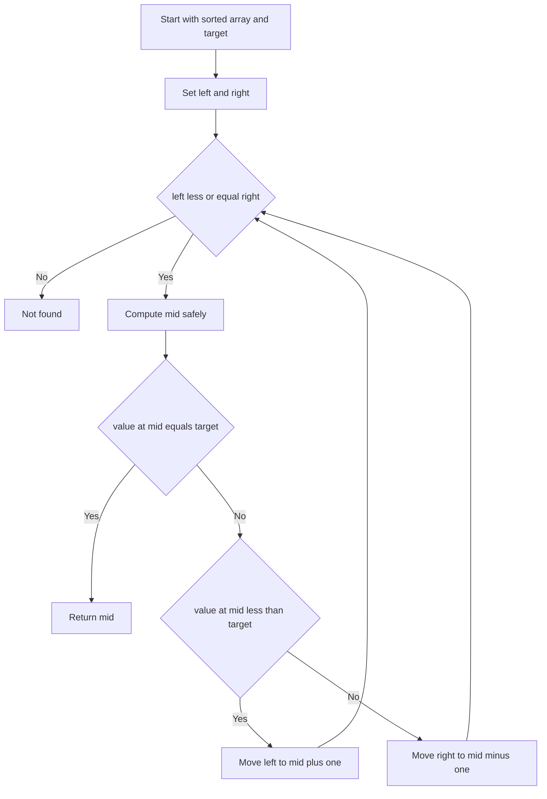

---
topic:
  - Computer Science
subtopic:
  - Algorithms
level:
  - "4"
priority: Medium
status: Done
dg-publish: true
---

# Intro

Binary Search finds a target in a sorted array by repeatedly cutting the search range in half. This gives logarithmic time complexity and predictable performance for large inputs. Use it when the data is sorted and random access is cheap. Example: finding a user id in a sorted list of millions of numeric ids.

## How It Works

- Keep two boundaries `left` and `right` and inspect the middle index each loop.
- If `a[mid]` is less than target, move `left` to `mid + 1`; if `a[mid]` is greater than target, move `right` to `mid - 1`; if equal, return `mid`.
- Use `mid = left + (right - left) / 2` to avoid integer overflow in fixed-width integer languages.
- Complexity: `O(log n)` time, `O(1)` extra space for iterative implementation.

## Example

```csharp
public static int BinarySearch(int[] arr, int target)
{
    int left = 0;
    int right = arr.Length - 1;

    while (left <= right)
    {
        int mid = left + (right - left) / 2;

        if (arr[mid] == target)
        {
            return mid;
        }

        if (arr[mid] < target)
        {
            left = mid + 1;
        }
        else
        {
            right = mid - 1;
        }
    }

    return -1;
}
```

## Diagram



## Pitfalls

- **Unsorted input** — binary search relies on monotonic ordering; on unsorted data the half-split decision is meaningless and it returns false negatives. Sort first (amortize the cost over many searches) or use a different strategy.
- **Off-by-one boundaries** — inconsistent loop condition and boundary updates produce infinite loops or skipped elements. Keep them paired: `left <= right` with `left = mid + 1` / `right = mid - 1`.
- **Duplicates** — plain binary search returns *any* match. Finding the first or last occurrence needs a lower-/upper-bound variant that keeps searching after a hit.

## Tradeoffs

| Choice | Binary Search | Alternative | Decision criteria |
| --- | --- | --- | --- |
| vs linear search | O(log n), needs sorted data | O(n), works on any order | Use binary search when data is already sorted or searched repeatedly; linear search for tiny or one-shot unsorted data. |
| vs hash lookup ([[Dictionary]]) | O(log n), in-place, supports range queries | O(1) average, extra memory, point lookups only | Use a hash when you only need exact-match point lookups; binary search when you also need ordering, ranges, or no extra memory. |
| sort-then-search vs scan | Pays O(n log n) sort once | No preprocessing | Sort-and-search wins when many queries amortize the sort; a single query over unsorted data does not justify sorting. |

## Questions

> [!QUESTION]- Why does binary search require sorted data?
> - The half-split decision depends on monotonic ordering.
> - Without sorting, `a[mid] < target` gives no guarantee about where the target can be.
> - Binary search can skip over the target on unsorted input and return false negatives.
> - The O(log n) speed is conditional on the sorted precondition — if data arrives unsorted you must pay an O(n log n) sort first or fall back to a linear scan, so assert or document the requirement.

> [!QUESTION]- How do you find the first occurrence of a duplicated value?
> - On equality, store `mid` as a candidate answer instead of returning immediately.
> - Continue searching the left half by setting `right = mid - 1` to look for an earlier match.
> - Keep the same loop condition and overflow-safe midpoint calculation.
> - Return the stored candidate after the loop ends.
> - This variant never early-exits, so it does slightly more work than a plain search in exchange for well-defined behavior on duplicates — which you need whenever first/last-match semantics matter.

> [!QUESTION]- Why use `mid = left + (right - left) / 2` instead of `(left + right) / 2`?
> - `(left + right)` can exceed the integer maximum on large arrays, wrapping to a negative index.
> - `left + (right - left) / 2` computes the same midpoint without ever forming the oversized sum.
> - This exact bug shipped in the JDK's binary search for years before being caught.
> - The safe form reads slightly less obviously but is correct across the full index range, so prefer it over the textbook average in any production code.

## References

- [Binary search (CP Algorithms)](https://cp-algorithms.com/num_methods/binary_search.html) — implementation patterns, lower/upper bound variants, and edge-case analysis.
- [Array.BinarySearch method (.NET API)](https://learn.microsoft.com/dotnet/api/system.array.binarysearch) — official reference; note it returns the bitwise complement of the insertion point when the value is absent.
- [Nearly all binary searches and mergesorts are broken (Google Research)](https://research.google/blog/extra-extra-read-all-about-it-nearly-all-binary-searches-and-mergesorts-are-broken/) — the canonical write-up of the midpoint overflow bug.

<!-- whats-next:start -->

---

> [!note] Whats next
> **Parent**
>  [[Software Engineering/02 Computer Science/Algorithms/Algorithms|Algorithms]]
>
> **Pages**
> - [[Software Engineering/02 Computer Science/Algorithms/Search Algorithms/DFS BFS|DFS BFS]]
> - [[Software Engineering/02 Computer Science/Algorithms/Search Algorithms/KMP (Knuth-Morris-Pratt) Algorithm|KMP (Knuth-Morris-Pratt) Algorithm]]
> - [[Software Engineering/02 Computer Science/Algorithms/Search Algorithms/Rabin Karp Search|Rabin Karp Search]]
<!-- whats-next:end -->
