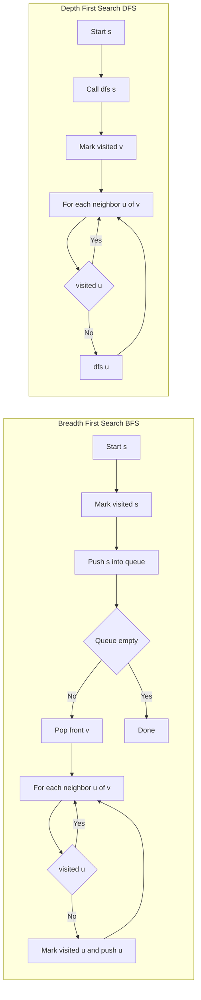

---
topic:
  - "Computer Science"
subtopic:
  - "Algorithms"
level:
  - "4"
priority: Medium
status: Ready To Repeat

dg-publish: false
---

# Intro

BFS and DFS are graph traversal algorithms with different exploration strategies. BFS explores layer by layer and is the right default for shortest path by edge count in an unweighted graph. DFS explores one branch deeply first and is useful for reachability, cycle checks, and topological workflows.

## Deeper Explanation

- BFS uses a queue and expands all nodes at distance `k` before distance `k + 1`.
- DFS uses recursion or an explicit stack and dives to depth before backtracking.
- Both run in `O(V + E)` time, but memory profile differs by graph shape.

## Example

```text
Graph edges: A-B, A-C, B-D, C-E
BFS from A visit order: A, B, C, D, E
DFS from A (one valid order): A, B, D, C, E
```

## Diagram



## Questions

> [!QUESTION]- When should I use BFS vs DFS?
> - Use BFS for shortest path by edge count in unweighted graphs.
> - Use DFS for deep exploration tasks like cycle detection and topological ordering.
> - BFS can use more memory on wide graphs because the frontier queue grows by level.
> - Why it matters: choosing traversal by problem goal prevents subtle correctness bugs.

> [!QUESTION]- Why can BFS return shortest unweighted path but DFS cannot guarantee it?
> - BFS visits nodes in increasing number of edges from the source.
> - The first time BFS reaches a node, that path is minimal by hop count.
> - DFS can reach a node through a longer branch before exploring a shorter alternative.
> - Why it matters: this distinction is a common interview and production design decision.

## Links

- [Depth-first search (Wikipedia)](https://en.wikipedia.org/wiki/Depth-first_search)
- [Breadth-first search (Wikipedia)](https://en.wikipedia.org/wiki/Breadth-first_search)
- [BFS (cp-algorithms)](https://cp-algorithms.com/graph/breadth-first-search.html)
- [DFS (cp-algorithms)](https://cp-algorithms.com/graph/depth-first-search.html)

<!-- whats-next:start -->

---

> [!note] Whats next
> **Parent**
>  [[Software Engineering/02 Computer Science/Algorithms/Algorithms|Algorithms]]
>
> **Pages**
> - [[Software Engineering/02 Computer Science/Algorithms/Search Algorithms/Binary Search|Binary Search]]
> - [[Software Engineering/02 Computer Science/Algorithms/Search Algorithms/KMP (Knuth-Morris-Pratt) Algorithm|KMP (Knuth-Morris-Pratt) Algorithm]]
> - [[Software Engineering/02 Computer Science/Algorithms/Search Algorithms/Rabin Karp Search|Rabin Karp Search]]
<!-- whats-next:end -->
