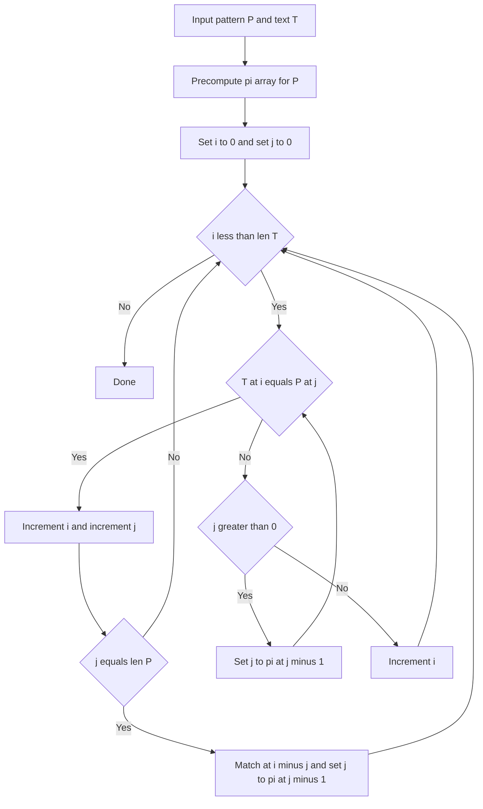

---
topic:
  - "Computer Science"
subtopic:
  - "Algorithms"
level:
  - "4"
priority: Medium
status: Ready To Repeat

dg-publish: false
---

# Intro

KMP searches for a pattern in linear time by reusing previous match information instead of restarting after mismatch. Its key idea is the prefix function (LPS), which tells how far to shift the pattern while preserving valid partial progress. Use KMP when worst-case guarantees matter and input size is large.

## Deeper Explanation

- Build an LPS table for the pattern in `O(m)` time.
- While scanning text, on mismatch jump `j` to `lps[j - 1]` instead of moving `i` backward.
- Total complexity is `O(n + m)` with `O(m)` auxiliary memory.

## Example

```text
Pattern: ABABC
LPS:     0 0 1 2 0
Text:    ABABABC
At mismatch after ABAB, KMP jumps using LPS instead of rescanning from scratch.
```

## Diagram



## Questions

> [!QUESTION]- What does the prefix function (LPS) represent?
> - For each index, LPS stores the longest proper prefix that is also a suffix.
> - It encodes how much of the current partial match is still valid after mismatch.
> - This lets KMP avoid rescanning text characters already compared.
> - Why it matters: LPS is the mechanism that gives KMP its linear worst-case bound.

> [!QUESTION]- When is KMP a better choice than simpler substring search?
> - When you need predictable worst-case runtime on adversarial inputs.
> - When pattern matching is frequent and repeated over large text streams.
> - When backtracking-heavy naive matching would cause latency spikes.
> - Why it matters: predictable performance is often more valuable than small constant-factor wins.

## Links

- [Knuth-Morris-Pratt algorithm (Wikipedia)](https://en.wikipedia.org/wiki/Knuth%E2%80%93Morris%E2%80%93Pratt_algorithm)
- [Prefix function / KMP (cp-algorithms)](https://cp-algorithms.com/string/prefix-function.html)

<!-- whats-next:start -->

---

> [!note] Whats next
> **Parent**
>  [[Software Engineering/02 Computer Science/Algorithms/Algorithms|Algorithms]]
>
> **Pages**
> - [[Software Engineering/02 Computer Science/Algorithms/Search Algorithms/Binary Search|Binary Search]]
> - [[Software Engineering/02 Computer Science/Algorithms/Search Algorithms/DFS BFS|DFS BFS]]
> - [[Software Engineering/02 Computer Science/Algorithms/Search Algorithms/Rabin Karp Search|Rabin Karp Search]]
<!-- whats-next:end -->
