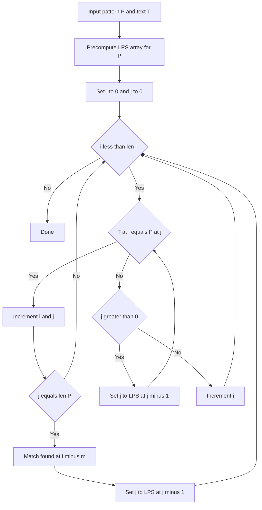

---
topic:
  - Computer Science
subtopic:
  - Algorithms
level:
  - "4"
priority: Medium
status: Ready To Repeat
dg-publish: true
---

# Intro

The Knuth-Morris-Pratt (KMP) algorithm searches for a pattern in text in guaranteed `O(n + m)` time by never rescanning text characters after a mismatch. Its key mechanism is the prefix function (also called the LPS array — Longest Proper Prefix which is also a Suffix), which precomputes for each position in the pattern how far back to fall when a mismatch occurs, reusing work already done instead of starting over.

Use KMP when worst-case linear time matters — for example, scanning large log streams or network traffic where adversarial inputs (like `"aaaaab"` in `"aaaa...a"`) would degrade naive search to `O(nm)`. For simple one-off searches on typical text, language built-in functions (which often use optimized heuristics) are fine, but KMP gives a strict guarantee that naive search cannot.

## How It Works

**Step 1 — Build the prefix function (LPS array)** in `O(m)`:
For each position `j` in the pattern, `lps[j]` stores the length of the longest proper prefix of `pattern[0..j]` that is also a suffix. This tells the algorithm: on mismatch at position `j`, the pattern can be shifted so that `lps[j-1]` characters of the existing match are preserved.

**Step 2 — Scan the text** in `O(n)`:
Maintain two pointers: `i` (text position) and `j` (pattern position). On match, advance both. On mismatch, if `j > 0`, set `j = lps[j-1]` (fall back without moving `i`); if `j == 0`, advance `i`. When `j` reaches `m`, a full match is found at position `i - m`.

Total: `O(n + m)` time, `O(m)` space for the LPS array. The text pointer `i` never moves backward — this is what gives KMP its linear guarantee.



## Example

```text
Pattern: ABABC    (m=5)
LPS:     [0, 0, 1, 2, 0]

  lps[0]=0: "A" has no proper prefix that is also a suffix
  lps[1]=0: "AB" — no match
  lps[2]=1: "ABA" — prefix "A" matches suffix "A"
  lps[3]=2: "ABAB" — prefix "AB" matches suffix "AB"
  lps[4]=0: "ABABC" — no match

Text: ABABABC
  i=0..3: match ABAB (j=4)
  i=4: T[4]='A' ≠ P[4]='C' → mismatch. Set j=lps[3]=2 (keep "AB" match).
  i=4..6: match from j=2. T[4..6]="ABC" matches P[2..4]="ABC".
  j=5=m → match found at position 2.
```

## Pitfalls

### Off-by-One in LPS Construction

- **What goes wrong**: incorrect index arithmetic in the prefix function produces wrong fallback values, causing missed matches or infinite loops during search.
- **Why it happens**: the LPS construction has a subtle two-pointer loop where `length` tracks the current longest prefix-suffix and must fall back through `lps[length-1]` on mismatch, not just reset to zero.
- **How to avoid it**: test LPS output against known examples. `"ABABC"` → `[0,0,1,2,0]`, `"AABAAAB"` → `[0,1,0,1,2,2,3]`. If your implementation disagrees, the fallback logic is wrong.

### Single-Pattern Limitation

- **What goes wrong**: running KMP once per pattern on a multi-pattern search becomes `O(k·(n+m))` for `k` patterns, slower than a single-pass multi-pattern algorithm.
- **Why it happens**: KMP's prefix function is built for one pattern. Each additional pattern requires a separate text scan.
- **How to avoid it**: for multi-pattern matching, use Aho-Corasick, which builds a single automaton from all patterns and scans text once in `O(n + total_pattern_length + matches)`.

## Tradeoffs

| Choice | Option A | Option B | Decision criteria |
| --- | --- | --- | --- |
| Worst-case guarantee needed | KMP `O(n+m)` | Naive `O(nm)` | KMP is strictly better on adversarial inputs. Naive is simpler for small inputs where worst case is unlikely. |
| Multiple patterns | Aho-Corasick | KMP per pattern | Aho-Corasick scans text once for all patterns. Switch when pattern count exceeds 2-3. |
| Implementation simplicity | Rabin-Karp | KMP | Rabin-Karp is simpler to code (rolling hash) but has probabilistic worst case. KMP is deterministic but requires understanding the prefix function. |

## Questions

> [!QUESTION]- What does the prefix function (LPS array) encode and why does it matter?
  > - For each position `j`, `lps[j]` is the length of the longest proper prefix of `pattern[0..j]` that is also a suffix.
  > - On mismatch at position `j`, the algorithm falls back to `lps[j-1]` instead of restarting, preserving valid partial match progress.
  > - This prevents the text pointer `i` from ever moving backward, giving the linear time guarantee.
  > - **Tradeoff**: the LPS array costs `O(m)` time and space to precompute — negligible for single-use searches, but amortized well when the same pattern is reused across multiple texts.

> [!QUESTION]- When is KMP worth the implementation complexity over naive search?
  > - When inputs can be adversarial (e.g., user-supplied patterns against server logs) and worst-case `O(nm)` is unacceptable.
  > - When pattern matching runs on large text streams where constant re-scanning wastes throughput.
  > - When predictable latency matters more than average-case speed.
  > - **Tradeoff**: naive search has smaller code footprint and better constants on typical text — use KMP when the worst-case cost of naive search exceeds the implementation effort.

> [!QUESTION]- How does KMP compare to Rabin-Karp for single-pattern matching?
  > - KMP gives deterministic `O(n+m)` worst case. Rabin-Karp gives expected `O(n+m)` but can degrade to `O(nm)` on hash collisions.
  > - Rabin-Karp is simpler to implement (rolling hash arithmetic vs prefix function logic).
  > - Rabin-Karp extends more naturally to multi-pattern search via hash sets.
  > - **Tradeoff**: choose KMP when deterministic performance is required; choose Rabin-Karp when simplicity and multi-pattern extension matter more than worst-case guarantees.

## References

- [Knuth-Morris-Pratt algorithm -- encyclopedic overview with formal correctness argument and history (Wikipedia)](https://en.wikipedia.org/wiki/Knuth%E2%80%93Morris%E2%80%93Pratt_algorithm)
- [Prefix function and KMP -- implementation guide with LPS construction, code examples, and applications to string problems (cp-algorithms)](https://cp-algorithms.com/string/prefix-function.html)

<!-- whats-next:start -->

---

> [!note] Whats next
> **Parent**
>  [[Software Engineering/02 Computer Science/Algorithms/Algorithms|Algorithms]]
>
> **Pages**
> - [[Software Engineering/02 Computer Science/Algorithms/Search Algorithms/Binary Search|Binary Search]]
> - [[Software Engineering/02 Computer Science/Algorithms/Search Algorithms/DFS BFS|DFS BFS]]
> - [[Software Engineering/02 Computer Science/Algorithms/Search Algorithms/Rabin Karp Search|Rabin Karp Search]]
<!-- whats-next:end -->
