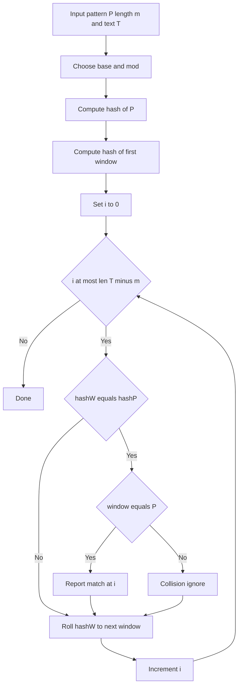

---
topic:
  - "Computer Science"
subtopic:
  - "Algorithms"
level:
  - "4"
priority: Medium
status: Ready To Repeat

dg-publish: false
---

# Intro

Rabin Karp uses a rolling hash to compare pattern and text windows efficiently. Instead of comparing every character first, it compares hashes and verifies only on hash match. Use it when scanning many windows quickly or when extending to multiple patterns with hash-based prefiltering.

## Deeper Explanation

- Compute a hash for the pattern and the first text window.
- Slide one character at a time and update hash in `O(1)` using rolling arithmetic.
- On equal hashes, verify actual substring to avoid false positives from collisions.
- Average behavior is strong, while worst case can degrade with heavy collisions.

## Example

```text
Pattern: aba
Text:    abacaba
Window hashes are rolled across text; only equal-hash windows are verified by direct compare.
```

## Diagram



## Questions

> [!QUESTION]- What are hash collisions and how do we handle them?
> - A collision means two different substrings produce the same hash value.
> - Rabin Karp handles this by confirming candidate matches with direct substring comparison.
> - Good base/mod choices or double hashing reduce collision probability significantly.
> - Why it matters: correctness depends on verification, not hash equality alone.

> [!QUESTION]- When is Rabin Karp preferable to KMP?
> - When rolling-window hashing is a natural fit for the problem.
> - When you want a simple probabilistic prefilter before exact matching.
> - When extending to multiple patterns with hash sets for candidate detection.
> - Why it matters: picking by workload shape avoids overengineering.

## Links

- [Rabin-Karp algorithm (Wikipedia)](https://en.wikipedia.org/wiki/Rabin%E2%80%93Karp_algorithm)
- [String hashing (cp-algorithms)](https://cp-algorithms.com/string/string-hashing.html)

<!-- whats-next:start -->

---

> [!note] Whats next
> **Parent**
>  [[Software Engineering/02 Computer Science/Algorithms/Algorithms|Algorithms]]
>
> **Pages**
> - [[Software Engineering/02 Computer Science/Algorithms/Search Algorithms/Binary Search|Binary Search]]
> - [[Software Engineering/02 Computer Science/Algorithms/Search Algorithms/DFS BFS|DFS BFS]]
> - [[Software Engineering/02 Computer Science/Algorithms/Search Algorithms/KMP (Knuth-Morris-Pratt) Algorithm|KMP (Knuth-Morris-Pratt) Algorithm]]
<!-- whats-next:end -->
