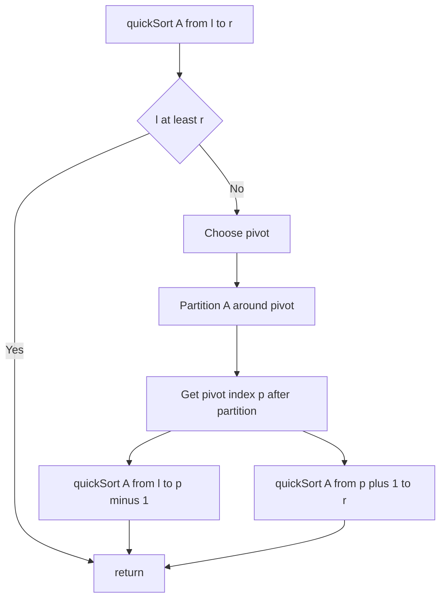

---
topic:
  - Computer Science
subtopic:
  - Algorithms
level:
  - "4"
priority: Low
status: Creation
dg-publish: true
---
# Intro

Quick sort partitions the array around a pivot so smaller elements go left and larger go right, then recursively sorts the partitions. It is often the fastest comparison sort in practice due to excellent cache behavior and low constant factors, but it has a worst-case O(n²) if pivots are consistently bad. Production implementations use randomized pivots or introsort (fallback to heapsort) to guarantee O(n log n) worst case.

## Mechanism

Choose a pivot, partition the array in-place so all elements less than the pivot are to its left and all greater are to its right, then recurse on both sides. The pivot is in its final sorted position after partitioning.



## Complexity

| Case | Time | Space (stack) |
|------|------|---------------|
| Best | O(n log n) | O(log n) |
| Average | O(n log n) | O(log n) |
| Worst (bad pivots) | O(n²) | O(n) |

**Properties:** in-place (Lomuto/Hoare partition), not stable, excellent cache locality.

## C# Implementation (Lomuto partition, randomized pivot)

```csharp
private static readonly Random _rng = new();

public static void QuickSort(int[] a, int left, int right)
{
    if (left >= right) return;

    // Randomized pivot to avoid O(n²) on sorted/reverse-sorted input
    int pivotIdx = _rng.Next(left, right + 1);
    (a[pivotIdx], a[right]) = (a[right], a[pivotIdx]);

    int p = Partition(a, left, right);
    QuickSort(a, left, p - 1);
    QuickSort(a, p + 1, right);
}

private static int Partition(int[] a, int left, int right)
{
    int pivot = a[right];
    int i = left - 1;
    for (int j = left; j < right; j++)
    {
        if (a[j] <= pivot)
        {
            i++;
            (a[i], a[j]) = (a[j], a[i]);
        }
    }
    (a[i + 1], a[right]) = (a[right], a[i + 1]);
    return i + 1;
}
```

## When to Use

- **General-purpose in-memory sorting:** quick sort's cache-friendly access pattern makes it faster than merge sort in practice for most inputs.
- **When stability is not required:** quick sort is not stable; use merge sort if equal elements must preserve their original order.
- **With randomized pivot or introsort:** .NET's `Array.Sort` uses introsort (quick sort + heap sort fallback) to guarantee O(n log n) worst case.

Avoid naive quick sort (fixed pivot) on inputs that may be sorted or reverse-sorted — it degrades to O(n²).

## References

- [Quicksort (Wikipedia)](https://en.wikipedia.org/wiki/Quicksort) — Lomuto and Hoare partition schemes, randomization, and introsort.
- [Quick sort (cp-algorithms)](https://cp-algorithms.com/sorting/quick_sort.html) — practical implementation tips including three-way partition for duplicate keys.

<!-- whats-next:start -->

---

> [!note] Whats next
> **Parent**
>  [[Software Engineering/02 Computer Science/Algorithms/Algorithms|Algorithms]]
>
> **Pages**
> - [[Software Engineering/02 Computer Science/Algorithms/Sorting Algorithms/Bubble Sort|Bubble Sort]]
> - [[Software Engineering/02 Computer Science/Algorithms/Sorting Algorithms/Insertion Sort|Insertion Sort]]
> - [[Software Engineering/02 Computer Science/Algorithms/Sorting Algorithms/Merge Sort|Merge Sort]]
> - [[Software Engineering/02 Computer Science/Algorithms/Sorting Algorithms/Selection Sort|Selection Sort]]
<!-- whats-next:end -->
