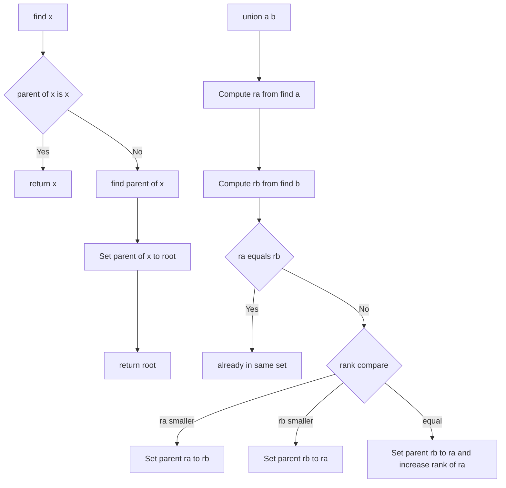

---
topic:
  - Computer Science
subtopic:
  - Algorithms
level:
  - "3"
priority: Medium
status: Ready to Repeat
dg-publish: true
---
# Intro

Union-Find is the algorithmic technique that operates over a [[Software Engineering/02 Computer Science/Data Structures/Disjoint Set|disjoint set]] to answer connectivity queries efficiently as sets are merged. It supports two operations — `find(x)` (which set is x in?) and `union(a, b)` (merge the sets of a and b) — and with two optimizations runs both in near-constant amortized time **O(α(n))**, where α is the inverse Ackermann function: effectively O(1) for any practical input.

Union-Find is the backbone of Kruskal's minimum spanning tree algorithm and shows up in network connectivity, image segmentation, clustering, account linking, and cycle detection. Mapping a problem to Union-Find quickly is a strong interview signal.

This note covers the **algorithm** — the operations, their optimizations, and the analysis. The underlying [[Software Engineering/02 Computer Science/Data Structures/Disjoint Set|Disjoint Set]] note covers how the data is laid out in memory.

## The Algorithm

**`find(x)`** — walk up the parent chain until reaching the root (the set's representative). With **path compression**, rewire every visited node to point directly to the root, flattening the tree for future queries.

**`union(a, b)`** — find the roots of both elements. If different, attach one tree under the other. With **union by rank**, attach the shorter tree under the taller one so the tree stays flat.



### Why the two optimizations matter

- **Path compression** rewires every node on the path from `x` to the root to point directly to the root, flattening the tree over time and making future `find` calls on those nodes O(1). Without it, repeated `find` on a deep tree is O(n) per call.
- **Union by rank** attaches the tree of smaller rank (approximate height) under the larger, bounding height at O(log n) before path compression kicks in.

Used alone, either gives O(log n); **together they achieve O(α(n)) amortized** — the reason Union-Find scales to large connectivity workloads. α(n) ≤ 4 for any n that fits in the observable universe.

## Cycle Detection

Before adding an edge `(u, v)` to a graph, call `find(u)` and `find(v)`. If they return the same root, `u` and `v` are already in the same connected component — adding the edge would create a cycle. If different, call `union(u, v)` to merge the components. This O(α(n)) test is what makes Union-Find the standard tool for incremental connectivity.

## Application — Kruskal's MST

Kruskal's algorithm builds a [[Software Engineering/02 Computer Science/Algorithms/Graph Algorithms/Minimum Spanning Tree|minimum spanning tree]] by greedily adding the cheapest edge that does not form a cycle, using Union-Find for the cycle test:

```csharp
public static List<(int u, int v, int w)> KruskalMST(
    int n,
    List<(int u, int v, int w)> edges)
{
    edges.Sort((a, b) => a.w.CompareTo(b.w)); // sort by weight
    var dsu = new DisjointSet(n);
    var mst = new List<(int, int, int)>();

    foreach (var (u, v, w) in edges)
    {
        if (dsu.Union(u, v)) // false if u and v are already connected
            mst.Add((u, v, w));
        if (mst.Count == n - 1) break; // MST complete
    }
    return mst;
}
```

## Questions

> [!QUESTION]- What is path compression and why does it matter?
> During `find(x)`, path compression rewires every node on the path from x to the root to point directly to the root. This flattens the tree over time, making future `find` calls on those nodes O(1). Without it, repeated `find` on a deep tree is O(n) per call.
> Cost: a small constant overhead per `find` call to update parent pointers — negligible in practice.

> [!QUESTION]- What is union by rank and how does it complement path compression?
> Union by rank attaches the tree with smaller rank (approximate height) under the tree with larger rank. This prevents the tree from growing tall, bounding the height at O(log n) before path compression kicks in. Together, the two optimizations achieve O(α(n)) amortized time.
> Without union by rank, path compression alone gives O(log n) amortized; without path compression, union by rank alone gives O(log n) worst case.

> [!QUESTION]- How does Union-Find detect cycles in a graph?
> Before adding an edge (u, v), call `find(u)` and `find(v)`. If they return the same root, u and v are already in the same connected component — adding the edge would create a cycle. If different, call `union(u, v)` to merge the components.

> [!QUESTION]- What real problems are naturally modeled by Union-Find?
> Connectivity during incremental edge additions in graphs; Kruskal minimum spanning tree edge filtering; group-merging problems such as account linking and clustering. The common thread: you repeatedly union sets and query whether two items are connected.

## Tradeoffs

**Union by rank vs union by size**: Both bound tree height at O(log n) without path compression and achieve O(α(n)) together with it. Union by size is often preferred because element count is a natural quantity and enables O(1) set-size queries via `_size[Find(x)]`. Union by rank is marginally simpler when size queries are not needed. Choose based on whether downstream code needs to know partition sizes.

**Path compression variants**: Three strategies achieve the same O(α(n)) amortized bound but differ in write volume:
- *Full compression* (point every node directly to root): most aggressive, maximum pointer rewrites per call.
- *Path halving* (skip every other node): half the writes, nearly identical empirical speed.
- *Path splitting* (each node points to its grandparent): similar to halving, easier to implement iteratively.
Path halving is often preferred in cache-sensitive code because fewer writes reduce cache-line dirtying. The standard implementation uses full compression for clarity.

**Union-Find is incremental-only — it can't efficiently split.** Union merges sets cheaply, but there is no fast `split`/`un-union`: after path compression the structure has forgotten the original tree shape. This dictates the algorithm class:

- **Edges only ever added** (incremental connectivity) → Union-Find is ideal.
- **Edges added *and* removed** (fully dynamic connectivity) → Union-Find can't do it; you need link-cut trees or Euler-tour trees.
- **A known-in-advance sequence with deletions** → process it **offline in reverse** (each deletion becomes an addition) with a rollback variant (union by rank, no path compression). This reverse-time trick is the standard way Union-Find copes with deletions.

**Connectivity only, not paths**: Union-Find answers "are a and b connected?" in O(α(n)) but not *how* they connect. If you need the actual path or node degrees, maintain an adjacency list alongside it.

## References

- [DSU / Union-Find (cp-algorithms)](https://cp-algorithms.com/data_structures/disjoint_set_union.html) — practical implementation guide with path compression, union by rank, and applications including Kruskal's MST and offline LCA.
- [Kruskal's algorithm (cp-algorithms)](https://cp-algorithms.com/graph/mst_kruskal.html) — MST construction using Union-Find with worked examples.
- [Disjoint-set data structure (Wikipedia)](https://en.wikipedia.org/wiki/Disjoint-set_data_structure) — proof of the O(α(n)) amortized bound.

<!-- whats-next:start -->

---

> [!note] Whats next
> **Parent**
>  [[Software Engineering/02 Computer Science/02 Computer Science|02 Computer Science]]
>
> **Topics**
> - [[Software Engineering/02 Computer Science/Algorithms/Graph Algorithms/Graph Algorithms|Graph Algorithms]]
> - [[Software Engineering/02 Computer Science/Algorithms/Paradigms/Paradigms|Paradigms]]
> - [[Software Engineering/02 Computer Science/Algorithms/Patterns/Patterns|Patterns]]
> - [[Software Engineering/02 Computer Science/Algorithms/Search Algorithms/Search Algorithms|Search Algorithms]]
> - [[Software Engineering/02 Computer Science/Algorithms/Sorting Algorithms/Sorting Algorithms|Sorting Algorithms]]
<!-- whats-next:end -->
