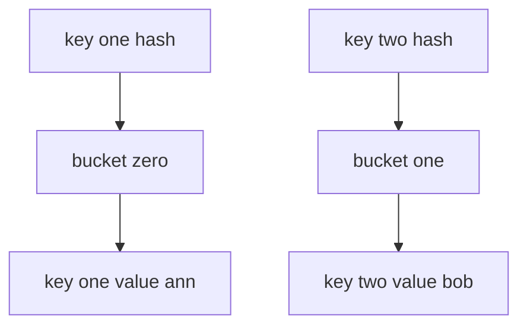

---
topic:
  - Computer Science
subtopic:
  - Data Structures
level:
  - "4"
priority: Medium
status: Ready To Repeat
dg-publish: true
---

# Intro

`Dictionary<TKey, TValue>` is the primary key-value collection in .NET. Use it for fast lookups by key in single-threaded or externally synchronized code.

## Deeper Explanation

`Dictionary` is hash-table based: keys are mapped to buckets by hash code, then equality checks resolve collisions.
Average lookup/add/remove is O(1), but bad hash distribution can degrade performance.

## Structure



### Example

```csharp
var byId = new Dictionary<int, string>
{
    [1] = "Ann",
    [2] = "Bob"
};

if (byId.TryGetValue(2, out var user))
{
    Console.WriteLine(user);
}
```

### Pitfalls

- If `Equals` says two keys are equal, `GetHashCode` must match too.
- Mutable keys can become unfindable after mutation.
- `Dictionary` is not safe for concurrent writes; use `ConcurrentDictionary` when needed.

### Tradeoffs

- For tiny maps (very small `N`), linear search can be cheaper.
- For sorted key iteration, use `SortedDictionary`/`SortedList`.
- For read-only hot paths, consider `FrozenDictionary`.

## Questions

> [!QUESTION]- What data structure is used behind `Dictionary<TKey, TValue>`?
> A hash table with bucket-based key distribution and collision handling.

> [!QUESTION]- Why is `Dictionary` usually faster than `List` for lookups?
> It computes a hash and jumps to a bucket instead of scanning each element.

> [!QUESTION]- How does hash collision affect performance?
> More collisions increase comparisons in a bucket chain and can push operations toward O(n).

## Hash-Based Collections Comparison

| Type | Key type | Thread-safe | Ordering | When to use |
|---|---|---|---|---|
| `Dictionary<TKey,TValue>` | Generic | No | Insertion (not guaranteed) | Default key-value map in modern .NET |
| `Hashtable` | `object` | No (Synchronized wrapper only) | None | Legacy interop only |
| `HashSet<T>` | N/A (values only) | No | None | Unique value membership checks |
| `ConcurrentDictionary<TKey,TValue>` | Generic | Yes | None | Concurrent read/write without external locks |

**Decision rule**: start with `Dictionary<TKey,TValue>`. Switch to `ConcurrentDictionary` for concurrent writes, `FrozenDictionary` for read-only hot paths, `SortedDictionary` for ordered iteration.

## Links

- [Dictionary<TKey, TValue> class](https://learn.microsoft.com/en-us/dotnet/api/system.collections.generic.dictionary-2) — API reference with remarks on hash contract requirements and capacity.
- [Selecting a collection class](https://learn.microsoft.com/en-us/dotnet/standard/collections/selecting-a-collection-class) — Microsoft decision guide for choosing between Dictionary, Hashtable, SortedDictionary, and concurrent variants.
- [Anatomy of the .NET dictionary](https://dunnhq.com/posts/2024/anatomy-of-the-dotnet-dictionary/) — practitioner deep-dive into internal bucket layout, collision handling, and resize behavior.

<!-- whats-next:start -->

---

> [!note] Whats next
> **Parent**
>  [[Software Engineering/02 Computer Science/02 Computer Science|02 Computer Science]]
>
> **Pages**
> - [[Software Engineering/02 Computer Science/Data Structures/Graph|Graph]]
> - [[Software Engineering/02 Computer Science/Data Structures/HashMap|HashMap]]
> - [[Software Engineering/02 Computer Science/Data Structures/HashSet|HashSet]]
> - [[Software Engineering/02 Computer Science/Data Structures/Hashtable|Hashtable]]
> - [[Software Engineering/02 Computer Science/Data Structures/Heap|Heap]]
> - [[Software Engineering/02 Computer Science/Data Structures/LinkedList|LinkedList]]
> - [[Software Engineering/02 Computer Science/Data Structures/List|List]]
> - [[Software Engineering/02 Computer Science/Data Structures/Queue|Queue]]
> - [[Software Engineering/02 Computer Science/Data Structures/Span|Span]]
> - [[Software Engineering/02 Computer Science/Data Structures/Stack|Stack]]
> - [[Software Engineering/02 Computer Science/Data Structures/Trees|Trees]]
<!-- whats-next:end -->
