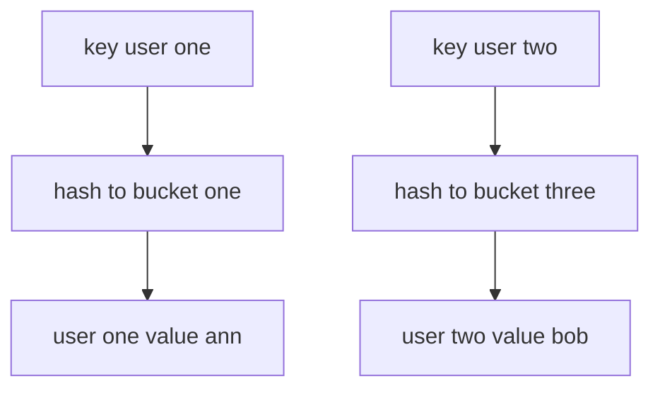

---
topic:
  - Computer Science
subtopic:
  - Data Structures
level:
  - "4"
priority: Medium
status: Ready to Repeat
dg-publish: true
---

# Intro

A hash map stores key-value pairs and uses hashing to find a bucket quickly. The goal is fast insert, lookup, and delete by key — O(1) average, O(n) worst case when all keys collide into one bucket. In .NET, the primary hash map implementation is `Dictionary<TKey, TValue>`, while `Hashtable` is the older non-generic version. A concrete example: a user session cache storing 50K active sessions by session ID achieves sub-microsecond lookups with `Dictionary<string, Session>`, where the same lookup in a `List<Session>` would scan 25K entries on average.

## Deeper Explanation

Hash maps use two rules together: hash distribution and equality checks.

- The key hash chooses an index or bucket.
- If multiple keys land in the same bucket, equality checks resolve collisions.
- Good hash distribution keeps buckets short and operations fast.

### Load factor and resizing

The reason inserts are *amortized* O(1) — not strictly O(1) — is resizing. The map tracks a **load factor** (entries ÷ buckets). When it crosses the threshold, the map allocates a larger bucket array and **rehashes every existing entry** into it, an O(n) operation. Across many inserts this averages out to O(1) each, but any single insert can trigger a full O(n) rehash.

Two practical consequences:

- **Pre-size when you know the count.** `new Dictionary<TKey,TValue>(expectedCount)` allocates enough buckets up front, skipping the repeated grow-and-rehash churn. Filling a 1M-entry map from default capacity rehashes ~20 times along the way.
- **`.NET`'s `Dictionary` resizes to the next prime** above double the current size, which improves hash distribution (modulo a prime scatters keys better than modulo a power of two).

> [!WARNING]
> **Hash flooding (algorithmic-complexity DoS).** If an attacker controls the keys and can force many into one bucket, every operation degrades from O(1) to O(n) and CPU spikes — a real denial-of-service vector for anything that builds a map from untrusted input (HTTP form/query keys, JSON properties). .NET randomizes the `string` hash seed per process to defend against this; custom key types with a weak `GetHashCode` (or one returning a constant) are still exposed.

## Structure



### Example

```csharp
var usersById = new Dictionary<int, string>
{
    [1001] = "Ann",
    [1002] = "Bob"
};

if (usersById.TryGetValue(1002, out var name))
{
    Console.WriteLine(name);
}
```

### Pitfalls

- **Mutable key fields break lookups** — if you insert a key, then mutate a field that participates in `GetHashCode`, the entry becomes orphaned in the wrong bucket. Lookups return `false` even though the entry exists. Use immutable key types (`string`, `int`, records with `init` properties) or never mutate key fields after insertion.
- **Poor `GetHashCode` creates O(n) degradation** — a `GetHashCode` that returns the same value for all instances (e.g., `return 0;`) puts every entry in one bucket, turning the hash map into a linked list. In .NET, the default `GetHashCode` for value types uses reflection-based field hashing which is slow; always override it for custom struct keys.
- **Hash map when sorted iteration is needed** — `Dictionary` does not guarantee enumeration order. If you insert keys 3, 1, 2 and iterate, you might get 3, 1, 2 or any permutation. Use `SortedDictionary` for ordered keys, or sort after retrieval.

### Tradeoffs

- Hash map vs sorted map: hash map favors fast point lookups, sorted map favors ordered iteration.
- Hash map vs list scan: hash map wins for repeated lookups by key, list scan can be simpler for very small fixed data sets.

## Questions

> [!QUESTION]- Why can hash map performance degrade from O(1) to O(n)?
> Excessive collisions put many keys in the same bucket, so operations must compare more entries.

> [!QUESTION]- Why does a bad `GetHashCode` implementation create correctness and performance risk?
> Hash maps rely on hash and equality contracts. If equal keys do not produce equal hashes, lookups can fail. If hashes are poorly distributed, bucket chains grow and performance drops.

> [!QUESTION]- Which .NET type is the standard hash map in modern code?
> `Dictionary<TKey, TValue>` is the default hash map in modern .NET.

## Hash-Based Collections Comparison

| Type | Key type | Thread-safe | When to use |
|---|---|---|---|
| `Dictionary<TKey,TValue>` | Generic | No | Default hash map in modern .NET |
| `Hashtable` | `object` | No | Legacy interop only |
| `HashSet<T>` | N/A (values only) | No | Unique value membership |
| `ConcurrentDictionary<TKey,TValue>` | Generic | Yes | Concurrent read/write |

**Decision rule**: use `Dictionary<TKey,TValue>` by default. `Hashtable` only for legacy API compatibility.

## Links

- [Dictionary TKey TValue class](https://learn.microsoft.com/en-us/dotnet/api/system.collections.generic.dictionary-2) — API reference; the primary hash map in modern .NET.
- [Selecting a collection class](https://learn.microsoft.com/en-us/dotnet/standard/collections/selecting-a-collection-class) — Microsoft decision guide for choosing between hash-based and sorted collections.
- [Anatomy of the .NET dictionary](https://dunnhq.com/posts/2024/anatomy-of-the-dotnet-dictionary/) — practitioner deep-dive into bucket layout, collision handling, and resize behavior.

<!-- whats-next:start -->

---

> [!note] Whats next
> **Parent**
>  [[Software Engineering/02 Computer Science/02 Computer Science|02 Computer Science]]
>
> **Pages**
> - [[Software Engineering/02 Computer Science/Data Structures/Bloom Filter|Bloom Filter]]
> - [[Software Engineering/02 Computer Science/Data Structures/Circular Buffer|Circular Buffer]]
> - [[Software Engineering/02 Computer Science/Data Structures/Dictionary|Dictionary]]
> - [[Software Engineering/02 Computer Science/Data Structures/Disjoint Set|Disjoint Set]]
> - [[Software Engineering/02 Computer Science/Data Structures/Graph|Graph]]
> - [[Software Engineering/02 Computer Science/Data Structures/HashSet|HashSet]]
> - [[Software Engineering/02 Computer Science/Data Structures/Hashtable|Hashtable]]
> - [[Software Engineering/02 Computer Science/Data Structures/Heap|Heap]]
> - [[Software Engineering/02 Computer Science/Data Structures/LinkedList|LinkedList]]
> - [[Software Engineering/02 Computer Science/Data Structures/List|List]]
> - [[Software Engineering/02 Computer Science/Data Structures/LRU Cache|LRU Cache]]
> - [[Software Engineering/02 Computer Science/Data Structures/Queue|Queue]]
> - [[Software Engineering/02 Computer Science/Data Structures/Span|Span]]
> - [[Software Engineering/02 Computer Science/Data Structures/Stack|Stack]]
> - [[Software Engineering/02 Computer Science/Data Structures/Trees|Trees]]
> - [[Software Engineering/02 Computer Science/Data Structures/Trie|Trie]]
<!-- whats-next:end -->
