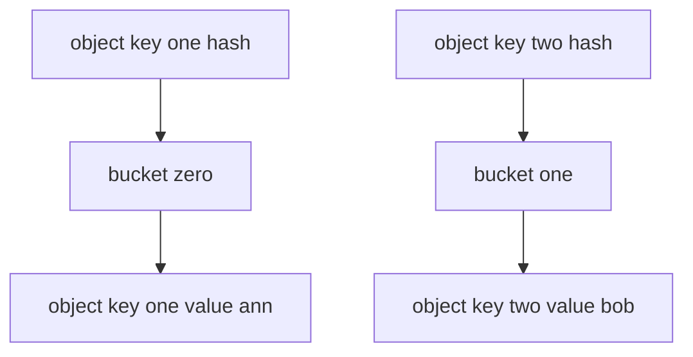

---
topic:
  - Computer Science
subtopic:
  - Data Structures
level:
  - "4"
priority: Medium
status: Creation
dg-publish: true
---

# Intro

`Hashtable` is the non-generic hash table from `System.Collections`. It is mostly legacy in modern .NET and is usually replaced by `Dictionary<TKey, TValue>`.

## Deeper Explanation

`Hashtable` stores keys and values as `object`, so value types are boxed/unboxed.
It still uses hash buckets and collision resolution similar to modern hash-based collections.

## Structure



### Example

```csharp
var table = new Hashtable
{
    ["user:1"] = "Ann"
};

var value = table["user:1"]; // object
```

### Pitfalls

- No compile-time type safety because everything is `object`.
- Boxing/unboxing increases allocations and CPU overhead.
- `Synchronized()` wrappers do not make multi-step operations atomic.

### Tradeoffs

- Keep only for interop with old APIs that already require `Hashtable`.
- Prefer `Dictionary<TKey, TValue>` for regular code and `ConcurrentDictionary` for concurrent writes.

## Questions

> [!QUESTION]- How does inserting a value into a hashtable work?
> The key is hashed, mapped to a bucket, and inserted there. Collisions are handled by chain/probe resolution.

> [!QUESTION]- Why does using a hash code instead of comparing full keys speed up lookups?
> Hashing narrows search to one bucket instead of scanning all entries.

## Links

- [Hashtable class](https://learn.microsoft.com/en-us/dotnet/api/system.collections.hashtable)
- [When to use generic collections](https://learn.microsoft.com/en-us/dotnet/standard/collections/when-to-use-generic-collections)
- [Selecting a collection class](https://learn.microsoft.com/en-us/dotnet/standard/collections/selecting-a-collection-class)
- [Hashtable implementation in dotnet runtime](https://github.com/dotnet/runtime/blob/main/src/libraries/System.Private.CoreLib/src/System/Collections/Hashtable.cs)

<!-- whats-next:start -->

---

> [!note] Whats next
> **Parent**
>  [[Software Engineering/02 Computer Science/02 Computer Science|02 Computer Science]]
>
> **Pages**
> - [[Software Engineering/02 Computer Science/Data Structures/Dictionary|Dictionary]]
> - [[Software Engineering/02 Computer Science/Data Structures/Graph|Graph]]
> - [[Software Engineering/02 Computer Science/Data Structures/HashMap|HashMap]]
> - [[Software Engineering/02 Computer Science/Data Structures/HashSet|HashSet]]
> - [[Software Engineering/02 Computer Science/Data Structures/Heap|Heap]]
> - [[Software Engineering/02 Computer Science/Data Structures/LinkedList|LinkedList]]
> - [[Software Engineering/02 Computer Science/Data Structures/List|List]]
> - [[Software Engineering/02 Computer Science/Data Structures/Queue|Queue]]
> - [[Software Engineering/02 Computer Science/Data Structures/Span|Span]]
> - [[Software Engineering/02 Computer Science/Data Structures/Stack|Stack]]
> - [[Software Engineering/02 Computer Science/Data Structures/Trees|Trees]]
<!-- whats-next:end -->
