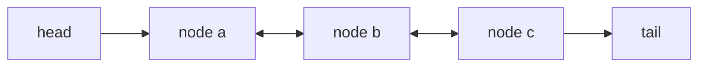

---
topic:
  - Computer Science
subtopic:
  - Data Structures
level:
  - "4"
priority: Medium
status: Done
dg-publish: true
---

# Intro

`LinkedList<T>` is a doubly linked list where each node points to previous and next nodes. It is useful when you already keep node references and need frequent O(1) inserts/removes around those nodes.

Each element lives in a `LinkedListNode<T>` holding a value plus `Previous` and `Next` references; the list keeps `First`/`Last` handles and a count. Inserting or removing at a node you already hold rewires only two or three pointers — no elements move, so it is O(1). The cost is locality: nodes are scattered across the heap, so reaching the *k*-th element means walking *k* pointers (O(n)), and that pointer-chasing defeats CPU cache prefetching.

## Structure



## Example

```csharp
var list = new LinkedList<string>();
var a = list.AddLast("A");
list.AddLast("C");

list.AddAfter(a, "B");
list.Remove("C");
```

## Pitfalls

- Using `LinkedList<T>` for index-based access causes O(n) scans and can underperform `List<T>` significantly. Prefer `List<T>`/arrays for index-heavy workloads, or store node handles when linked-list locality edits are truly required.
- Using detached or foreign `LinkedListNode<T>` instances as anchors (`AddBefore`, `AddAfter`, `Remove`) throws because a node must belong to the target list context. Check `node.List` before using node handles and re-find/re-add nodes when needed.
- Pointer-rich node allocation hurts cache locality, so iteration can be slower even when complexity looks similar on paper. Prefer `List<T>` for traversal-heavy workloads unless node-local O(1) edits are the dominant operation.

## Tradeoffs

| Choice | `LinkedList<T>` | Alternative | Decision criteria |
| --- | --- | --- | --- |
| vs [[List]] | O(1) edits around held nodes | Contiguous, fast iteration & index access | Pick the linked list only when you hold node handles and edit locally; otherwise [[List]] wins in practice. |
| vs [[Queue]] / [[Stack]] | General two-ended editing | Simpler, faster FIFO/LIFO API | If you only need ends-only access, the dedicated queue/stack is clearer and faster. |
| vs [[List]] for big O on paper | O(1) insert/remove | O(n) insert/remove (shift) | The asymptotics favor linked list, but cache effects usually make `List<T>` faster for realistic n — measure before trusting big O here. |

## Questions

> [!QUESTION]- Why is `LinkedList<T>` often slower than `List<T>` despite O(1) inserts/removes?
> - CPU cache locality dominates real workloads: `List<T>` keeps data contiguous and prefetch-friendly.
> - Linked-list nodes are scattered on the heap, so every traversal step is a cache-missing pointer chase.
> - The O(1) edit only helps if you *already hold the node* — finding it first is O(n) and erases the advantage.
> - Big-O favors the linked list, but constant factors favor the array — trust measurements over asymptotics for in-memory n.

> [!QUESTION]- When is `LinkedList<T>` the right choice in .NET?
> - When your algorithm already stores `LinkedListNode<T>` handles and performs many inserts/removes around them (e.g. an LRU cache moving a node to the front).
> - When splicing whole sublists by pointer is a core operation.
> - When you must avoid the O(n) element shift that `List<T>` pays for mid-sequence edits at very large sizes.
> - You accept worse iteration speed and per-node memory overhead to get guaranteed O(1) local restructuring.

> [!QUESTION]- What is a common signal to migrate from `LinkedList<T>` to `List<T>`?
> - If code frequently searches by index or value *before* each edit, you are paying O(n) traversal repeatedly.
> - That pattern means you are not actually exploiting held node handles — the linked list's only advantage.
> - Iteration-heavy or random-access code is another clear signal.
> - Switching to `List<T>` improves locality and iteration but reintroduces O(n) mid-sequence inserts, so confirm those are rare before migrating.

## References

- [`LinkedList<T>` class](https://learn.microsoft.com/en-us/dotnet/api/system.collections.generic.linkedlist-1) — API reference covering node operations, AddBefore/AddAfter, and enumeration.
- [Selecting a collection class](https://learn.microsoft.com/en-us/dotnet/standard/collections/selecting-a-collection-class) — Microsoft decision guide; explains when linked list is appropriate vs array-backed collections.
- [Performance tips for collections](https://learn.microsoft.com/en-us/dotnet/standard/collections/) — overview of .NET collection types with complexity and memory characteristics.
- [Exploring C# LinkedLists via LRU Caches](https://blog.softwx.net/2012/07/exploring-c-linkedlists-via-lru-caches.html) — practitioner example of a real use case (LRU cache) where O(1) node-local edits justify linked list overhead.

<!-- whats-next:start -->

---

> [!note] Whats next
> **Parent**
>  [[Software Engineering/02 Computer Science/02 Computer Science|02 Computer Science]]
>
> **Pages**
> - [[Software Engineering/02 Computer Science/Data Structures/Dictionary|Dictionary]]
> - [[Software Engineering/02 Computer Science/Data Structures/Graph|Graph]]
> - [[Software Engineering/02 Computer Science/Data Structures/HashMap|HashMap]]
> - [[Software Engineering/02 Computer Science/Data Structures/HashSet|HashSet]]
> - [[Software Engineering/02 Computer Science/Data Structures/Hashtable|Hashtable]]
> - [[Software Engineering/02 Computer Science/Data Structures/Heap|Heap]]
> - [[Software Engineering/02 Computer Science/Data Structures/List|List]]
> - [[Software Engineering/02 Computer Science/Data Structures/Queue|Queue]]
> - [[Software Engineering/02 Computer Science/Data Structures/Span|Span]]
> - [[Software Engineering/02 Computer Science/Data Structures/Stack|Stack]]
> - [[Software Engineering/02 Computer Science/Data Structures/Trees|Trees]]
<!-- whats-next:end -->
