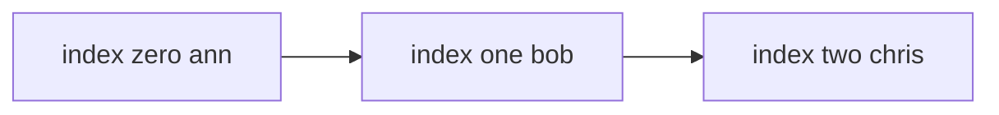

---
topic:
  - Computer Science
subtopic:
  - Data Structures
level:
  - "4"
priority: Medium
status: Ready To Repeat
dg-publish: true
---

# Intro

`List<T>` is the default dynamic array in .NET. Use it when you need ordered data, fast index access, and efficient appends.

## Deeper Explanation

`List<T>` stores items in a contiguous array, so indexing by position is O(1) and iterating is cache friendly.
When `Count` grows past `Capacity`, the internal array is reallocated and copied to a larger buffer.

When `Count` exceeds `Capacity`, `List<T>` allocates a new internal array with double the current capacity (power-of-two growth), copies all elements, and releases the old buffer. The doubling strategy ensures any sequence of n appends costs O(n) total — amortized O(1) per append — even though individual resize events are O(n). The pre-sizing constructor `new List<T>(capacity)` eliminates resizes for known-size collections, which matters in hot paths where repeated allocation and GC pressure are measurable. Prefer `Capacity` pre-sizing over post-construction `TrimExcess` when the final size is known upfront.

## Structure



### Example

```csharp
var users = new List<string>(capacity: 4) { "Ann", "Bob" };
users.Add("Chris");
users.Remove("Bob");

// O(1) index access
Console.WriteLine(users[0]);
```

### Pitfalls

- Repeated growth without pre-sizing can allocate/copy many times.
- Insert/remove in the middle is O(n) due to shifting.
- `Clear()` resets `Count` but usually keeps `Capacity`.

### Tradeoffs

- Prefer `List<T>` over `LinkedList<T>` for most workloads because iteration is faster in practice.
- Use `LinkedList<T>` only when you already hold node references and need O(1) inserts/removes around them.

## Questions

> [!QUESTION]- How is `List<T>` implemented under the hood?
> `List<T>` wraps an internal `T[]` buffer and tracks `Count` separately from `Capacity`.
> When capacity is exceeded, it allocates a bigger array and copies elements.

> [!QUESTION]- What is the difference between `Count` and `Capacity` in `List<T>`?
> `Count` is the number of logical elements. `Capacity` is the size of the internal array.

> [!QUESTION]- How do `Clear()` and `Remove()` affect `Capacity` in `List<T>`?
> They usually change only `Count`. To shrink memory, use `TrimExcess()` or set `Capacity`.

## References

- [`List<T>` class](https://learn.microsoft.com/en-us/dotnet/api/system.collections.generic.list-1) — API reference with remarks on capacity, sorting, and searching.
- [Supplemental API remarks for `List<T>`](https://learn.microsoft.com/en-us/dotnet/fundamentals/runtime-libraries/system-collections-generic-list%7Bt%7D) — additional guidance on performance characteristics and common patterns.
- [When to use generic collections](https://learn.microsoft.com/en-us/dotnet/standard/collections/when-to-use-generic-collections) — explains why `List<T>` replaces `ArrayList` and when to prefer other collection types.
- [List implementation in dotnet runtime](https://github.com/dotnet/runtime/blob/main/src/libraries/System.Private.CoreLib/src/System/Collections/Generic/List.cs) — source code showing the internal array, capacity doubling, and resize logic.

<!-- whats-next:start -->

---

> [!note] Whats next
> **Parent**
>  [[Software Engineering/02 Computer Science/02 Computer Science|02 Computer Science]]
>
> **Pages**
> - [[Software Engineering/02 Computer Science/Data Structures/Dictionary|Dictionary]]
> - [[Software Engineering/02 Computer Science/Data Structures/Graph|Graph]]
> - [[Software Engineering/02 Computer Science/Data Structures/HashMap|HashMap]]
> - [[Software Engineering/02 Computer Science/Data Structures/HashSet|HashSet]]
> - [[Software Engineering/02 Computer Science/Data Structures/Hashtable|Hashtable]]
> - [[Software Engineering/02 Computer Science/Data Structures/Heap|Heap]]
> - [[Software Engineering/02 Computer Science/Data Structures/LinkedList|LinkedList]]
> - [[Software Engineering/02 Computer Science/Data Structures/Queue|Queue]]
> - [[Software Engineering/02 Computer Science/Data Structures/Span|Span]]
> - [[Software Engineering/02 Computer Science/Data Structures/Stack|Stack]]
> - [[Software Engineering/02 Computer Science/Data Structures/Trees|Trees]]
<!-- whats-next:end -->
