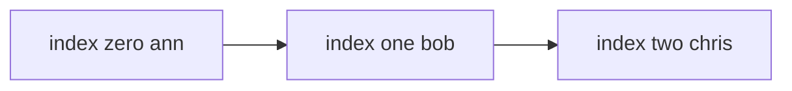

---
topic:
  - Computer Science
subtopic:
  - Data Structures
level:
  - "4"
priority: Medium
status: Done
dg-publish: true
---

# Intro

`List<T>` is the default dynamic array in .NET. Use it when you need ordered data, fast index access, and efficient appends.

It stores items in a contiguous array and tracks `Count` separately from `Capacity`, so indexing is O(1) and iteration is cache-friendly. When `Count` would exceed `Capacity`, it allocates a new array of double the size, copies the elements, and drops the old one — so any run of n appends costs O(n) total (amortized O(1) each) even though an individual resize is O(n). When the final size is known, `new List<T>(capacity)` skips those resizes, which is worth doing on hot paths where the repeated allocation and GC pressure are measurable.



## Example

```csharp
var users = new List<string>(capacity: 4) { "Ann", "Bob" };
users.Add("Chris");
users.Remove("Bob");

// O(1) index access
Console.WriteLine(users[0]);
```

## Pitfalls

- **Repeated growth without pre-sizing** — appending to a default-constructed list triggers multiple allocate-and-copy resizes. Pass an initial `capacity` when the final size is known.
- **Middle insert/remove is O(n)** — `Insert`/`RemoveAt` away from the tail shift every following element. Use a different structure if mid-sequence edits dominate.
- **`Clear()` keeps capacity** — `Clear()` resets `Count` but retains the backing array, so memory is not released. Use `TrimExcess()` or reassign when you need the memory back.

## Tradeoffs

| Choice | `List<T>` | Alternative | Decision criteria |
| --- | --- | --- | --- |
| vs [[LinkedList]] | Contiguous, fast iteration & index access | O(1) edits around held node handles | Default to `List<T>`; pick [[LinkedList]] only when you already hold node references and do many localized inserts/removes. |
| vs `T[]` (array) | Resizable, rich API | Fixed size, slightly lower overhead | Use a list when the count changes; use an array when the size is fixed and known. |
| vs `ImmutableList<T>` | Mutable, cheap writes | Safe sharing across threads | Use `List<T>` for single-owner mutation; immutable variants when many readers share without locking. |

## Questions

> [!QUESTION]- How is `List<T>` implemented under the hood?
> - It wraps an internal `T[]` buffer and tracks `Count` (logical size) separately from `Capacity` (array length).
> - When `Count` would exceed `Capacity`, it allocates a new array of double the size, copies the elements, and drops the old one.
> - Contiguous storage is what makes index access O(1) and iteration cache-friendly.
> - The contiguous array gives speed and locality but makes mid-sequence inserts O(n) — that shaping decision is the whole reason to sometimes pick another structure.

> [!QUESTION]- What is the difference between `Count` and `Capacity`?
> - `Count` is the number of elements you have actually added.
> - `Capacity` is how many the current backing array can hold before a resize is needed.
> - You can raise `Capacity` ahead of time to avoid resizes; `Count` only changes via add/remove.
> - A large pre-set `Capacity` removes resize copies but holds memory you may not use, so pre-size only when the count is roughly known.

> [!QUESTION]- How do `Clear()` and `Remove()` affect `Capacity`?
> - Both change only `Count`; the backing array (and thus `Capacity`) is left intact.
> - This is deliberate — reusing the array avoids re-allocating if the list fills up again.
> - To actually reclaim memory, call `TrimExcess()` or set `Capacity` explicitly.
> - Keeping capacity speeds up refill but pins memory in long-lived lists that briefly spiked large — trim those explicitly.

## References

- [`List<T>` class](https://learn.microsoft.com/en-us/dotnet/api/system.collections.generic.list-1) — API reference with remarks on capacity, sorting, and searching.
- [Supplemental API remarks for `List<T>`](https://learn.microsoft.com/en-us/dotnet/fundamentals/runtime-libraries/system-collections-generic-list%7Bt%7D) — additional guidance on performance characteristics and common patterns.
- [When to use generic collections](https://learn.microsoft.com/en-us/dotnet/standard/collections/when-to-use-generic-collections) — explains why `List<T>` replaces `ArrayList` and when to prefer other collection types.
- [List implementation in dotnet runtime](https://github.com/dotnet/runtime/blob/main/src/libraries/System.Private.CoreLib/src/System/Collections/Generic/List.cs) — source code showing the internal array, capacity doubling, and resize logic.

<!-- whats-next:start -->

---

> [!note] Whats next
> **Parent**
>  [[Software Engineering/02 Computer Science/02 Computer Science|02 Computer Science]]
>
> **Pages**
> - [[Software Engineering/02 Computer Science/Data Structures/Bloom Filter|Bloom Filter]]
> - [[Software Engineering/02 Computer Science/Data Structures/Circular Buffer|Circular Buffer]]
> - [[Software Engineering/02 Computer Science/Data Structures/Dictionary|Dictionary]]
> - [[Software Engineering/02 Computer Science/Data Structures/Graph|Graph]]
> - [[Software Engineering/02 Computer Science/Data Structures/HashMap|HashMap]]
> - [[Software Engineering/02 Computer Science/Data Structures/HashSet|HashSet]]
> - [[Software Engineering/02 Computer Science/Data Structures/Hashtable|Hashtable]]
> - [[Software Engineering/02 Computer Science/Data Structures/Heap|Heap]]
> - [[Software Engineering/02 Computer Science/Data Structures/LinkedList|LinkedList]]
> - [[Software Engineering/02 Computer Science/Data Structures/LRU Cache|LRU Cache]]
> - [[Software Engineering/02 Computer Science/Data Structures/Queue|Queue]]
> - [[Software Engineering/02 Computer Science/Data Structures/Span|Span]]
> - [[Software Engineering/02 Computer Science/Data Structures/Stack|Stack]]
> - [[Software Engineering/02 Computer Science/Data Structures/Trees|Trees]]
> - [[Software Engineering/02 Computer Science/Data Structures/Trie|Trie]]
<!-- whats-next:end -->
