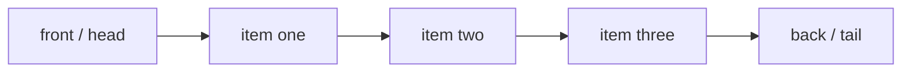

---
topic:
  - Computer Science
subtopic:
  - Data Structures
level:
  - "4"
priority: Medium
status: Done
dg-publish: true
---

# Intro

`Queue<T>` is a FIFO (first in, first out) collection. The earliest enqueued item is processed first. Use it for buffering, breadth-first traversal, and producer-consumer style pipelines.

Internally it is a circular buffer — a backing array with separate `head` and `tail` indices. `Enqueue` writes at `tail`, `Dequeue` reads from `head`, and both advance modulo the array length, so the live region wraps around the array instead of shifting elements. That keeps both operations O(1). When the region fills the whole array, the queue copies into a larger one with `head` reset to 0 — a one-time O(n) resize amortized across many operations.



## Example

```csharp
var jobs = new Queue<string>();
jobs.Enqueue("job-1");
jobs.Enqueue("job-2");

Console.WriteLine(jobs.Dequeue()); // job-1
Console.WriteLine(jobs.Peek());    // job-2
```

## Pitfalls

- **Dequeuing an empty queue** — `Dequeue`/`Peek` on an empty queue throws `InvalidOperationException`. Guard with `Count` or use `TryDequeue`/`TryPeek`.
- **Ignoring priority** — a plain FIFO queue delays urgent work behind older low-value items. Switch to `PriorityQueue<TElement, TPriority>` when ordering by priority matters.
- **Unbounded growth** — silent memory growth occurs when producers outpace consumers in bursty systems. Apply backpressure or a bounded `Channel<T>` at architecture boundaries.

## Tradeoffs

| Choice | `Queue<T>` | Alternative | Decision criteria |
| --- | --- | --- | --- |
| vs [[Stack]] | FIFO — preserves arrival order | LIFO — newest first | Use a queue for fairness/BFS/pipelines; a stack for backtracking/undo. |
| vs `PriorityQueue<TElement,TPriority>` | Order = arrival time | Order = priority key | Use the priority queue when urgency, not arrival, decides processing order. |
| vs `Channel<T>` | Simple in-memory buffer, not thread-safe | Async, bounded, concurrent producers/consumers | Upgrade to a channel when multiple threads coordinate or you need backpressure. |

## Questions

> [!QUESTION]- Why is `Queue<T>` suitable for BFS?
> - BFS must visit nodes in order of increasing distance — all of layer *k* before any of layer *k+1*.
> - A FIFO queue naturally enforces that: neighbors enqueued earlier (closer) are dequeued earlier.
> - Swapping in a stack would turn the traversal into DFS, changing the result.
> - The queue guarantees correct level order, but its frontier can hold a whole layer of the graph — a memory cost you accept when shortest-path-by-hops correctness matters.

> [!QUESTION]- When should you replace `Queue<T>` with `PriorityQueue<TElement, TPriority>`?
> - When correctness depends on priority rather than arrival time — Dijkstra, schedulers, SLA-driven dispatch.
> - A FIFO queue would serve a low-priority older item ahead of an urgent newer one.
> - `PriorityQueue` keeps a heap so the smallest key is always dequeued first.
> - It moves you from O(1) enqueue/dequeue to O(log n) heap operations, so pay it only when ordering by priority is actually required.

> [!QUESTION]- Why can a queue be a production reliability problem even if operations are O(1)?
> - Per-operation complexity says nothing about system-level throughput.
> - If producers persistently outpace consumers, the queue grows without bound — memory climbs and latency spikes as items wait longer.
> - This is a flow-control problem, not an algorithmic one.
> - An unbounded in-memory queue maximizes ingest but risks OOM; a bounded queue/channel adds backpressure that protects the system at the cost of rejecting or blocking producers.

## References

- [`Queue<T>` class](https://learn.microsoft.com/en-us/dotnet/api/system.collections.generic.queue-1) — API reference covering Enqueue, Dequeue, Peek, and circular buffer internals.
- [`PriorityQueue<TElement, TPriority>` class](https://learn.microsoft.com/en-us/dotnet/api/system.collections.generic.priorityqueue-2) — use when ordering by priority rather than arrival time is required.
- [Collections in .NET](https://learn.microsoft.com/en-us/dotnet/standard/collections/) — overview of all collection types with complexity and usage guidance.
- [System.Threading.Channels library](https://learn.microsoft.com/en-us/dotnet/core/extensions/channels) — async producer-consumer channels; the right upgrade path when `Queue<T>` needs concurrent access.
- [Queue implementation in dotnet runtime](https://github.com/dotnet/runtime/blob/main/src/libraries/System.Private.CoreLib/src/System/Collections/Generic/Queue.cs) — source code showing the circular buffer and resize logic.

<!-- whats-next:start -->

---

> [!note] Whats next
> **Parent**
>  [[Software Engineering/02 Computer Science/02 Computer Science|02 Computer Science]]
>
> **Pages**
> - [[Software Engineering/02 Computer Science/Data Structures/Bloom Filter|Bloom Filter]]
> - [[Software Engineering/02 Computer Science/Data Structures/Circular Buffer|Circular Buffer]]
> - [[Software Engineering/02 Computer Science/Data Structures/Disjoint Set|Disjoint Set]]
> - [[Software Engineering/02 Computer Science/Data Structures/Dynamic Array|Dynamic Array]]
> - [[Software Engineering/02 Computer Science/Data Structures/Graph|Graph]]
> - [[Software Engineering/02 Computer Science/Data Structures/Hash Set|Hash Set]]
> - [[Software Engineering/02 Computer Science/Data Structures/HashMap|HashMap]]
> - [[Software Engineering/02 Computer Science/Data Structures/Heap|Heap]]
> - [[Software Engineering/02 Computer Science/Data Structures/LinkedList|LinkedList]]
> - [[Software Engineering/02 Computer Science/Data Structures/LRU Cache|LRU Cache]]
> - [[Software Engineering/02 Computer Science/Data Structures/Span|Span]]
> - [[Software Engineering/02 Computer Science/Data Structures/Stack|Stack]]
> - [[Software Engineering/02 Computer Science/Data Structures/Trees|Trees]]
> - [[Software Engineering/02 Computer Science/Data Structures/Trie|Trie]]
<!-- whats-next:end -->
