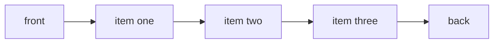

---
topic:
  - Computer Science
subtopic:
  - Data Structures
level:
  - "4"
priority: Medium
status: Ready To Repeat
dg-publish: true
---

# Intro

`Queue<T>` is a FIFO (first in, first out) collection. The earliest enqueued item is processed first. Use it for buffering, breadth-first traversal, and producer-consumer style pipelines.

`Queue<T>` is implemented as a circular buffer in .NET:

- `Enqueue` adds at the tail; `Dequeue` removes from the head.
- Head/tail indices wrap around instead of shifting elements.
- Operations are O(1) on average, with occasional O(n) resize copies.

Because head and tail indices advance modulo the array length, neither `Enqueue` nor `Dequeue` shifts elements — only index arithmetic occurs. When the buffer fills completely, the queue copies all elements to a larger array with the head reset to index 0, then resumes the circular layout. This one-time O(n) resize is amortized over many operations so steady-state throughput stays O(1).
## Structure



### Example

```csharp
var jobs = new Queue<string>();
jobs.Enqueue("job-1");
jobs.Enqueue("job-2");

Console.WriteLine(jobs.Dequeue()); // job-1
Console.WriteLine(jobs.Peek());    // job-2
```

### Pitfalls

- `Dequeue`/`Peek` on an empty queue throws `InvalidOperationException`. Guard with `Count` when queue emptiness is expected.
- Using a queue where priority matters can delay urgent work. Switch to `PriorityQueue<TElement, TPriority>` when ordering by priority is required.
- Unbounded enqueues can grow memory silently in bursty systems. Apply backpressure or capacity policies at architecture boundaries.

### Tradeoffs

- `Queue<T>` vs `Stack<T>`: queue preserves arrival order, stack prioritizes newest items.
- `Queue<T>` vs `Channel<T>`: queue is simple in-memory buffering, channels provide richer async coordination for concurrent producers/consumers.

## Questions

> [!QUESTION]- Why is `Queue<T>` suitable for BFS?
> BFS processes nodes in discovery order by levels. FIFO behavior naturally enforces this traversal order.

> [!QUESTION]- When should you replace `Queue<T>` with `PriorityQueue<TElement, TPriority>`?
> When business correctness depends on priority rather than arrival time, such as shortest-path, scheduler, or SLA-driven dispatching.

> [!QUESTION]- Why can a queue become a production reliability problem even if operations are O(1)?
> Complexity is not the only risk. If producers outpace consumers, memory grows and latency spikes. Throughput and backpressure design matter more than method complexity.

## Links

- [`Queue<T>` class](https://learn.microsoft.com/en-us/dotnet/api/system.collections.generic.queue-1) — API reference covering Enqueue, Dequeue, Peek, and circular buffer internals.
- [`PriorityQueue<TElement, TPriority>` class](https://learn.microsoft.com/en-us/dotnet/api/system.collections.generic.priorityqueue-2) — use when ordering by priority rather than arrival time is required.
- [Collections in .NET](https://learn.microsoft.com/en-us/dotnet/standard/collections/) — overview of all collection types with complexity and usage guidance.
- [System.Threading.Channels library](https://learn.microsoft.com/en-us/dotnet/core/extensions/channels) — async producer-consumer channels; the right upgrade path when `Queue<T>` needs concurrent access.
- [Queue implementation in dotnet runtime](https://github.com/dotnet/runtime/blob/main/src/libraries/System.Private.CoreLib/src/System/Collections/Generic/Queue.cs) — source code showing the circular buffer and resize logic.

<!-- whats-next:start -->

---

> [!note] Whats next
> **Parent**
>  [[Software Engineering/02 Computer Science/02 Computer Science|02 Computer Science]]
>
> **Pages**
> - [[Software Engineering/02 Computer Science/Data Structures/Dictionary|Dictionary]]
> - [[Software Engineering/02 Computer Science/Data Structures/Graph|Graph]]
> - [[Software Engineering/02 Computer Science/Data Structures/HashMap|HashMap]]
> - [[Software Engineering/02 Computer Science/Data Structures/HashSet|HashSet]]
> - [[Software Engineering/02 Computer Science/Data Structures/Hashtable|Hashtable]]
> - [[Software Engineering/02 Computer Science/Data Structures/Heap|Heap]]
> - [[Software Engineering/02 Computer Science/Data Structures/LinkedList|LinkedList]]
> - [[Software Engineering/02 Computer Science/Data Structures/List|List]]
> - [[Software Engineering/02 Computer Science/Data Structures/Span|Span]]
> - [[Software Engineering/02 Computer Science/Data Structures/Stack|Stack]]
> - [[Software Engineering/02 Computer Science/Data Structures/Trees|Trees]]
<!-- whats-next:end -->
