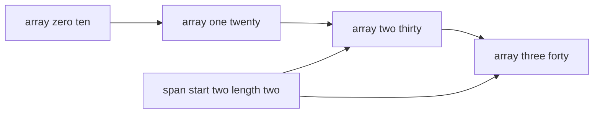

---
topic:
  - Computer Science
subtopic:
  - Data Structures
level:
  - "4"
priority: Medium
status: Ready To Repeat
dg-publish: true
---

# Intro

`Span<T>` is a stack-only view over contiguous memory. It does not own data, it only points to existing memory (array, stackalloc buffer, or unmanaged memory). Use it when you need high-performance slicing/parsing with minimal allocations.

`Span<T>` gives bounds-checked access to a contiguous region with very low overhead:

- Slicing creates lightweight subviews without copying data.
- It can wrap array segments and stack-allocated buffers.
- Because it is a `ref struct`, it cannot escape to the managed heap.

## Structure



### Example

```csharp
Span<int> values = stackalloc int[] { 10, 20, 30, 40 };
Span<int> tail = values.Slice(2); // 30, 40

tail[0] = 300;
Console.WriteLine(values[2]); // 300
```

### Pitfalls

- Returning a `Span<T>` that points to stack memory is invalid because the underlying buffer is gone after method return. Keep span lifetimes within the owning scope.
- `Span<T>` cannot be used across `await` boundaries because it is stack-only. Use `Memory<T>` for async flows.
- Converting every API to `Span<T>` can hurt readability when performance is not a bottleneck. Apply it to measured hot paths.

### Tradeoffs

- `Span<T>` vs `T[]`: spans avoid copies for slicing, arrays are simpler when you need ownership and long-lived storage.
- `Span<T>` vs `Memory<T>`: spans are best for synchronous fast paths, `Memory<T>` is better when data must survive async boundaries.

## Questions

> [!QUESTION]- Why is `Span<T>` a `ref struct`?
> It prevents the span from being boxed or moved to the heap, which protects memory safety for references to stack and unmanaged buffers.

> [!QUESTION]- When should you choose `Memory<T>` instead of `Span<T>`?
> Use `Memory<T>` when the buffer must cross async boundaries, be stored in fields, or live longer than a single synchronous scope.

## References

- [`Span<T>` struct](https://learn.microsoft.com/en-us/dotnet/api/system.span-1) — API reference covering constructors, Slice, and ref struct constraints.
- [`Memory<T>` and `Span<T>` usage guidelines](https://learn.microsoft.com/en-us/dotnet/standard/memory-and-spans/) — Microsoft guidance on when to use Span vs Memory, ownership rules, and async boundaries.
- [Welcome to C# 7.2 and Span](https://devblogs.microsoft.com/dotnet/welcome-to-c-7-2-and-span/) — .NET blog post introducing `Span<T>` with motivation, design rationale, and early usage examples.

<!-- whats-next:start -->

---

> [!note] Whats next
> **Parent**
>  [[Software Engineering/02 Computer Science/02 Computer Science|02 Computer Science]]
>
> **Pages**
> - [[Software Engineering/02 Computer Science/Data Structures/Dictionary|Dictionary]]
> - [[Software Engineering/02 Computer Science/Data Structures/Graph|Graph]]
> - [[Software Engineering/02 Computer Science/Data Structures/HashMap|HashMap]]
> - [[Software Engineering/02 Computer Science/Data Structures/HashSet|HashSet]]
> - [[Software Engineering/02 Computer Science/Data Structures/Hashtable|Hashtable]]
> - [[Software Engineering/02 Computer Science/Data Structures/Heap|Heap]]
> - [[Software Engineering/02 Computer Science/Data Structures/LinkedList|LinkedList]]
> - [[Software Engineering/02 Computer Science/Data Structures/List|List]]
> - [[Software Engineering/02 Computer Science/Data Structures/Queue|Queue]]
> - [[Software Engineering/02 Computer Science/Data Structures/Stack|Stack]]
> - [[Software Engineering/02 Computer Science/Data Structures/Trees|Trees]]
<!-- whats-next:end -->
