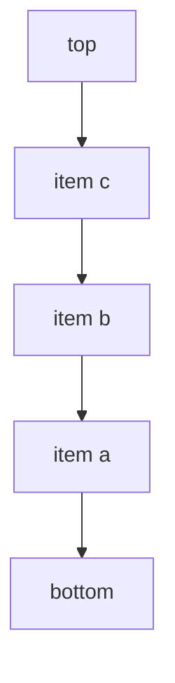

---
topic:
  - Computer Science
subtopic:
  - Data Structures
level:
  - "4"
priority: Medium
status: Ready To Repeat
dg-publish: true
---

# Intro

`Stack<T>` is a LIFO (last in, first out) collection. The most recently pushed element is the first popped. Use it for backtracking, undo flows, and depth-first traversals.

`Stack<T>` in .NET is array-backed and optimized for top-of-stack operations:

- `Push`, `Pop`, and `Peek` are O(1) on average.
- Capacity grows when needed, similar to `List<T>`.
- Enumeration is from top to bottom.

The runtime uses a call stack with the same LIFO discipline: each function invocation pushes a stack frame containing its local variables and return address; when the function returns, the frame is popped. An explicit `Stack<T>` mirrors this behavior in application code — useful for undo/redo chains, expression evaluation, and depth-first backtracking without the recursion limit risk. Unlike the implicit call stack, `Stack<T>` capacity is bounded only by heap memory.
## Structure



### Example

```csharp
var stack = new Stack<string>();
stack.Push("A");
stack.Push("B");

Console.WriteLine(stack.Peek()); // B
Console.WriteLine(stack.Pop());  // B
Console.WriteLine(stack.Pop());  // A
```

### Pitfalls

- Calling `Pop`/`Peek` on an empty stack throws `InvalidOperationException`. Check `Count` first when emptiness is possible.
- Using `Stack<T>` for queue-like workflows reverses processing order and causes subtle logic bugs. Validate ordering requirements before choosing it.
- Large temporary stacks can grow memory and remain allocated. Use `TrimExcess()` if a long-lived stack shrinks significantly.

### Tradeoffs

- `Stack<T>` vs `Queue<T>`: stack favors LIFO workflows, queue favors FIFO processing pipelines.
- Recursive DFS vs explicit `Stack<T>`: recursion is concise, explicit stack avoids deep-recursion stack-overflow risk.

## Questions

> [!QUESTION]- When is an explicit `Stack<T>` better than recursion?
> When graph/tree depth may be large or unbounded. An explicit stack avoids blowing the call stack and gives more control over traversal state.

> [!QUESTION]- Why can `Stack<T>` be a poor fit for work queues?
> Work queues usually require FIFO fairness. LIFO processing can starve older items and change expected behavior.

> [!QUESTION]- What is the complexity of `Push` and why is it not always constant in practice?
> `Push` is O(1) amortized. It can be O(n) during resize because elements are copied to a larger internal array.

## Links

- [`Stack<T>` class](https://learn.microsoft.com/en-us/dotnet/api/system.collections.generic.stack-1) — API reference covering Push, Pop, Peek, and enumeration order.
- [Selecting a collection class](https://learn.microsoft.com/en-us/dotnet/standard/collections/selecting-a-collection-class) — Microsoft decision guide for choosing between Stack, Queue, and other collection types.
- [Generic collections in .NET](https://learn.microsoft.com/en-us/dotnet/standard/collections/) — overview of all generic collection types with complexity and usage guidance.
- [Stack implementation in dotnet runtime](https://github.com/dotnet/runtime/blob/main/src/libraries/System.Private.CoreLib/src/System/Collections/Generic/Stack.cs) — source code showing the internal array and resize logic.

<!-- whats-next:start -->

---

> [!note] Whats next
> **Parent**
>  [[Software Engineering/02 Computer Science/02 Computer Science|02 Computer Science]]
>
> **Pages**
> - [[Software Engineering/02 Computer Science/Data Structures/Dictionary|Dictionary]]
> - [[Software Engineering/02 Computer Science/Data Structures/Graph|Graph]]
> - [[Software Engineering/02 Computer Science/Data Structures/HashMap|HashMap]]
> - [[Software Engineering/02 Computer Science/Data Structures/HashSet|HashSet]]
> - [[Software Engineering/02 Computer Science/Data Structures/Hashtable|Hashtable]]
> - [[Software Engineering/02 Computer Science/Data Structures/Heap|Heap]]
> - [[Software Engineering/02 Computer Science/Data Structures/LinkedList|LinkedList]]
> - [[Software Engineering/02 Computer Science/Data Structures/List|List]]
> - [[Software Engineering/02 Computer Science/Data Structures/Queue|Queue]]
> - [[Software Engineering/02 Computer Science/Data Structures/Span|Span]]
> - [[Software Engineering/02 Computer Science/Data Structures/Trees|Trees]]
<!-- whats-next:end -->
