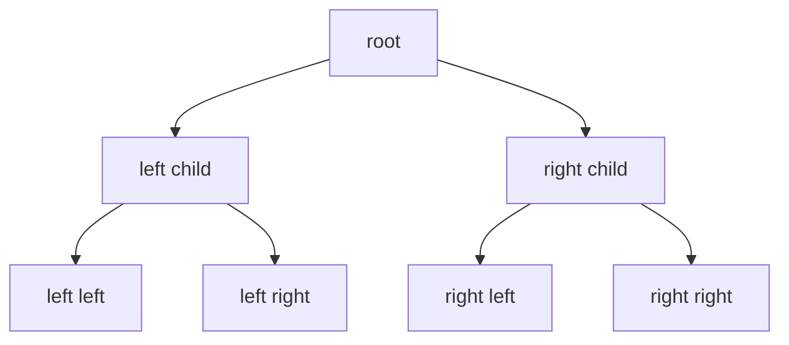

---
topic:
  - Computer Science
subtopic:
  - Data Structures
level:
  - "4"
priority: Medium
status: Ready to Repeat
dg-publish: true
---

# Intro

Trees represent hierarchical data with parent-child relationships. In .NET, tree-like behavior commonly appears through `SortedSet<T>` (red-black tree), `SortedDictionary<TKey, TValue>`, custom recursive node models, and expression trees in the compiler pipeline. A concrete use case: an autocomplete service maintains a trie (prefix tree) of 500K product names; lookup for any prefix completes in O(k) where k is prefix length, regardless of dataset size — a `Dictionary` scan would be O(n).

## Deeper Explanation

A tree organizes nodes so each node has at most one parent (except the root) and any number of children. Balanced trees keep height at O(log n), making insert, delete, and search O(log n). Unbalanced trees degrade toward O(n) — inserting already-sorted values into a naïve BST produces a linked list.

**Traversal orders** define processing sequence:

- *Pre-order* (root → left → right): used to serialize or copy a tree.
- *In-order* (left → root → right): visits nodes in sorted order for a BST — the basis for `SortedSet<T>` enumeration.
- *Post-order* (left → right → root): used when children must be processed before parents, such as deleting a subtree or evaluating an expression tree.
- *BFS (level-order)*: uses a `Queue<T>` to visit nodes level by level, natural for shortest-path in unweighted trees.

`SortedSet<T>` in .NET uses a red-black tree internally, guaranteeing O(log n) insert and lookup regardless of insertion order.

**Terminology:** *height* (longest root-to-leaf path), *depth* (distance from root), *balance factor* (height difference between subtrees). A *full* tree has 0 or 2 children per node; a *complete* tree fills levels left-to-right (the heap shape); a *perfect* tree is both.

## Common Tree Types

"Tree" is a family — the right one depends on the operation you need:

| Type | What it adds | Used for |
|---|---|---|
| **BST** | Ordered left < node < right | Baseline ordered lookup — but degrades to O(n) if unbalanced |
| **AVL / Red-Black** | Self-balancing rotations → guaranteed O(log n) | `SortedSet`/`SortedDictionary` (red-black); AVL is more rigidly balanced (faster reads, more rotations) |
| **B-tree / B+-tree** | High fan-out, shallow; node = disk/page sized | **Database & filesystem indexes** — minimizes disk seeks. See [[Software Engineering/03 Data Persistence/SQL/Indexes\|Indexes]] |
| **Trie (prefix tree)** | Path = sequence of characters | Autocomplete, prefix search, routing tables — O(k) by key length, independent of n |
| **Heap** | Parent/child priority, array-backed | Priority queues — see [[Software Engineering/02 Computer Science/Data Structures/Heap\|Heap]] |
| **Segment / Fenwick (BIT)** | Range aggregates with point updates | Range-sum/min queries in O(log n) |

## Traversal Without Recursion

The depth pitfall (below) is why production traversal of unbounded-depth trees uses an explicit `Stack<T>` rather than recursion. For the extreme case, **Morris traversal** achieves in-order traversal in **O(1) extra space** by temporarily rewiring leaf `right` pointers (threading) instead of using a stack at all — niche, but the canonical answer to "traverse a tree without recursion *and* without a stack."

## Structure



### Example

```csharp
var ids = new SortedSet<int> { 5, 1, 3, 3 };
// Stored sorted and unique: 1, 3, 5
```

### Pitfalls

- **Stack overflow on recursive traversal** — a tree with 100K+ nodes and no balancing guarantee (e.g., user-built BST from sorted input) can degrade to a linked list with depth 100K. Recursive DFS blows the default 1 MB stack. Use iterative traversal with an explicit `Stack<T>` for unknown-depth trees.
- **GC pressure from node objects** — each tree node is a separate heap allocation. A tree with 1M nodes creates 1M objects for the GC to track. For read-heavy scenarios, consider a flat array-based representation (binary heap style) where children of node i are at 2i+1 and 2i+2.
- **Unbalanced insert patterns** — inserting already-sorted values into a naive BST produces a linked list with O(n) operations. Always use self-balancing trees (red-black, AVL) or .NET's `SortedSet<T>` which guarantees O(log n) regardless of insertion order.

### Tradeoffs

- `SortedSet<T>` gives sorted uniqueness with O(log n) operations.
- Flat arrays/lists can be faster for simple one-time sorting and scan workloads.

## Questions

> [!QUESTION]- Which built-in .NET collection is closest to a self-balancing tree?
> `SortedSet<T>` (and `SortedDictionary<TKey, TValue>` for key-value scenarios).

> [!QUESTION]- When would you avoid recursive tree traversal?
> On unknown/deep depth, where iterative traversal with an explicit stack is safer.

## Links

- [`SortedSet<T>` class](https://learn.microsoft.com/en-us/dotnet/api/system.collections.generic.sortedset-1) — API reference for the closest built-in self-balancing tree in .NET.
- [Sorted collection types](https://learn.microsoft.com/en-us/dotnet/standard/collections/sorted-collection-types) — Microsoft overview of SortedSet, SortedDictionary, and SortedList with complexity comparison.
- [Traverse a binary tree with parallel tasks](https://learn.microsoft.com/en-us/dotnet/standard/parallel-programming/how-to-traverse-a-binary-tree-with-parallel-tasks) — example of parallel tree traversal using Task Parallel Library.
- [SortedSet implementation in dotnet runtime](https://github.com/dotnet/runtime/blob/main/src/libraries/System.Collections/src/System/Collections/Generic/SortedSet.cs) — source code for the red-black tree backing `SortedSet<T>`.

<!-- whats-next:start -->

---

> [!note] Whats next
> **Parent**
>  [[Software Engineering/02 Computer Science/02 Computer Science|02 Computer Science]]
>
> **Pages**
> - [[Software Engineering/02 Computer Science/Data Structures/Bloom Filter|Bloom Filter]]
> - [[Software Engineering/02 Computer Science/Data Structures/Circular Buffer|Circular Buffer]]
> - [[Software Engineering/02 Computer Science/Data Structures/Dictionary|Dictionary]]
> - [[Software Engineering/02 Computer Science/Data Structures/Graph|Graph]]
> - [[Software Engineering/02 Computer Science/Data Structures/HashMap|HashMap]]
> - [[Software Engineering/02 Computer Science/Data Structures/HashSet|HashSet]]
> - [[Software Engineering/02 Computer Science/Data Structures/Hashtable|Hashtable]]
> - [[Software Engineering/02 Computer Science/Data Structures/Heap|Heap]]
> - [[Software Engineering/02 Computer Science/Data Structures/LinkedList|LinkedList]]
> - [[Software Engineering/02 Computer Science/Data Structures/List|List]]
> - [[Software Engineering/02 Computer Science/Data Structures/LRU Cache|LRU Cache]]
> - [[Software Engineering/02 Computer Science/Data Structures/Queue|Queue]]
> - [[Software Engineering/02 Computer Science/Data Structures/Span|Span]]
> - [[Software Engineering/02 Computer Science/Data Structures/Stack|Stack]]
> - [[Software Engineering/02 Computer Science/Data Structures/Trie|Trie]]
<!-- whats-next:end -->
