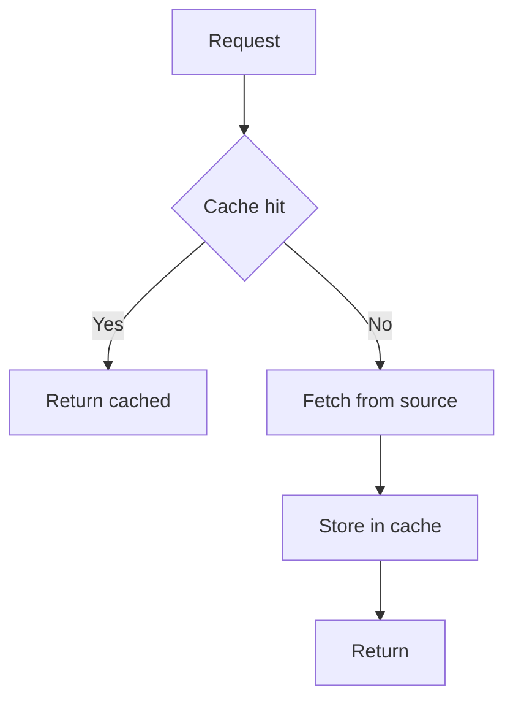
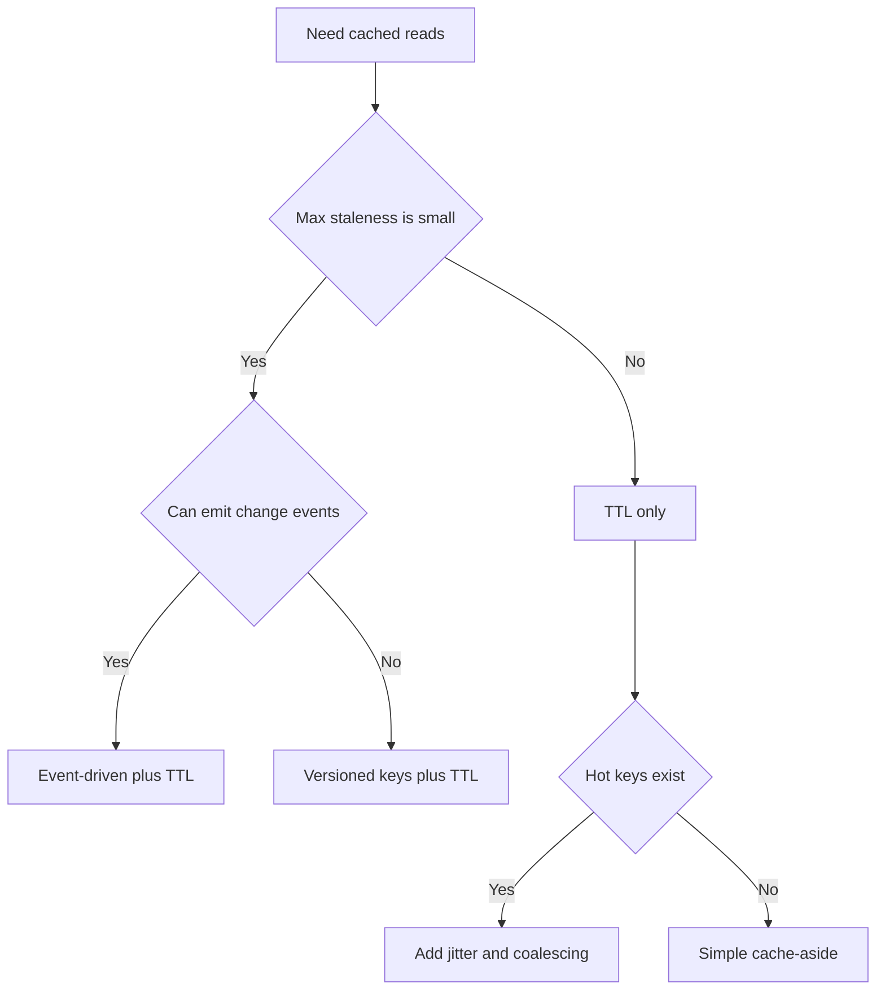
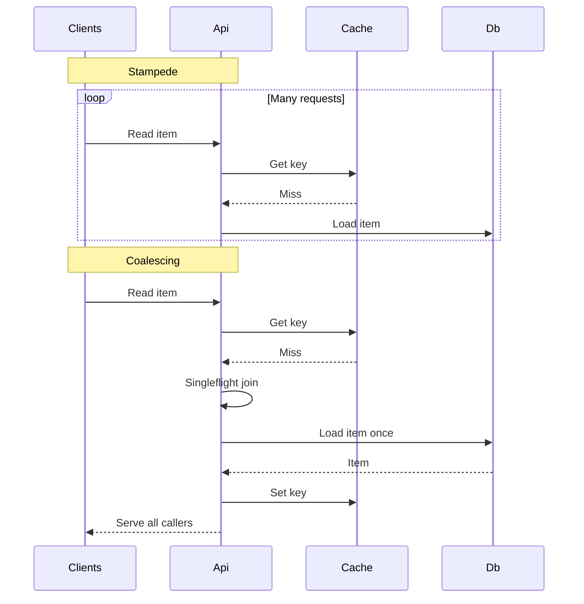

---
topic:
  - Data Persistence
subtopic: []
level:
  - "4"
priority: High
status: Ready to Repeat

publish: true
---

# Intro

Caching stores a copy of data closer to where it is consumed — in process memory, in a shared out-of-process store like Redis, or both — so that repeated reads skip the slower origin. The mechanism is simple: check the cache first; on a miss, fetch from the source, store the result, and return it. On a hit, return the stored copy without touching the source at all.

Most systems layer two cache tiers. An in-process cache (L1) sits inside the application and returns data in nanoseconds with no network hop. A distributed cache (L2) like Redis or SQL Server sits outside the process, survives restarts, and is shared across instances — but every read costs a network round-trip and deserialization. When both tiers are present, L1 is checked first; an L1 miss falls through to L2; an L2 miss falls through to the origin.

The hard part is never the read path — it is deciding when cached data is no longer valid. Every caching bug in production traces back to invalidation: serving stale prices, leaking one tenant's data to another, or slamming the database when a hot key expires across all instances simultaneously. The rest of this note covers how to choose patterns, invalidation strategies, and operational guardrails that keep the cache correct.



## Cache Patterns

**Cache-aside** — the application reads and writes the cache explicitly. On a miss, the app fetches from the source, writes to the cache, and returns. The app owns both paths.

**Read-through / write-through** — a cache layer sits between the app and the source. On a read miss, the cache itself fetches from the source. On a write, the cache writes through to the source synchronously. The app talks only to the cache.

**Write-behind (write-back)** — like write-through, but the cache writes to the source asynchronously. This reduces write latency but risks data loss if the cache fails before flushing.

Cache-aside with `IDistributedCache`:

```csharp
public static async Task<string> GetUserName(
    string userId,
    IDistributedCache cache,
    Func<string, Task<string>> loadFromDb,
    CancellationToken ct)
{
    var key = $"user-name:{userId}";
    var cached = await cache.GetStringAsync(key, ct);
    if (cached is not null)
        return cached;

    var value = await loadFromDb(userId);
    await cache.SetStringAsync(
        key,
        value,
        new DistributedCacheEntryOptions { AbsoluteExpirationRelativeToNow = TimeSpan.FromMinutes(5) },
        ct);
    return value;
}
```

The same operation with `HybridCache` (.NET 9+) — stampede protection and L1/L2 layering are built in:

```csharp
public class UserService(HybridCache cache)
{
    public async Task<string> GetUserNameAsync(string userId, CancellationToken ct)
    {
        return await cache.GetOrCreateAsync(
            $"user-name:{userId}",
            async cancel => await LoadFromDbAsync(userId, cancel),
            token: ct);
    }
}
```

## Invalidation Strategies

Invalidation strategy is a correctness decision, not an optimization detail. Start by writing down your staleness contract, then pick the simplest strategy that meets it.

- **Explicit delete on write** — on successful write, delete `key` or write the new value. If deletes can be lost, you still need a TTL as a safety net. Best when all writes go through one path that can delete or update cache.
- **TTL only** — choose TTL from a staleness budget, not from guesswork. Add jitter and stampede protection for hot keys. Best when stale reads are acceptable and updates are infrequent or hard to observe.
- **Event-driven** — publish invalidation events on writes, consume them in all app instances. Typical transports: message broker pub/sub, database change data capture, outbox pattern. If you cannot guarantee delivery, treat events as best-effort and keep TTL. Best when correctness matters and you can reliably emit change events.
- **Versioned keys** — key includes a version, for example `user-name:{userId}:v{version}`. Version comes from row version, updated_at, etag, or a separate version store. Old keys naturally age out by TTL, no delete required. Best when deletes are expensive or unreliable, and you can carry a version token.

Decision rule of thumb:



## Correctness and Staleness

Treat cached data as a replica with its own consistency model.

- **Staleness budget** — the maximum age or divergence your product can tolerate, per data type. Example: prices might need seconds, user avatars can tolerate hours.
- **Eventual vs strong consistency** — TTL-only and best-effort invalidation are eventual consistency. Strong consistency usually means bypassing cache or coupling cache and source writes in the same correctness boundary.
- **Read-your-writes** — for user-facing writes, ensure the writer reads fresh data immediately after writing. Common patterns: write-through cache, delete on write, versioned key using row version, per-request bypass for the writer.
- **Stale-while-revalidate** — serve slightly stale data fast while refreshing in the background. Trades bounded staleness for predictable latency and load. The pattern uses two TTLs: a soft TTL (freshness window) and a hard TTL (safety expiration). On a soft miss, the stale value is returned immediately while a background task refreshes the cache. On a hard miss, the caller blocks on a fresh fetch.

Stale-while-revalidate sketch — dual-TTL with background refresh:

```csharp
// Envelope wraps the value with a freshness timestamp.
var json = await cache.GetStringAsync(key, ct);
var envelope = JsonSerializer.Deserialize<Envelope<T>>(json);

if (envelope is not null)
{
    if (DateTimeOffset.UtcNow <= envelope.FreshUntilUtc)
        return envelope.Value; // Fresh — serve immediately.

    // Soft-expired: serve stale, trigger background refresh.
    _ = Task.Run(() => RefreshAsync(key));
    return envelope.Value;
}

// Hard miss: block and refill.
var value = await LoadFromSourceAsync(ct);
await WriteCacheAsync(key, value, softTtl, hardTtl, ct);
return value;
```

Notes:

- Soft TTL is a latency contract. Hard TTL is a safety contract.
- `IDistributedCache` does not give you atomic singleflight across instances. Pair SWR with stampede protection for hot keys. `HybridCache` provides this out of the box.

## Cache Stampede

Cache stampede (thundering herd, dogpile) happens when many requests miss at once and all recompute the same expensive value. The result is a burst that can overwhelm the database or downstream service — often right when the cache is least helpful.

Mitigations:

- **Jitter** — randomize expirations so hot keys do not all expire at the same second.
- **Request coalescing (singleflight)** — one in-flight load per cache key, everyone else awaits the same task. `HybridCache` does this automatically.
- **Lock-based fetch** — only the lock holder recomputes and refills the cache. Requires a backend that supports atomic lock semantics (e.g., Redis).
- **Background refresh** — proactively refresh hot keys before they expire, or use stale-while-revalidate.



## Tradeoffs

| Dimension | IMemoryCache (L1) | IDistributedCache (L2) | HybridCache (.NET 9+) |
| --- | --- | --- | --- |
| Latency | Nanoseconds, no network | Milliseconds, network round-trip + deserialization | Nanoseconds for L1 hit, milliseconds for L2 miss |
| Capacity | Bounded by app process memory | Bounded by cache cluster (Redis, SQL) | L1 bounded by process, L2 by cluster |
| Sharing | Per-instance, no sharing across pods | Shared across all instances | Shared L2, per-instance L1 |
| Stampede protection | Manual (singleflight pattern) | Manual (distributed lock) | Built-in |
| Survivability | Wiped on restart or deploy | Survives app restarts | L1 wiped, L2 survives |
| Tag-based invalidation | Not supported | Not supported | Built-in |
| Best for | Single-instance apps, hot-path data | Multi-instance apps, shared state | Default choice for new .NET 9+ apps |

Decision rule: start with `HybridCache` for new .NET 9+ projects — it handles L1/L2 layering, stampede protection, and serialization out of the box. Fall back to `IDistributedCache` when you need explicit control over cache writes, or `IMemoryCache` for single-instance scenarios where distributed state is unnecessary.

## Eviction Under Memory Pressure

Invalidation removes data that's *wrong*; **eviction** removes data when the cache is *full*. A cache is bounded, so it must decide what to drop — and if you don't configure that, the runtime decides for you (often badly):

- **`IMemoryCache`** does not bound itself by default. You must set `SizeLimit` and give every entry a `Size`, otherwise an unbounded cache becomes a memory leak (the "unbounded growth" pitfall below). It then evicts by a priority + recency heuristic.
- **Redis** evicts according to its `maxmemory-policy`: `noeviction` (reject writes — surprises people), `allkeys-lru`, `allkeys-lfu` (Redis 4+, better for skewed popularity), `volatile-ttl` (drop soonest-to-expire), etc. Choosing the policy *is* a design decision; `allkeys-lru`/`allkeys-lfu` are the usual choices for a pure cache.

The eviction policy is the same family of algorithms as an in-process [[Software Engineering/02 Computer Science/Data Structures/LRU Cache|LRU cache]]: LRU is the simple default, LFU resists scan pollution. Watch the **eviction rate** metric — a high rate means the working set no longer fits and hit rate is collapsing, the signal to grow the cache or shrink what you store.

## Pitfalls

- **Cache poisoning** — key includes untrusted input, missing tenant boundary, or cache stores error responses. Mitigation: strict key design, include auth and tenant scope, do not cache failures unless explicitly modeled.
- **Unbounded growth** — high-cardinality keys, missing expirations, or versioned keys without TTL. Mitigation: enforce TTL, cap key space, monitor memory and evictions.
- **Serialization cost and format drift** — large payloads and frequent (de)serialization can dominate latency, and schema changes can break old entries. Mitigation: cache smaller projections, version the cached envelope, measure CPU and payload size.
- **Cold start after deploy** — restart or rollout wipes in-memory caches and can amplify load on the source. Mitigation: distributed cache for shared warm state, background warmup for hot keys, gradual rollout.
- **Distributed cache partition and partial outages** — network split can cause a fleet-wide miss storm or inconsistent reads. Mitigation: timeouts, circuit breaker, fallback to source with rate limiting, avoid coupling correctness to cache.
- **Negative caching without care** — caching "not found" can hide newly created data and extend user-visible inconsistency. Mitigation: short TTL for negatives, invalidate on create.
- **Cache key design mistakes** — missing locale, permissions, feature flags, or query parameters leads to serving wrong content. Mitigation: deterministic key builder, include all correctness dimensions.

## Questions

> [!QUESTION]- How do you reduce cache stampede?
> Add jitter to expirations so hot keys do not all expire simultaneously. Use request coalescing (singleflight pattern) so only one caller recomputes while others await the result. Consider stale-while-revalidate or background refresh to avoid blocking on recomputation entirely. `HybridCache` in .NET 9+ handles coalescing automatically.

## References

- [HybridCache library in ASP.NET Core (.NET 9+)](https://learn.microsoft.com/aspnet/core/performance/caching/hybrid)
- [Overview of caching in ASP.NET Core](https://learn.microsoft.com/aspnet/core/performance/caching/overview)
- [IDistributedCache API reference](https://learn.microsoft.com/dotnet/api/microsoft.extensions.caching.distributed.idistributedcache)
- [Cache-aside pattern (Azure Architecture Center)](https://learn.microsoft.com/azure/architecture/patterns/cache-aside)
- [RFC 5861 — HTTP cache-control extensions for stale content](https://www.rfc-editor.org/rfc/rfc5861)
- [Solving thundering herds with request coalescing (jazco.dev)](https://jazco.dev/2023/09/28/request-coalescing)
