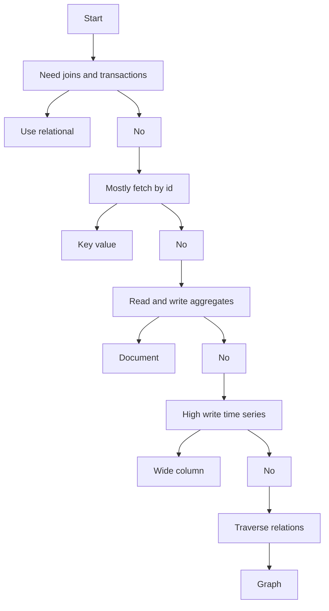

---
topic:
  - "Data Persistence"
subtopic: []
level:
  - "3"
priority: Medium
status: Creation
tags:
  - FolderNote

dg-publish: true
---

# Intro

NoSQL is an umbrella term for non-relational data stores that trade some of the relational model (normalized tables + joins) for scalability, flexible schemas, or specialized access patterns.
You reach for it when your workload is better described as "fetch by key", "store a document", "traverse relationships", or "write lots of events" rather than "join many tables".
The hard part is not "NoSQL vs SQL" but selecting the right NoSQL family and modeling your data around your queries.

## Deeper Explanation

### Mental Model

Most NoSQL systems optimize for one primary access pattern:

| Family | Best at | Typical modeling rule |
| --- | --- | --- |
| Key value | Lookups by id | Keys are your index |
| Document | Aggregate reads and writes | Embed related data you read together |
| Wide column | Large sparse tables, time series like writes | Partition key drives scalability |
| Graph | Relationship traversal | Edges are first class, not joins |



### Example

Document store example: a product page is an aggregate, so store it as one document.

```json
{
  "id": "p-123",
  "name": "Keyboard",
  "price": 79.99,
  "tags": ["input", "usb"],
  "inventory": {
    "warehouse": "kyiv-1",
    "available": 42
  }
}
```

### Tradeoffs

- SQL vs NoSQL: SQL buys you strong consistency and joins; NoSQL often buys you scaling characteristics and simpler operational patterns for specific workloads

## Questions

> [!QUESTION]- What are non-relational databases?
> Non-relational databases (often grouped under the term NoSQL) store and query data without the classic relational model of normalized tables and joins. They typically favor flexible schemas and horizontal scaling, and come in several major families: key-value, document, wide-column, and graph databases.

> [!QUESTION]- You are building a user profile API with very frequent reads by user id. Which NoSQL family fits best and why?
> Key value or document store.
> Use key value if the access pattern is almost entirely by id and you do not need rich querying.
> Use document store if you need to read and update an aggregate document (profile + preferences) and occasionally query by a few indexed fields.

> [!QUESTION]- When is NoSQL a bad idea?
> When your core use case needs relational constraints and multi-entity transactions, or your queries are fundamentally join heavy.
> In that case, add caching, read replicas, or a denormalized read model before switching storage models.

## Links

- [Understand data store models](https://learn.microsoft.com/azure/architecture/guide/technology-choices/data-store-overview)
- [Relational vs NoSQL data](https://learn.microsoft.com/dotnet/architecture/cloud-native/relational-vs-nosql-data)
- [Choose a data store](https://learn.microsoft.com/azure/architecture/guide/technology-choices/data-stores-getting-started)
- [Designing Data Intensive Applications chapter on storage and retrieval](https://www.oreilly.com/library/view/designing-data-intensive-applications/9781098119058/ch04.html)

<!-- whats-next:start -->

---

> [!note] Whats next
> **Parent**
>  [[Software Engineering/03 Data Persistence/03 Data Persistence|03 Data Persistence]]
>
<!-- whats-next:end -->
