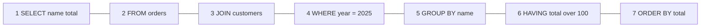
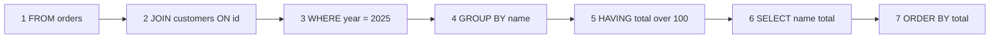

---
topic:
  - Data Persistence
subtopic:
  - SQL
tags:
  - FolderNote
dg-publish: true
priority: High
level:
  - '4'
status: Creation
---

# Intro

The relational model organizes data into tables of rows and columns, with relationships expressed through keys rather than nesting. SQL (Structured Query Language) is the declarative standard for querying and manipulating that data: you describe *what* you want, and the engine decides *how* to get it. For backend engineers, SQL fluency is non-negotiable because most production systems store critical state in a relational database, and understanding how the engine actually executes queries is what separates correct code from performant code. Relational databases enforce a schema and provide ACID transactions by default across relational workloads; this lets you express complex multi-table queries without denormalizing your data model upfront.

## Logical Query Execution Order

SQL is written in one order but executed in another.

- **How you WRITE it**



- **How the engine EXECUTES it**



### Rules of Thumb

Think of it as: **"The engine builds a table first, then decorates it."**

1. **FROM/JOIN first, SELECT near last.** The engine needs to know *which tables* before it can do anything.
2. **WHERE before GROUP BY.** Filter rows *before* grouping. Cheaper to discard rows early.
3. **HAVING is WHERE for groups.** Use it only when filtering on an aggregate; otherwise use `WHERE`.
4. **SELECT runs late.** Column aliases from `SELECT` are invisible to `WHERE` and `GROUP BY`, but visible to `ORDER BY`.
5. **ORDER BY then TOP/LIMIT last.** Sorting is expensive. Slicing happens only after everything else is settled.

A concrete example showing the difference between write order and execution order:

```sql
-- You write SELECT first, but the engine starts at FROM
SELECT department, COUNT(*) AS headcount
FROM employees
WHERE hire_date >= '2024-01-01'
GROUP BY department
HAVING COUNT(*) > 5
ORDER BY headcount DESC;

-- Engine order: FROM employees -> WHERE hire_date filter -> GROUP BY department
-- -> HAVING count filter -> SELECT columns -> ORDER BY headcount
-- The alias 'headcount' works in ORDER BY because SELECT runs before it.
-- The same alias fails in WHERE because SELECT hasn't run yet.
```

## Questions

> [!QUESTION]- What is the difference between WHERE and HAVING?
> `WHERE` filters rows before grouping and cannot reference aggregate functions. `HAVING` filters groups after `GROUP BY` and can use aggregates like `COUNT(*)` or `SUM(amount)`. If a condition doesn't depend on an aggregate, always put it in `WHERE` because it reduces the rows that enter the grouping step.

> [!QUESTION]- What is a stored procedure and how is it different from a function?
> A stored procedure executes multi-step logic, can modify data, and returns result sets or output parameters. A function returns a value (scalar or table) and is designed to be called inline in a query. In SQL Server, legacy (non-inlined) scalar UDFs are evaluated row-by-row and can inhibit parallel query plans. SQL Server 2019+ may inline eligible scalar UDFs, avoiding this. Inline table-valued functions (iTVFs) are expanded like macros and don't have the parallelism problem.

> [!QUESTION]- What is a Common Table Expression (CTE) and when should you use a temp table instead?
> A CTE is a named temporary result set defined with `WITH`, scoped to a single statement. It improves readability and enables recursive queries for hierarchical data. A CTE is generally treated like an inline view; don't assume it's materialized or reused across multiple references. If you reference the same CTE twice in a query, the optimizer may execute the underlying query twice. For guaranteed reuse of an expensive result, use a temp table instead.

> [!QUESTION]- What are SQL Server transaction isolation levels?
> The five isolation levels are: `READ UNCOMMITTED` (dirty reads allowed), `READ COMMITTED` (default, reads only committed data), `REPEATABLE READ` (re-reading a row returns the same data), `SERIALIZABLE` (full isolation, highest blocking), and `SNAPSHOT` (transaction-level consistent snapshot via row versioning in tempdb). Separately, Read Committed Snapshot Isolation (RCSI) is a database-level option (`ALTER DATABASE ... SET READ_COMMITTED_SNAPSHOT ON`) that makes `READ COMMITTED` use statement-level row versioning instead of shared locks, eliminating most reader-writer blocking without changing the isolation level name. Switching to `READ UNCOMMITTED` or `NOLOCK` is a common anti-pattern: you can read rolled-back, partially-written, or duplicate data.

> [!QUESTION]- How do you diagnose and optimize a slow query?
> Start with the execution plan (`SET STATISTICS IO ON` or the graphical plan in SSMS). Look for table scans on large tables (missing index), key lookups (a non-clustered index was used but the engine must go back to the clustered index, or the heap via RID lookup, for extra columns; fix by including those columns in the index), and fat arrows indicating large row estimates. Check for stale statistics (`UPDATE STATISTICS`) when cardinality estimates are wildly off. For repeated slow queries, investigate parameter sniffing: a plan compiled for one parameter value may be terrible for another, fixable with `OPTION (RECOMPILE)` or `OPTIMIZE FOR`.

## Links

- [Query processing architecture guide (Microsoft Learn)](https://learn.microsoft.com/sql/relational-databases/query-processing-architecture-guide?view=sql-server-ver16)
- [WITH common_table_expression (T-SQL)](https://learn.microsoft.com/sql/t-sql/queries/with-common-table-expression-transact-sql?view=sql-server-ver16)
- [Joins — Microsoft Learn](https://learn.microsoft.com/sql/relational-databases/performance/joins?view=sql-server-ver16)
- [Execution plans overview](https://learn.microsoft.com/sql/relational-databases/performance/execution-plans?view=sql-server-ver16)
- [SQL Server index design guide](https://learn.microsoft.com/sql/relational-databases/sql-server-index-design-guide?view=sql-server-ver17)
- [Use The Index, Luke](https://use-the-index-luke.com/)

<!-- whats-next:start -->

---

> [!note] Whats next
> **Parent**
>  [[Software Engineering/03 Data Persistence/03 Data Persistence|03 Data Persistence]]
>
> **Pages**
> - [[Software Engineering/03 Data Persistence/SQL/Indexes|Indexes]]
> - [[Software Engineering/03 Data Persistence/SQL/Normalization Denormalization|Normalization Denormalization]]
<!-- whats-next:end -->
