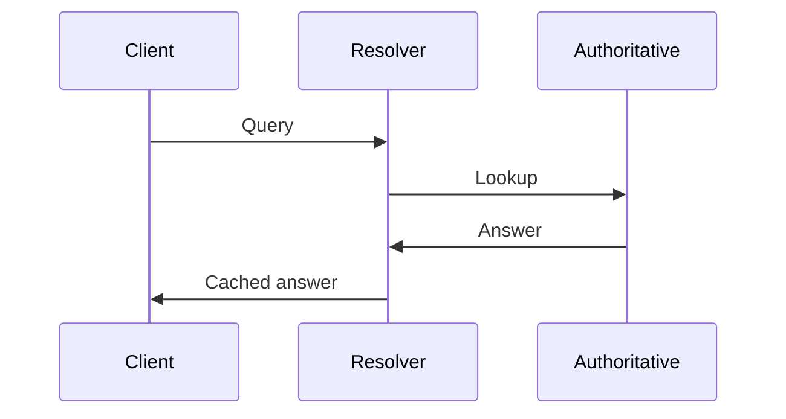

---
topic:
  - "Networks"
subtopic:
  - "Protocols"
level:
  - "3"
priority: Medium
status: Not-Started

dg-publish: true
---

# Intro

DNS maps human-readable names to records like IP addresses.
You reach for it to discover services, route traffic, and control where users land.

## Deeper Explanation

### Mental Model

## Questions

> [!QUESTION]- Why does DNS "take time" to update?
> Caching.
> Resolvers and clients respect TTL and keep old answers until they expire.

## Links

- [RFC 1034 DNS concepts](https://www.rfc-editor.org/rfc/rfc1034)
- [RFC 1035 DNS implementation](https://www.rfc-editor.org/rfc/rfc1035)
- [DNS basics](https://www.cloudflare.com/learning/dns/what-is-dns/)

<!-- whats-next:start -->

---

> [!note] Whats next
> **Parent**
>  [[Software Engineering/04 Networks/04 Networks|04 Networks]]
>
> **Pages**
> - [[Software Engineering/04 Networks/Protocols/gRPC|gRPC]]
> - [[Software Engineering/04 Networks/Protocols/HTTP & HTTPS|HTTP & HTTPS]]
> - [[Software Engineering/04 Networks/Protocols/HTTP 2|HTTP 2]]
> - [[Software Engineering/04 Networks/Protocols/RPC|RPC]]
> - [[Software Engineering/04 Networks/Protocols/SMTP|SMTP]]
<!-- whats-next:end -->
