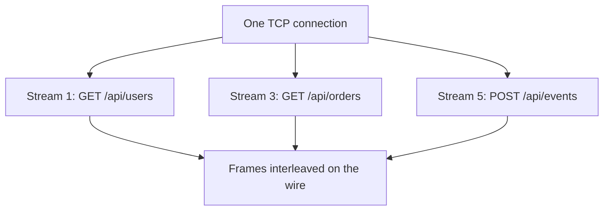

---
topic:
  - Networks
subtopic:
  - Protocols
level:
  - "3"
priority: Medium
status: Ready to Repeat
publish: true
---
# Intro

HTTP/2 is the second major version of the HTTP protocol, standardized in 2015 (RFC 7540, superseded by RFC 9113). It runs over a single TCP connection and multiplexes many request/response pairs simultaneously, eliminating the head-of-line blocking and connection overhead that limited HTTP/1.1. The result is lower latency and higher throughput for web applications that make many concurrent requests — without changing the HTTP semantics (methods, headers, status codes) that applications already use.

See [[Software Engineering/04 Networks/Protocols/HTTP|HTTP]] for the foundational HTTP concepts that HTTP/2 builds on.

## What HTTP/1.1 Got Wrong

HTTP/1.1 has two fundamental performance problems:

1. **Head-of-line blocking at the application layer:** requests on a single connection are processed sequentially. If request 1 is slow, requests 2 and 3 wait. Browsers work around this by opening 6–8 parallel TCP connections per origin — wasteful and limited.

2. **Verbose headers:** HTTP/1.1 headers are plain text and sent in full with every request. A typical request has 500–800 bytes of headers. For small API calls, headers can be larger than the payload.

## How HTTP/2 Works

**Binary framing layer**
HTTP/2 replaces the text-based HTTP/1.1 format with a binary framing layer. Messages are split into frames (the smallest unit of communication), each tagged with a stream ID.

**Multiplexing**
Multiple streams share a single TCP connection. Frames from different streams are interleaved. Stream 1's response frames can arrive between stream 3's request frames. No waiting.



**HPACK header compression**
Headers are compressed using a static table (common headers like `:method: GET`) and a dynamic table (headers seen in previous requests on the same connection). A repeated `Authorization` header costs ~1 byte instead of ~500 bytes.

**Server push**
The server can proactively send resources the client will need before the client requests them. For example, when serving `index.html`, the server can push `style.css` and `app.js` without waiting for the browser to parse the HTML and request them.

In practice, server push has limited adoption — it is hard to predict what the client needs, and browsers often already have resources cached. HTTP/3 has deprecated server push.

**Stream prioritization**
Clients can assign priorities to streams, allowing the server to allocate bandwidth accordingly (e.g., prioritize HTML over images). In practice, priority support varies across implementations.

## How HTTP/2 Is Negotiated (ALPN)

A client and server don't just "speak HTTP/2" — they have to agree to. For HTTPS (the only mode browsers allow), this happens **during the TLS handshake via ALPN** (Application-Layer Protocol Negotiation): the `ClientHello` lists supported protocols (`h2`, `http/1.1`) and the server picks one in its reply — **zero extra round-trips**. This is why HTTP/2 is "TLS-required in practice": ALPN rides along on the handshake that's already happening.

Cleartext HTTP/2 (**h2c**) exists via an HTTP/1.1 `Upgrade` header, but browsers don't support it; it's mostly used **server-to-server** (e.g. behind a load balancer, or [[Software Engineering/04 Networks/Protocols/gRPC|gRPC]], which runs on HTTP/2 and relies on this multiplexing).

## HTTP/2 vs HTTP/1.1

| Feature | HTTP/1.1 | HTTP/2 |
|---------|----------|--------|
| Connections per origin | 6–8 (browser workaround) | 1 |
| Request multiplexing | No (sequential per connection) | Yes |
| Header format | Plain text, repeated in full | Binary, HPACK compressed |
| Server push | No | Yes (limited adoption) |
| Head-of-line blocking | Application layer | TCP layer only |
| TLS requirement | Optional | Required in practice (browsers enforce) |

## HTTP/2 in .NET

ASP.NET Core supports HTTP/2 natively via Kestrel. Enable it in `appsettings.json` or `Program.cs`:

```csharp
builder.WebHost.ConfigureKestrel(options =>
{
    options.ListenAnyIP(443, listenOptions =>
    {
        listenOptions.UseHttps();
        listenOptions.Protocols = HttpProtocols.Http1AndHttp2;
    });
});
```

`HttpClient` in .NET 5+ uses HTTP/2 by default when the server supports it:

```csharp
var client = new HttpClient
{
    DefaultRequestVersion = HttpVersion.Version20,
    DefaultVersionPolicy = HttpVersionPolicy.RequestVersionOrHigher
};
```

## Pitfalls

**TCP head-of-line blocking remains**
HTTP/2 eliminates application-layer head-of-line blocking but not TCP-layer blocking. A single lost packet stalls all streams on the connection until TCP retransmits it. Under high packet loss (mobile networks, congested links), HTTP/2 can perform worse than HTTP/1.1 with multiple connections. HTTP/3 (QUIC) solves this by using UDP with per-stream loss recovery.

**Single connection amplifies TCP congestion**
HTTP/1.1 uses multiple connections, so congestion on one does not affect others. HTTP/2's single connection means a congestion event affects all streams simultaneously.

**Server push cache invalidation**
Pushed resources may already be in the client's cache. The server has no way to know, so it wastes bandwidth pushing resources the client doesn't need. Most production deployments disable server push.

## Questions

> [!QUESTION]- What problem does HTTP/2 multiplexing solve compared to HTTP/1.1?
> HTTP/1.1 processes requests sequentially per connection — a slow request blocks all subsequent ones. Browsers work around this with 6–8 parallel connections, which is wasteful. HTTP/2 multiplexes many streams on one connection, eliminating application-layer head-of-line blocking and reducing connection overhead.
> Cost: a single TCP connection means TCP-layer packet loss affects all streams simultaneously.

> [!QUESTION]- Why does HTTP/2 still have head-of-line blocking?
> HTTP/2 eliminates it at the application layer but not at the TCP layer. TCP guarantees ordered delivery — a lost packet blocks all subsequent data until retransmitted, stalling all HTTP/2 streams on that connection. HTTP/3 (QUIC over UDP) solves this with per-stream loss recovery.

> [!QUESTION]- When would you choose HTTP/1.1 over HTTP/2?
> When the network has high packet loss (mobile, satellite) and you cannot use HTTP/3 — multiple HTTP/1.1 connections isolate packet loss better than a single HTTP/2 connection. Also when connecting to legacy servers or proxies that don't support HTTP/2.

## References

- [HTTP/2 (RFC 9113)](https://www.rfc-editor.org/rfc/rfc9113) — the current HTTP/2 specification, superseding RFC 7540.
- [Evolution of HTTP (MDN)](https://developer.mozilla.org/en-US/docs/Web/HTTP/Basics_of_HTTP/Evolution_of_HTTP#http2) — accessible history of HTTP versions with clear explanations of what each version improved.
- [HTTP/2 in ASP.NET Core (Microsoft Learn)](https://learn.microsoft.com/en-us/aspnet/core/fundamentals/servers/kestrel/http2) — Kestrel configuration for HTTP/2 including TLS requirements and protocol negotiation.
- [HPACK header compression (RFC 7541)](https://www.rfc-editor.org/rfc/rfc7541) — the header compression algorithm used by HTTP/2.
- [HTTP/2 is trickier than I thought (Cloudflare blog)](https://blog.cloudflare.com/http-2-for-web-developers/) — practitioner analysis of HTTP/2 performance characteristics and when it helps vs hurts.
