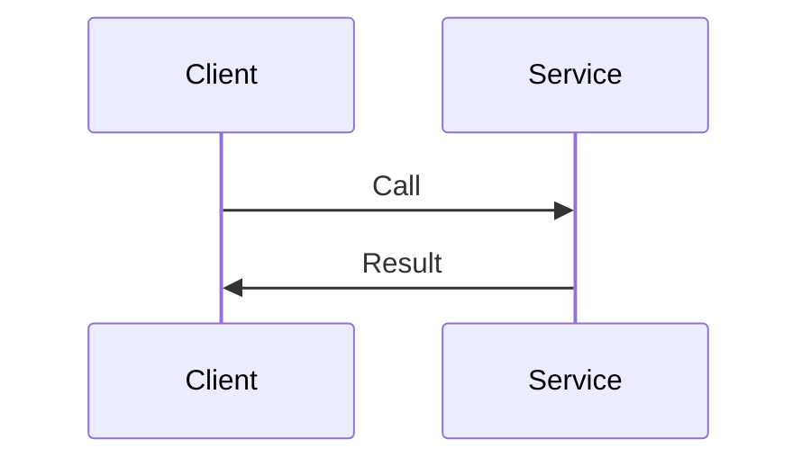

---
topic:
  - Networks
subtopic:
  - Protocols
level:
  - "3"
priority: Medium
status: Not-Started

dg-publish: false
---

# Intro

RPC (remote procedure call) is a communication style where a client invokes a server operation as if it were a local function.
You reach for it when you want a strongly defined service interface and predictable request and response shapes.
The core difficulty is that network calls fail in more ways than local calls.

## Deeper Explanation

### Mental Model

## Links

- [Fallacies of distributed computing](https://en.wikipedia.org/wiki/Fallacies_of_distributed_computing)
- [gRPC core concepts](https://grpc.io/docs/what-is-grpc/core-concepts/)

<!-- whats-next:start -->

---

> [!note] Whats next
> **Parent**
>  [[Software Engineering/04 Networks/04 Networks|04 Networks]]
>
> **Pages**
> - [[Software Engineering/04 Networks/Protocols/DNS|DNS]]
> - [[Software Engineering/04 Networks/Protocols/gRPC|gRPC]]
> - [[Software Engineering/04 Networks/Protocols/HTTP|HTTP]]
> - [[Software Engineering/04 Networks/Protocols/HTTP 2|HTTP 2]]
> - [[Software Engineering/04 Networks/Protocols/REST|REST]]
> - [[Software Engineering/04 Networks/Protocols/SMTP|SMTP]]
<!-- whats-next:end -->
