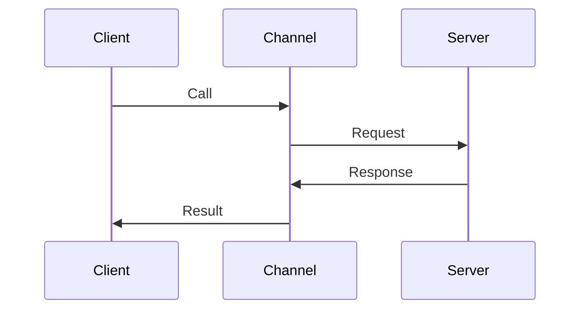

---
topic:
  - "Networks"
subtopic:
  - "Protocols"
level:
  - "3"
priority: High
status: Not-Started

dg-publish: true
---

# Intro

gRPC is a remote procedure call framework that runs over HTTP 2 and usually uses Protocol Buffers for message serialization.
You reach for it when you control both client and server and want strong contracts, fast binary payloads, and first class streaming.
In practice, gRPC design is about timeouts, versioning, retries, and observability, not just defining a service.

## Deeper Explanation

### Mental Model

RPC makes a network call look like a function call, but the failure modes are still network failure modes.



### Example

Service definition:

```proto
syntax = "proto3";

package greeter;

service Greeter {
  rpc SayHello (HelloRequest) returns (HelloReply);
}

message HelloRequest {
  string name = 1;
}

message HelloReply {
  string message = 1;
}
```

Client call shape:

```csharp
var channel = GrpcChannel.ForAddress("https://localhost:5001");
var client = new Greeter.GreeterClient(channel);

var reply = await client.SayHelloAsync(new HelloRequest { Name = "Nikita" });
Console.WriteLine(reply.Message);
```

### Pitfalls

- No deadlines: calls hang and consume resources
- Retrying non-idempotent calls: duplicates and inconsistent state
- Breaking changes in contracts: remove fields or renumbering breaks clients
- Assuming gRPC works everywhere: some proxies and browsers need gRPC Web

### Tradeoffs

- gRPC vs REST: gRPC has stronger contracts and streaming; REST is easier for public APIs and tooling
- Proto vs JSON: proto is smaller and faster; JSON is easier to debug and more flexible for ad hoc clients

## Questions

> [!QUESTION]- When is gRPC a better choice than REST?
> When you own both ends, need strong contracts, and benefit from streaming or lower overhead.
> It is common for internal service to service communication.

> [!QUESTION]- What are the first two things you set for production gRPC clients?
> Deadlines and retry policy.
> Without deadlines, resource usage is unbounded.
> Without a retry strategy, transient failures turn into user-visible failures.

## Links

- [gRPC concepts](https://grpc.io/docs/what-is-grpc/core-concepts/)
- [gRPC over HTTP 2](https://grpc.io/docs/guides/http2/)
- [RFC 7540 HTTP 2](https://www.rfc-editor.org/rfc/rfc7540)
- [gRPC for .NET](https://learn.microsoft.com/aspnet/core/grpc/?view=aspnetcore-8.0)

<!-- whats-next:start -->

---

> [!note] Whats next
> **Parent**
>  [[Software Engineering/04 Networks/04 Networks|04 Networks]]
>
> **Pages**
> - [[Software Engineering/04 Networks/Protocols/DNS|DNS]]
> - [[Software Engineering/04 Networks/Protocols/HTTP & HTTPS|HTTP & HTTPS]]
> - [[Software Engineering/04 Networks/Protocols/HTTP 2|HTTP 2]]
> - [[Software Engineering/04 Networks/Protocols/RPC|RPC]]
> - [[Software Engineering/04 Networks/Protocols/SMTP|SMTP]]
<!-- whats-next:end -->
