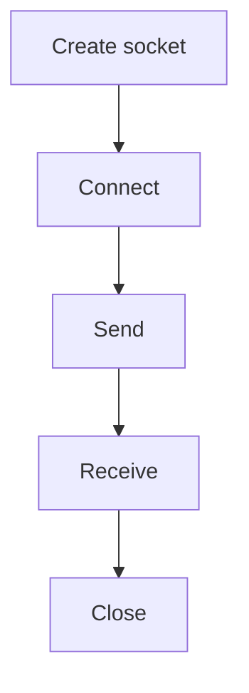

---
topic:
  - "Networks"
subtopic:
  - "Transport & Sockets"
level:
  - "3"
priority: Medium
status: Not-Started

dg-publish: true
---

# Intro

A socket is an endpoint for sending and receiving data over a network.
You reach for sockets when building custom protocols, low-level networking, or when you need precise control over connections.
The key mental model is that reads and writes are streams of bytes, not messages.

## Deeper Explanation

### Mental Model



### Example

```csharp
using var client = new TcpClient();
await client.ConnectAsync("example.com", 80);
```

### Tradeoffs

- High level protocols (HTTP, gRPC) are easier and safer; raw sockets are powerful but error-prone

## Questions

> [!QUESTION]- Why do partial reads happen?
> Because TCP is a byte stream.
> The network may deliver data in smaller chunks.

## Links

- [System.Net.Sockets namespace](https://learn.microsoft.com/dotnet/api/system.net.sockets)
- [TcpClient](https://learn.microsoft.com/dotnet/api/system.net.sockets.tcpclient)

<!-- whats-next:start -->

---

> [!note] Whats next
> **Parent**
>  [[Software Engineering/04 Networks/04 Networks|04 Networks]]
>
> **Pages**
> - [[Software Engineering/04 Networks/Transport & Sockets/TCP IP|TCP IP]]
> - [[Software Engineering/04 Networks/Transport & Sockets/UDP|UDP]]
<!-- whats-next:end -->
