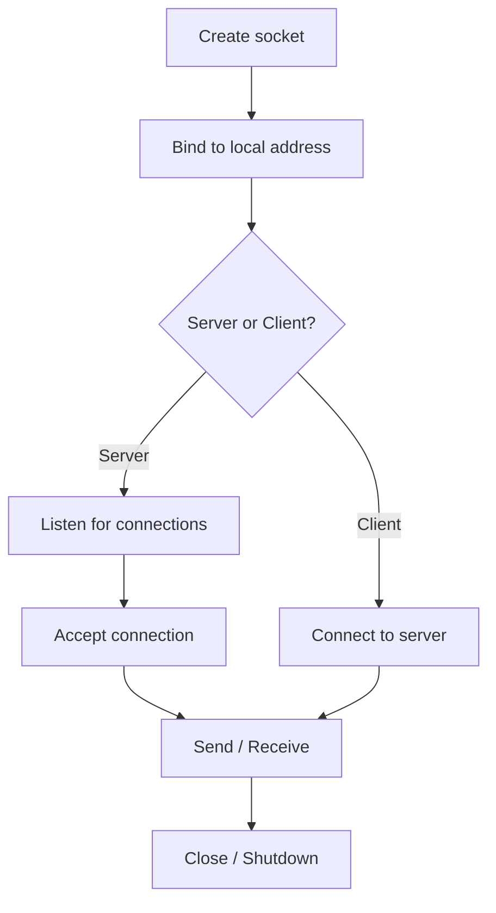

---
topic:
  - Networks
subtopic:
  - Transport & Sockets
level:
  - "3"
priority: Medium
status: Creation

dg-publish: true
---

# Intro

A socket is an endpoint for bidirectional communication between two processes over a network. It abstracts the OS networking stack into a file-like interface: you open a socket, connect it to a remote address, and then read/write bytes. The key mental model is that TCP sockets are **byte streams** — not message boundaries — so partial reads and partial writes are normal and must be handled explicitly.

You reach for raw sockets when building custom protocols, high-performance servers, or when HTTP/gRPC adds too much overhead. For most application-layer work, higher-level abstractions (`HttpClient`, gRPC, SignalR) are safer and faster to build with.

## TCP vs UDP Sockets

| Property | TCP | UDP |
|---|---|---|
| Connection | Connection-oriented (3-way handshake) | Connectionless |
| Delivery | Guaranteed, ordered | Best-effort, unordered |
| Framing | Byte stream (no message boundaries) | Datagrams (message boundaries preserved) |
| Overhead | Higher (ACKs, retransmit, flow control) | Lower |
| Use cases | HTTP, databases, file transfer | DNS, video streaming, gaming, telemetry |

**Decision rule**: use TCP when correctness requires delivery guarantees. Use UDP when latency matters more than reliability and the application can tolerate or handle loss itself.

## Socket Lifecycle



**Server side**: bind → listen → accept (blocks until a client connects) → read/write on the accepted socket.
**Client side**: connect → read/write.

## Example

### TCP Client with TcpClient

```csharp
using var client = new TcpClient();
await client.ConnectAsync("example.com", 80);

await using var stream = client.GetStream();

// Send HTTP/1.0 request
var request = "GET / HTTP/1.0\r\nHost: example.com\r\n\r\n"u8.ToArray();
await stream.WriteAsync(request);

// Read response — partial reads are normal; loop until done
var buffer = new byte[4096];
int bytesRead;
while ((bytesRead = await stream.ReadAsync(buffer)) > 0)
{
    Console.Write(Encoding.UTF8.GetString(buffer, 0, bytesRead));
}
```

### TCP Server with TcpListener

```csharp
var listener = new TcpListener(IPAddress.Any, 8080);
listener.Start();

while (true)
{
    var client = await listener.AcceptTcpClientAsync();
    _ = HandleClientAsync(client); // fire-and-forget per connection
}

static async Task HandleClientAsync(TcpClient client)
{
    await using var stream = client.GetStream();
    var buffer = new byte[1024];
    int bytesRead = await stream.ReadAsync(buffer);
    // process buffer[0..bytesRead]
    client.Close();
}
```

### UDP with UdpClient

```csharp
using var udp = new UdpClient();
var endpoint = new IPEndPoint(IPAddress.Parse("8.8.8.8"), 53);

var payload = new byte[] { 0x00, 0x01 }; // minimal DNS query stub
await udp.SendAsync(payload, endpoint);

var result = await udp.ReceiveAsync();
Console.WriteLine($"Received {result.Buffer.Length} bytes from {result.RemoteEndPoint}");
```

## Pitfalls

**Partial reads** — TCP is a byte stream. A single `ReadAsync` call may return fewer bytes than you sent. Always loop until you have received the expected number of bytes or a delimiter.

**Partial writes** — `WriteAsync` may not send all bytes in one call on some platforms. Check the return value or use `WriteAllAsync`/`Stream.WriteAsync` which handles this internally.

**Not closing sockets** — unclosed sockets hold OS file descriptors. Use `using` or `try/finally` to ensure `Close`/`Dispose` is called even on exceptions.

**Blocking the thread pool** — synchronous socket operations (`Receive`, `Send`) block a thread-pool thread. Use async APIs (`ReceiveAsync`, `SendAsync`, `TcpClient.GetStream()` + `ReadAsync`) to release threads during I/O waits.

**No framing on TCP** — TCP delivers a stream of bytes with no concept of message boundaries. If your protocol sends variable-length messages, you must add framing: length-prefix, delimiter, or fixed-size headers.

## Tradeoffs

| Option | Best for | Weakness |
|---|---|---|
| Raw `Socket` class | Full control, custom protocols | Verbose; manual framing, error handling |
| `TcpClient` / `TcpListener` | TCP client/server with stream API | Still requires framing; no HTTP semantics |
| `UdpClient` | UDP datagrams | No delivery guarantees; application must handle loss |
| `HttpClient` | HTTP/1.1, HTTP/2, HTTP/3 | Higher overhead; not suitable for custom binary protocols |
| `System.Net.WebSockets` | Full-duplex over HTTP | Requires HTTP upgrade; not for raw TCP |

## Questions

> [!QUESTION]- Why do partial reads happen with TCP sockets?
> TCP is a byte stream protocol. The network may deliver data in smaller chunks than the sender wrote. A single `ReadAsync` call returns however many bytes are available at that moment, which may be less than the full message. Applications must loop until the expected number of bytes is received.

> [!QUESTION]- What is the difference between `Socket`, `TcpClient`, and `TcpListener`?
> `Socket` is the low-level OS abstraction supporting TCP, UDP, and other protocols. `TcpClient` wraps a TCP socket and exposes a `NetworkStream` for stream-based I/O. `TcpListener` wraps a server-side TCP socket and provides `AcceptTcpClientAsync` for accepting connections. Use `TcpClient`/`TcpListener` for most TCP work; drop to `Socket` when you need protocol-level control.

> [!QUESTION]- When would you choose UDP over TCP for a production system?
> When latency matters more than delivery guarantees and the application can tolerate or recover from packet loss. Examples: real-time game state updates (stale frames are discarded anyway), DNS queries (fast retry is cheaper than TCP handshake), telemetry/metrics (occasional loss is acceptable). The application must implement its own reliability if needed.

## Links

- [System.Net.Sockets namespace](https://learn.microsoft.com/dotnet/api/system.net.sockets) — API reference for Socket, TcpClient, TcpListener, UdpClient, and NetworkStream.
- [TcpClient class](https://learn.microsoft.com/dotnet/api/system.net.sockets.tcpclient) — API reference with examples for connecting, reading, and writing over TCP.
- [Use sockets to send and receive data over TCP](https://learn.microsoft.com/dotnet/fundamentals/networking/sockets/tcp-classes) — Microsoft guide covering TcpClient/TcpListener patterns and async usage.
- [Use UDP sockets](https://learn.microsoft.com/dotnet/fundamentals/networking/sockets/udp-client) — Microsoft guide for UdpClient send/receive patterns.
- [Socket performance enhancements in .NET](https://learn.microsoft.com/dotnet/fundamentals/networking/sockets/socket-services) — covers SocketAsyncEventArgs and high-throughput socket patterns.

<!-- whats-next:start -->

---

> [!note] Whats next
> **Parent**
>  [[Software Engineering/04 Networks/04 Networks|04 Networks]]
>
> **Pages**
> - [[Software Engineering/04 Networks/Transport & Sockets/TCP IP|TCP IP]]
> - [[Software Engineering/04 Networks/Transport & Sockets/UDP|UDP]]
<!-- whats-next:end -->
